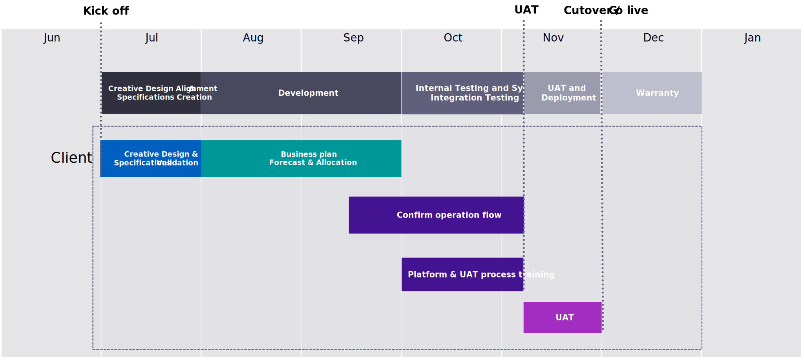
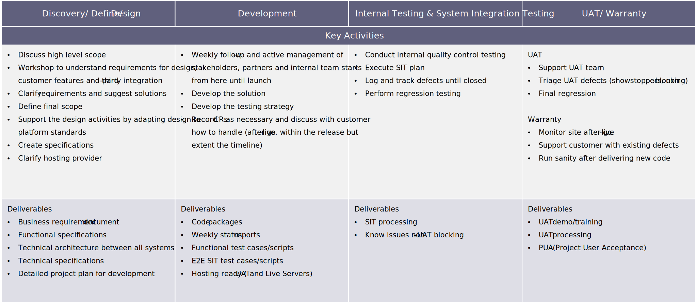

# Implementation phases

Many organizations prepare for a commerce transformation by creating a request for proposal (RFP). This includes detailed requirements, current systems of record, a business case, and specific goals (for example, revenue, conversion, average order value) to define success. The brand then approaches two to three different commerce systems integrators or digital agencies to evaluate, review estimates and proposals, select a company, and begin working towards projected timeline to launch.

This can be a successful approach. However, one recommendation that mitigates risk (before committing to a full implementation) is to work with an organization on a requirements assessment or discovery process that can confirm organizational preparedness, project scope, timeline, budget, business requirements, and technical approach. On average, this process should take between four to six weeks, but varies depending on the size of the project.

## Typical timeline example

## Sample timeline activities

