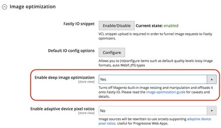

# Adobe Commerce performance optimization

## Geographic location of AEM and Adobe Commerce infrastructure

To reduce latency between the AEM publisher and Adobe Commerce GraphQL when building pages, the initial provisioning of the two separate infrastructures should be hosted within the same AWS (or Azure) Region. The geographical location chosen for both clouds should also be closest to the majority of your customer base, so that client side GraphQL requests are served from a geographically close location to the majority of your customers.

## GraphQL caching in Adobe Commerce

When the user’s browser or AEM publisher calls Adobe Commerce’s GraphQL, certain calls will be cached
in Fastly. The queries that are cached are generally those which contain non personal data and are not likely to change often. These are for example: categories, categoryList and products. Those that are explicitly not cached are those which change regularly and if cached could pose risks to personal data and site operations for example queries such as cart and customerPaymentTokens.

GraphQL allows you to make multiple queries in a single call. It is important to note that if you specify even one query that Adobe Commerce does not cache with many others that are not cacheable, Adobe Commerce will bypass the cache for all queries in the call. This should be considered by developers when combining multiple queries to ensure potentially cacheable queries are not unintentionally bypassed‡.

>[!NOTE]
>
> Further information on cacheable and non-cacheable queries, see the Adobe Commerce [developer documentation](https://devdocs.magento.com/guides/v2.4/graphql/caching.html).

## Catalog flat table

The use of flat tables for products and categories is not recommended. Use of this deprecated feature can results in performance degradations and indexing issues, therefore flat catalogue should be disabled via the Adobe Commerce admin, in the storefront section. Some third-party modules and customisations do require flat tables to function correctly – it is recommended that an evaluation be done to understand impacts and risks associated with having to use flat tables when choosing to utilize these extensions or customisations.

## Fastly origin shielding

By default, Fastly origin shielding is not enabled. The purpose of Fastly’s origin shielding is to reduce traffic directly to the Adobe Commerce origin: when a request is received, a Fastly edge location (or “point of presence” / POP) checks for cached content and provides it. If it is not cached, it continues to the Shield POP to check if it is cached there (if the content has previously been requested even from another global POP, it will be cached). Finally, if not cached on the Shield POP, it will only then proceed to the Origin server.

Fastly origin shielding can be enabled in your Adobe Commerce admin Fastly configuration backend settings. You should choose a shield location which is closest to your Adobe Commerce origin datacenter for the best performance.

## Fastly image optimization

Once Fastly origin shielding is enabled, this allows you to also activate Fastly Image Optimizer. Where product catalogue images are stored on Adobe Commerce, this service gives the ability to offload all resource intensive, product catalogue images transformation processing onto Fastly and off from the Adobe Commerce origin. End user response times are also improved for page load times, as images are transformed at the edge location which eliminates latency by reducing the number of requests back to the Adobe Commerce origin.

Fastly Image optimization can be enabled by “enable deep image optimization” in Fastly configuration in admin, although only after your origin shield has been activated. More details on configurations for Fastly Image optimization is available in the Adobe Commerce [developer documentation](https://devdocs.magento.com/cloud/cdn/fastly-image-optimization.html).



## Disable unused modules

If running Adobe Commerce headless, only serving requests through the GraphQL endpoint and no front-end store pages are being served directly from Adobe Commerce, then many modules become redundant and not used. By disabling unused modules, your Adobe Commerce code base becomes smaller, less complex and therefore could offer performance improvements. Disabling modules on Adobe Commerce can be managed using composer. Which modules that can be disabled would depend on the requirements for your site, and so no recommended list can be given as it would be specific to each customer’s implementation of Adobe Commerce.

## MySQL and Redis connection activation

By default, MySQL and Redis Slave connections are not activated in Adobe Commerce on cloud. This is because these settings are only suitable for customers that are expecting very high load. The Cross-AZ (cross-Availability Zones) latency is higher with slave connections activated and so this setting actually reduces performance of a Adobe Commerce on cloud instance in the case the instance is receiving only regular load levels.

If the Adobe Commerce instance is expecting extreme load, then activating master-slave for MySQL and Redis will help with performance by spreading out the load on the MySQL Database or Redis across different nodes.

As a guide, on environments with normal load, enabling Slave Connections will slow down performance by 10-15%. But on clusters with heavy load and traffic, there is a performance boost of around 10-15%. Therefore, it is important to load test your environment with expected traffic levels to evaluate if this setting would be beneficial to your performance times under load.

To enable/disable slave connections for mysql and redis you should edit your `.magento.env.yaml` file to include the following:

```
stage:
  deploy:
    MYSQL_USE_SLAVE_CONNECTION: true
    REDIS_USE_SLAVE_CONNECTION: true
```

For scaled architecture (split architecture – see below), Redis slave connections should not be enabled, as this will cause errors to appear. In the case of a split architecture, it is instead recommended to implement L2 caching for Redis.

## Moving to an Adobe Commerce on cloud scaled (split) architecture

If after all the configurations above, load test results or analysis of live infrastructure performance still indicates that the load levels to Adobe Commerce are of a level which consistently maxes out CPU and other system resources, then a move to a scaled (split) architecture should be considered.

With a standard Pro architecture, there are 3 nodes, each of which contains a full tech stack. By converting to split tier architecture, this changes to a minimum of 6 nodes: 3 of which contain ElasticSearch, MariaDB, Redis and other core services; the other 3 for processing web traffic contain phpfpm and NGINX. There are greater scaling possibilities with split tier: core nodes containing databases can be scaled vertically; web nodes can be scaled horizontally and vertically, giving a large amount of flexibility to expand infrastructure on demand for set period of high load activity and on nodes where the extra resources are needed.

If a decision has been made to switch to a split tier architecture due to heavy load expectations for your site, then a discussion should be engaged with your Customer Success Manager on the steps to enable this.
