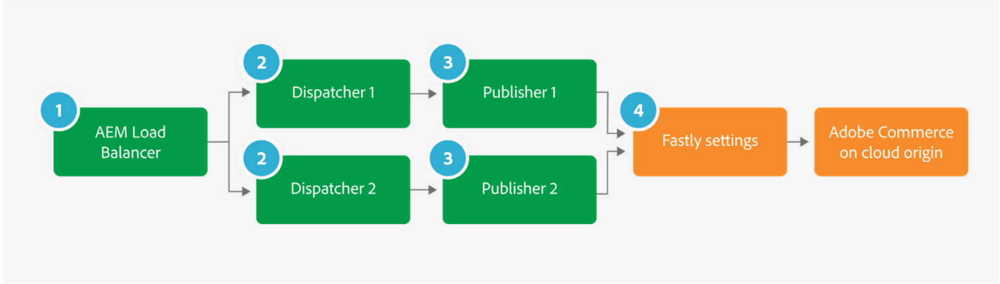
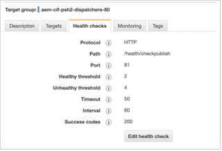
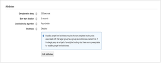
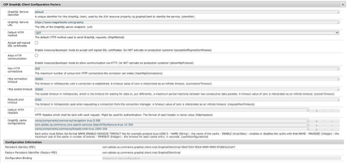
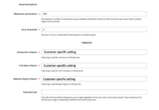

# Infrastructure alignments (timeouts and connection limits)

There are settings with AEM and Adobe Commerce and surrounding infrastructure such as load balancers which need alignment, these are related to connection limits and timeout settings.

A misalignment between these limits would mean that connections could end up being throttled at AEM side, whilst Adobe Commerce is capable of handling more connections. Similarly, for the timeout settings, a misalignment could mean timeout errors occur on AEM side, while Adobe Commerce is still processing a request.

For the timeout settings, the settings should be reviewed and aligned to prevent 503 timeout errors appearing when under load. There are several infrastructure and application timeout settings to review:

## AEM load balancer

Assuming there is an AWS application load balancer in the infrastructure and multiple dispatchers/publishers – the following settings should be considered for the load balancer:

1. Publisher health checks should be reviewed to prevent dispatchers dropping out of service unnecessarily early from load surges. The timeout settings of the load balancer health check should be aligned with the publisher timeout settings.

   

1. Dispatcher target group stickiness can be disabled, and Round Robin load balancing algorithm can be used. This is assuming there is no AEM specific functionality or AEM user sessions used that would require session stickiness to be set. It assumes that user login and session management is only on Adobe Commerce via GraphQL.

   

1. Please note if you do enable session stickiness, this may cause requests to Fastly not be cached, as by default, Fastly does not cache pages with the Set-Cookies header. Adobe Commerce sets cookies even on cacheable pages (TTL > 0), but the default Fastly VCL strips those cookies on cacheable pages in order for Fastly caching to work. If pages are not caching, check any custom cookies you may be using and also upload the Fastly VCL and recheck the site.

## Dispatcher timeout settings

The /timeout in the dispatcher “renders” options specifies the connection timeout accessing the AEM publish instance in milliseconds. This should be reviewed and the default setting of “0” (indefinite timeout) should be used if a separate load balancer is present to handle the timeout settings.

If there is no load balancer in the infrastructure, the timeout settings should instead be specified in the dispatcher /timeout settings, with a value that matches the GraphQL timeout settings in the publisher.

## Publishers

Publisher GraphQL connection limits and timeouts: Initially, the Max HTTP connections in Adobe Commerce CIF GraphQL Client Configuration Factory OSGI settings should be set to the default Fastly maximum connections limit, which is currently set to 200. Even if there are multiple publishers in the AEM farm, the limit should be set the same across each publisher, matching the Fastly setting. The reason for this is that in some cases, one publisher could be handling more traffic than the other publishers, if an associated dispatcher is taken out of the farm for example. This would mean that all traffic would be routed through the single remaining dispatcher and publishers, in this case the single publisher may then need all the HTTP connections.

The “Default HTTP method” should be set from POST to GET. Only GET requests are cached in Adobe Commerce GraphQL cache and so the default method should always be set to GET.

The http connection timeout and http socket timeout should be set to a value that matches the Fastly timeout.

The following image shows the Magento CIF GraphQL Client Configuration Factory. The settings shown here are examples only and need to be tuned on a case-by-case basis:

The following images shows the Fastly backend configurations. The settings shown here are examples only and need to be tuned on a case-by-case basis:

