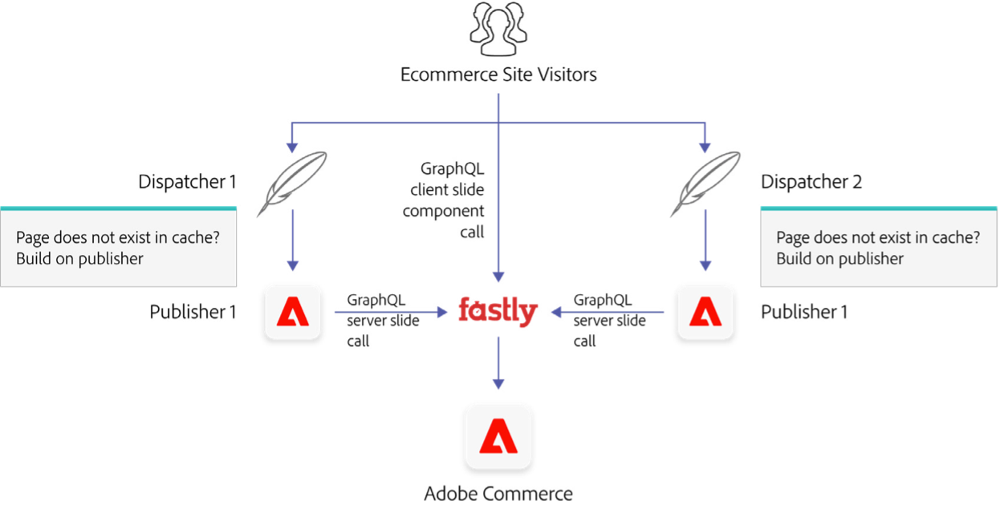
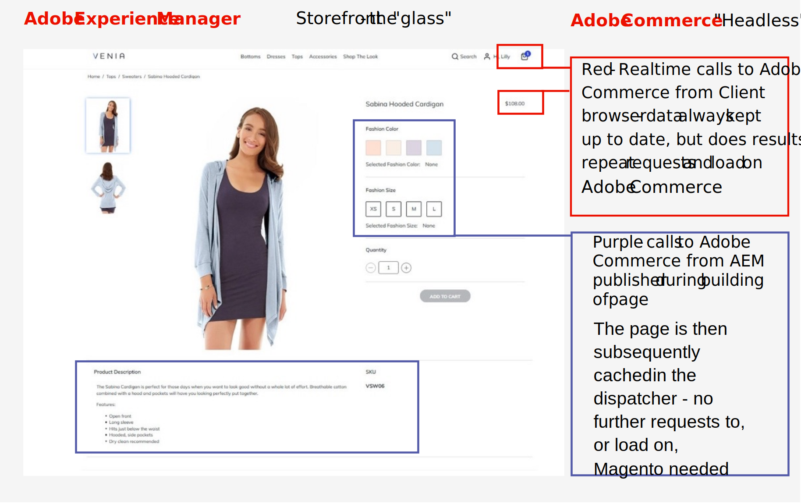

# Deliver experiences at scale with Adobe Commerce, Commerce Integration Framework, and Adobe Experience Manager

A recommended integration pattern between AEM and Adobe Commerce using CIF as a connector is for AEM to own the presentation layer (the “glass”) and Adobe Commerce to power the commerce backend as a “headless” backend. This integration approach leverages the strengths of each application: the authoring, personalisation, and omnichannel capabilities of AEM and ecommerce operations of Adobe Commerce.

In an AEM/CIF/Adobe Commerce environment, ecommerce site visitors will initially arrive at AEM. AEM will check if it has the requested page available in its dispatcher cache. If the page exists, this cached page will be served to the visitor, and no further processing is required. If the dispatcher does not contain the requested page, or it has expired, then the dispatcher requests the AEM publisher to build the page, with the publisher calling Adobe Commerce for ecommerce data to build the page if necessary. The built page is then passed to the dispatcher to serve to the visitor and is then cached preventing the need for further load to be placed onto the servers on subsequent requests to the same page from other visitors.

A combination of server-side rendering, and client-side rendering can be used in the AEM/CIF/Adobe Commerce model: Server-side rendering to deliver static content and client-side rendering to deliver frequently changing or personal dynamic content by directly calling Adobe Commerce for specific components
from within the user’s browser.

An example of the different components in a Product Detail Page on an example AEM ecommerce storefront can be seen in the example below:

## Server-side rendering

Ecommerce pages such as product detail pages (PDPs) and product listing pages (PLPs) are unlikely to change frequently and are suited to be fully cached after being rendered server-side using AEM CIF Core Components. The pages should be rendered on the AEM publisher using generic templates created in AEM. These components get data from Adobe Commerce via GraphQL APIs. These pages are created dynamically, rendered on the server, cached on the AEM dispatcher and then delivered to the browser. Examples of this are shown in the purple boxes in the example above.

## Client-side rendering

Where more dynamic attributes such as stock levels/availability or price are displayed, for example on Product Detail Pages (PDP’s), client-side components can be used. Whilst the template page can be built and cached on the dispatcher using the server-side rendering approach above, within the static page itself there can be dynamic client-side web components. These dynamic components can fetch data directly in the client’s browser from Adobe Commerce via GraphQL APIs to check, for example, current price or stock level in real time on the PDP. This ensures that content that is usually critical to be shown in real time is always fetched on page load. Examples of this are shown in the red boxes in the example above.

A combination of AEM templates and client-side rendering can also be used during the checkout process: client-side cart components render the shopping cart, checkout form and integration with the payment service provider. This hybrid approach can also be used for Adobe Commerce’s account management functionality such as create account, signing into account, and forgotten password.
