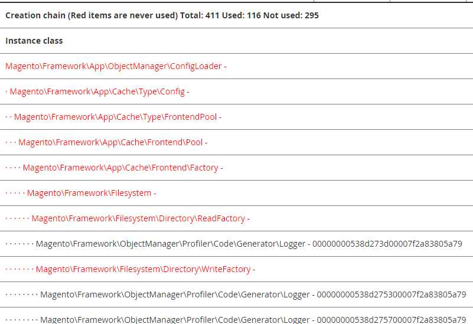

# Enable profiling

With Commerce profiling, you can:

- Enable a built-in profiler.

  You can use a built-in profiler with Commerce to perform tasks such as analyzing performance. The nature of profiling depends on the analytical tools that you use. We support multiple formats, including HTML. When you enable the profiler, a `var/profiler.flag` file generates indicating the profiler is enabled and configurations. When disabled, this file is deleted.

- Display dependency graphs on a Commerce page.

  A _dependency graph_ is a list of object dependencies and all of their dependencies, and all the dependencies for those dependencies, and so on.

  You should be particularly interested in the list of _unused dependencies_, which are objects that were created because they were requested in some constructor, but were never used (that is, none of their methods were called). As a result, processor time and memory spent to create these dependencies are wasted.

Commerce provides the base functionality in [`Magento\Framework\Profiler`](https://github.com/magento/magento2/blob/2.4.8/lib/internal/Magento/Framework/Profiler.php).

You can enable and configure the profiler using a MAGE_PROFILER variable or the command line.

## Set MAGE_PROFILER

You can set the value of `MAGE_PROFILER` in any of the ways discussed in [Set the value of bootstrap parameters](../bootstrap/set-parameters.md).

`MAGE_PROFILER` supports the following values:

- `1` to enable a specific profiler's output.

  You can use one of the following values to enable a specific profiler:

  - `csvfile` which uses [`Magento\Framework\Profiler\Driver\Standard\Output\Csvfile`](https://github.com/magento/magento2/blob/2.4.8/lib/internal/Magento/Framework/Profiler/Driver/Standard/Output/Csvfile.php)
  - Any other value (except `2`), including an empty value, which uses [`Magento\Framework\Profiler\Driver\Standard\Output\Html`](https://github.com/magento/magento2/blob/2.4.8/lib/internal/Magento/Framework/Profiler/Driver/Standard/Output/Html.php)

- `2` to enable dependency graphs.

  Dependency graphs typically display at the bottom of a page. The following figure shows portion of the output:

  

## CLI commands

You can enable or disable the profiler using CLI commands:

- `dev:profiler:enable <type>` enables the profiler with `type` of `html` (default) or `csvfile`. When enabled, a flagfile `var/profiler.flag` is created.
- `dev:profiler:disable` disables the profiler. When disabled, the flagfile `var/profiler.flag` is removed.

To enable dependency graphs, use the variable option.

**To enable or disable the profiler**:

1. Log in to your Commerce server.
1. Change to your Commerce installation directory.
1. As the file system owner, enable the profiler:

   To enable the profiler using type `html` and create a flagfile:

   ```bash
   bin/magento dev:profiler:enable html
   ```

   To enable the profiler using type `csvfile` and create a flagfile:

   ```bash
   bin/magento dev:profiler:enable csvfile
   ```

   The output is saved to `<project-root>/var/log/profiler.csv`. The `profiler.csv` is overridden on each page refresh.

   To disable the profiler and remove the flagfile:

   ```bash
   bin/magento dev:profiler:disable
   ```

