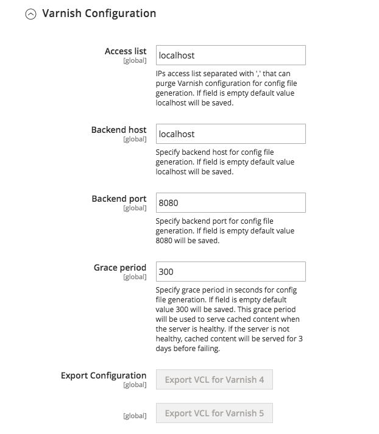

# Configure the Commerce application to use Varnish

To configure Magento to use Varnish:

1. Log in to the [Admin](https://glossary.magento.com/magento-admin) as an administrator.
1. Click **[!UICONTROL Stores]** > Settings > **Configuration** > **Advanced** > **System** > **Full Page Cache**.
1. From the **[!UICONTROL Caching Application]** list, click **Varnish Caching**.
1. Enter a value in the **[!UICONTROL TTL for public content]** field.
1. Expand **[!UICONTROL Varnish Configuration]** and enter the following information:
   
   Field | Description
   ------|------------
   Access list | Enter the fully qualified hostname, IP address, or [Classless Inter-domain Routing (CIDR)](https://www.digitalocean.com/community/tutorials/understanding-ip-addresses-subnets-and-cidr-notation-for-networking) notation IP address range for which to invalidate content. See [Varnish cache Purging](https://varnish-cache.org/docs/3.0/tutorial/purging.html).
   Backend host | Enter the fully qualified hostname or IP address and listen port of the Varnish _backend_ or _origin server_; that is, the server providing the content Varnish will accelerate. Typically, this is your web server. See [Varnish cache Backend servers](https://www.varnish-cache.org/docs/trunk/users-guide/vcl-backends.html).
   Backend port | Origin server's listen port.
   Grace period | The grace period determines how long Varnish serves stale content if the backend is not responsive. The default value is 300 seconds.

1. Click **Save Config**.

You can also activate Varnish from the command line--instead of logging in to the Admin—using the Magento command-line interface tool:

```bash
bin/magento config:set --scope=default --scope-code=0 system/full_page_cache/caching_application 2
```

## Export a Varnish configuration file

To export a Varnish configuration file from the Admin panel:

1. Click one of the export buttons to create a `varnish.vcl` you can use with Varnish.

   For example, if you have Varnish 4, click **Export VCL for Varnish 4**

   The following figure shows an example:

   

1. Back up your existing `default.vcl`. Then rename the `varnish.vcl` file you just exported to `default.vcl`. Then copy the file to the `/etc/varnish/` directory.

   ```bash
   cp /etc/varnish/default.vcl /etc/varnish/default.vcl.bak2
   ```

   ```bash
   mv <download_directory>/varnish.vcl default.vcl
   ```

   ```bash
   cp <download_directory>/default.vcl /etc/varnish/default.vcl
   ```

1. Adobe recommend you open `default.vcl` and change the value of `acl purge` to the IP address of the Varnish host. (You can specify multiple hosts on separate lines or you can use CIDR notation as well.)

   For example,

   ```conf
    acl purge {
       "localhost";
    }
   ```

1. If you want to customize the Vagrant health checks or grace mode or saint mode configuration, see [Advanced Varnish configuration]({{ page.baseurl }}/config-guide/varnish/config-varnish-advanced.html).

1. Restart Varnish and your web server:

   ```bash
   service varnish restart
   ```

   ```bash
   service httpd restart
   ```

## Cache Static Files

Static files should not be cached by default, but if you want to cache them, you can edit the section `Static files caching` in the VCL to have the following content:

```conf
# Static files should not be cached by default
  return (pass);

# But if you use a few locales and don't use CDN you can enable caching static files by commenting previous line (#return (pass);) and uncommenting next 3 lines
  #unset req.http.Https;
  #unset req.http./* {{ ssl_offloaded_header }} */;
  #unset req.http.Cookie;
```

You must make these changes before you configure Magento to use Varnish.
