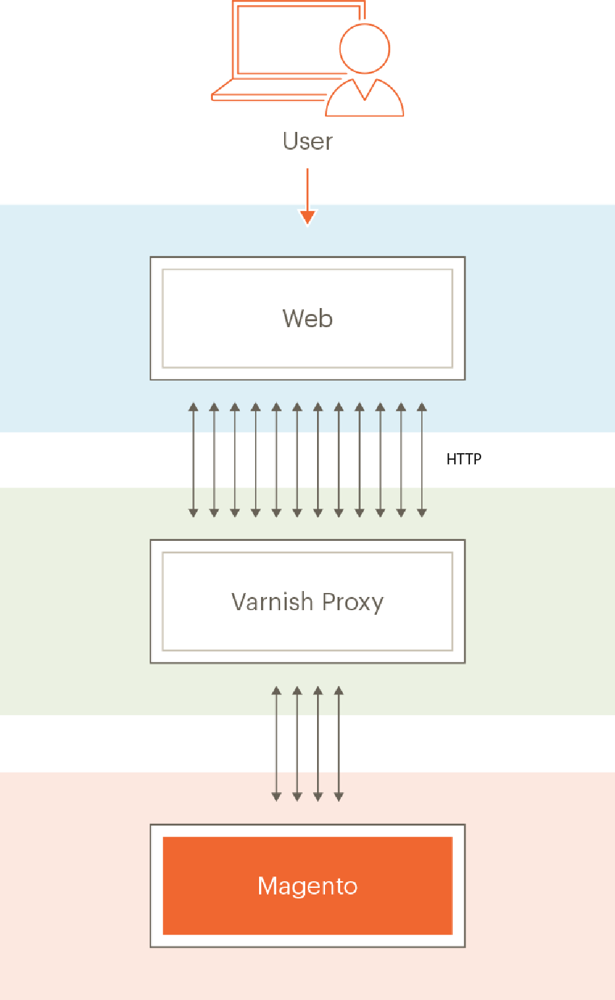
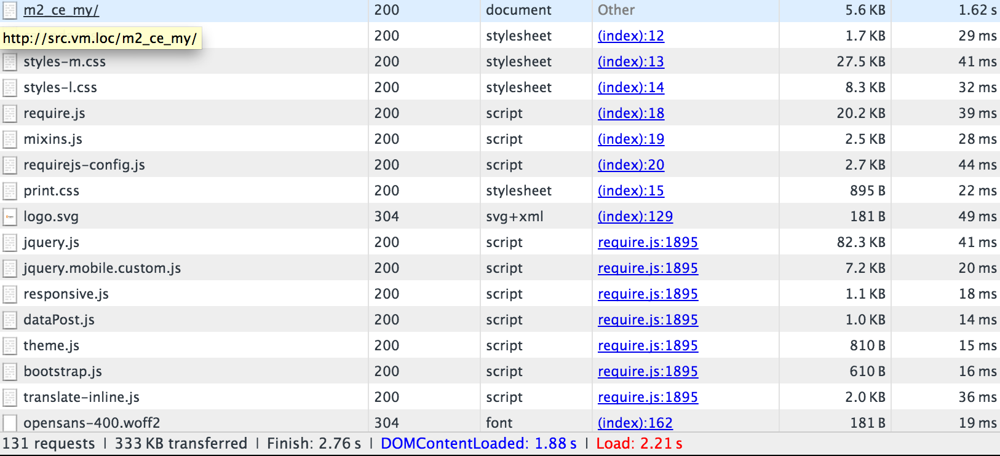
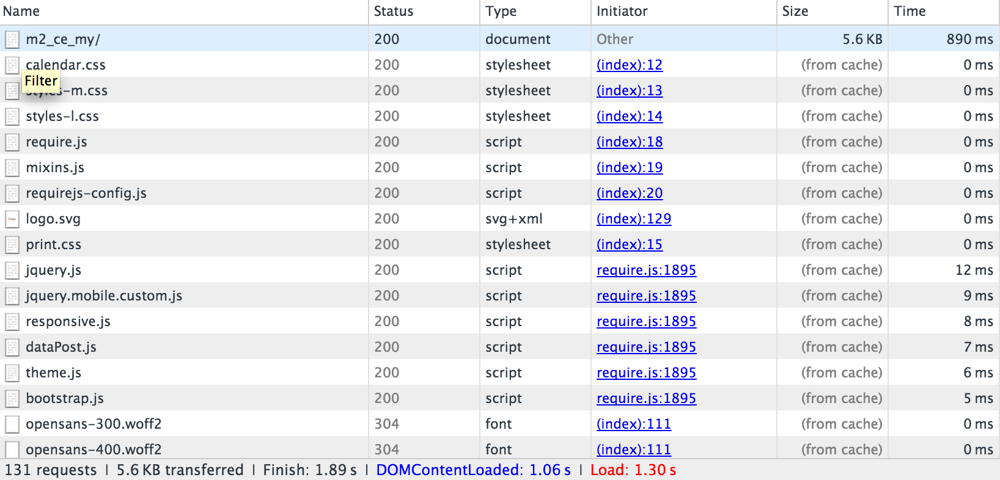
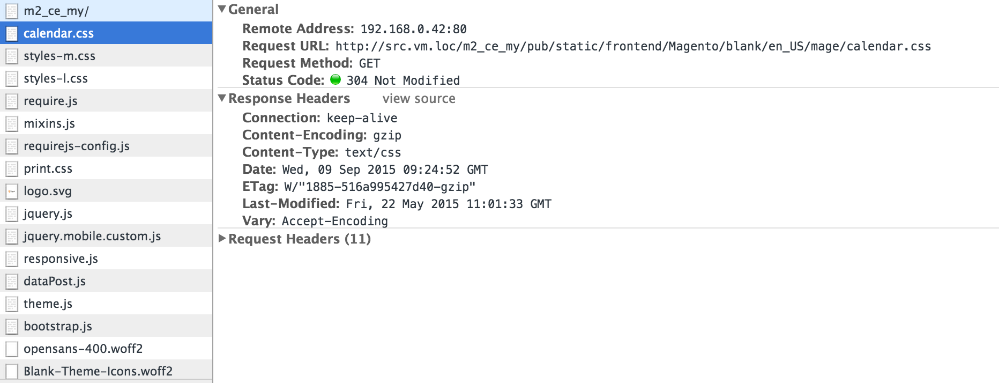
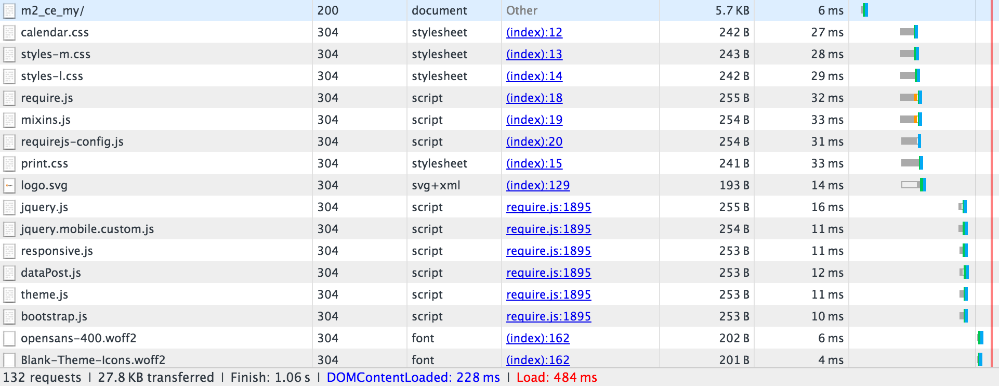

# Configure Varnish

[Varnish Cache](https://varnish-cache.org) is an open-source web application accelerator (also referred to as an _HTTP accelerator_ or _caching HTTP reverse proxy_). Varnish stores (or caches) files or fragments of files in memory, which enables Varnish to reduce the response time and network bandwidth consumption on future, equivalent requests. Unlike web servers like Apache and nginx, Varnish was designed for use exclusively with the HTTP protocol.

[System requirements](../../installation/system-requirements.md) lists the supported versions of Varnish.

>[!WARNING]
>
>We _strongly recommend_ you use Varnish in production. The built-in full-page caching—to either the file system or [database](https://developer.adobe.com/commerce/php/development/cache/partial/database-caching/)—is much slower than Varnish, and Varnish is designed to accelerate HTTP traffic.

For more information about Varnish, see:

- [The Big Varnish Picture](https://www.varnish-cache.org/docs/trunk/users-guide/intro.html)
- [Varnish startup options](https://www.varnish-cache.org/docs/trunk/reference/varnishd.html#ref-varnishd-options)
- [Varnish and Website Performance](https://www.varnish-cache.org/docs/trunk/users-guide/performance.html#users-performance)

## Varnish topology diagram

The following figure shows a basic view of Varnish in your Commerce topology.



In the preceding figure, users' HTTP requests over the internet result in numerous requests for CSS, HTML, JavaScript, and images (referred to collectively as _assets_). Varnish sits in front of the web server and proxies these requests to the web server.

As the web server returns assets, cacheable assets are stored in Varnish. Any subsequent requests for those assets are fulfilled by Varnish (meaning, the requests do not reach the web server). Varnish returns cached content extremely quickly. The results are faster response times to return the content to users and a reduced number of requests that must be fulfilled by Commerce.

Assets cached by Varnish expire at a configurable interval or are replaced by newer versions of the same assets. You can also clear the cache manually either using the Admin or the [`magento cache:clean`](../cli/manage-cache.md#clean-and-flush-cache-types) command.

## Process overview

This topic discusses how to initially install Varnish with a minimal set of parameters and test that it works. Then export a Varnish configuration from the Commerce Admin and test it again.

The process can be summarized as follows:

1. Install Varnish and test it by accessing any Commerce page to see if you are getting HTTP response headers that indicate Varnish is working.
1. Install the Commerce software and use the Admin to create a Varnish configuration file.
1. Replace your existing Varnish configuration file with the one generated by the Admin.
1. Test everything again.

   If there is nothing in your `<magento_root>/var/page_cache` directory, you have successfully configured Varnish with Commerce!

>[!NOTE]
>
>- Except where noted, you must enter all commands discussed in this topic as a user with `root` privileges.
>
>- This topic is written for Varnish on CentOS and Apache 2.4. If you are setting up Varnish in a different environment, some commands may be different. Consult Varnish documentation for more information.

## Known issues

We know of the following issues with Varnish:

- [Varnish does not support SSL](https://www.varnish-cache.org/docs/3.0/phk/ssl.html)

   As an alternative, use SSL termination or an SSL termination proxy.

- If you manually delete the contents of the `<magento_root>/var/cache` directory, you must restart Varnish.

- Possible error installing Commerce:

   ```
   Error 503 Service Unavailable
   Service Unavailable
   XID: 303394517
   Varnish cache server
   ```

   If you experience this error, edit `default.vcl` and add a timeout to the `backend` stanza as follows:

   ```conf
   backend default {
       .host = "127.0.0.1";
       .port = "8080";
       .first_byte_timeout = 600s;
   }
   ```

## Overview of Varnish caching

Varnish caching works with Commerce using:

- [`nginx.conf.sample`](https://github.com/magento/magento2/blob/2.4/nginx.conf.sample) from the Magento 2 GitHub repository
- `.htaccess` distributed configuration file for Apache provided with Commerce
- `default.vcl` configuration for Varnish generated using the [Admin](../cache/configure-varnish-commerce.md)

>[!INFO]
>
>This topic covers only the default options in the preceding list. There are many other ways to configure caching in complex scenarios (for example, using a Content Delivery Network); those methods are beyond the scope of this guide.

On the first browser request, cacheable assets are delivered to the client browser from Varnish and cached on the browser.

In addition, Varnish uses an Entity Tag (ETag) for static assets. The ETag provides a way to determine when static files change on the server. As a result, static assets are sent to the client when they change on the server---either on a new request from a browser or when the client refreshes the browser cache, typically by pressing F5 or Control+F5.

More detail is provided in the sections that follow.

## Caching by browser request

This section uses a browser inspector to show how assets are delivered to the browser in the first request and afterward loaded from the local browser cache.

### First browser request

`nginx.conf.sample` and `.htaccess` provide options for client caching. When the first request is made from a browser for a cacheable object, Varnish delivers it to the client.

The following figure shows an example using a browser inspector:



The preceding example shows a request for the storefront main page (`m2_ce_my`). CSS and JavaScript assets are cached on the client browser.

>[!NOTE]
>
>Most static assets have an HTTP 200 (OK) status code, indicating the asset was retrieved from the server.

### Second browser request

If the same browser requests the same page again, these assets are delivered from the local browser cache, as the following figure shows.



Note the difference in response time between the first and second request. Again, static assets have a 200 (OK) response code because they are delivered from local cache for the first time.

## How Commerce uses Etag

The following example shows response headers for a particular static asset.



`calendar.css` has an ETag response header which means the CSS file on the client browser can be compared to the one on the server.

In addition, static assets are returned with a 304 (Not Modified) HTTP status code, as the following figure shows.



The 304 status code occurs because the user invalidated their local cache and the content on the server did not change. Because of the 304 status code, the static asset _content_ is not transferred; only HTTP headers are downloaded to the browser.

If the content changes on the server, the client downloads the static asset with an HTTP 200 (OK) status code and a new ETag.

