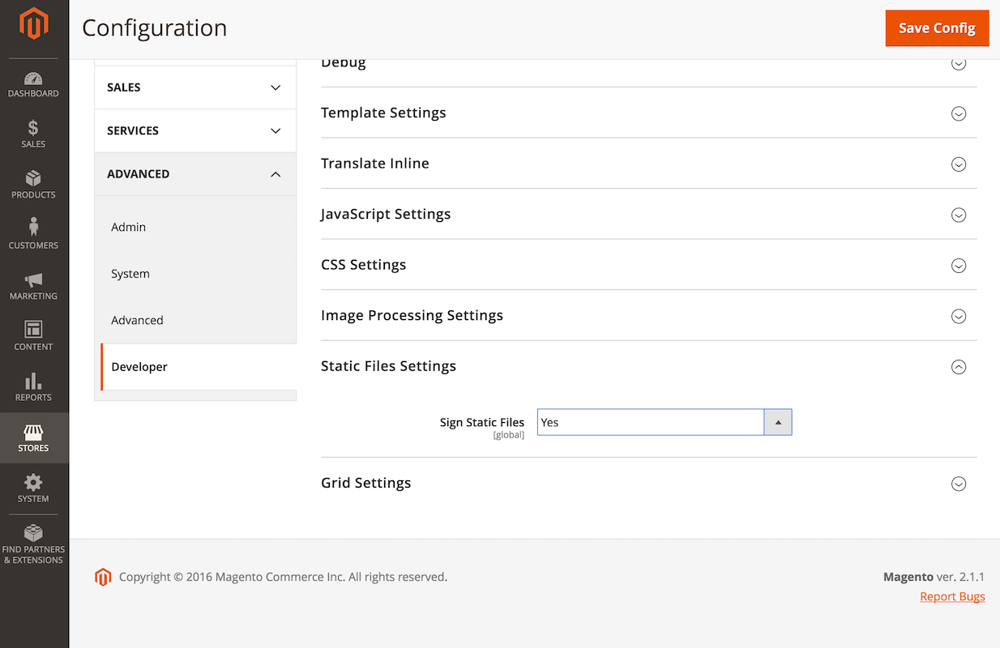

# Static content cache

To improve performance, Commerce sets the `Expires` headers for static resources, such as images, JavaScript, and CSS files.
Setting the `Expires` header on a static resource tells the browser to cache the resource at that URL and serve the cached version until it expires.
This is a common [best practice](https://developer.yahoo.com/performance/rules.html#expires=) for caching static resources.

When the browser caches a static resource and that resource changes on the server, you must clear the browser cache so it can download the new version.
Manually clearing the browser cache works if you are a website administrator, but this is not an appropriate request to make of your users when you want them to download new versions of a static resource.

## Static content signing

Static content signing is a Commerce feature that allows you to invalidate the browser cache for static resources.
Commerce accomplishes this by adding a deployment version to the URL of static files.

The following is an example of a URL signed with a version:

```
http://magento2.com/pub/static/version1475604434/frontend/Magento/luma/en_US/images/logo.svg
```

When you run the command [`setup:static-content:deploy`](../cli/static-view-file-deployment.md) to deploy static content, Commerce automatically changes the deployment version.
This changes the URL of the static files and forces the browser to load the new version of the files.

Commerce enables this feature by default, and Adobe recommends keeping this feature enabled to prevent issues related to browsers serving up old static resources.

The configuration for static content signing is in [**[!UICONTROL Stores]** > Settings > Configuration > **[!UICONTROL Advanced]** > **[!UICONTROL Developer]** > **[!UICONTROL Static Files Settings]**](https://experienceleague.adobe.com/en/docs/commerce-admin/systems/tools/developer-tools#static-file-signatures).

- **On-Premises only**: This configuration is available if your site is **not** in [Production mode](https://experienceleague.adobe.com/docs/commerce-operations/configuration-guide/setup/application-modes.html#production-mode).
- **Cloud**: This configuration is hidden because Production mode is strictly enforced; therefore, you must use the command line as shown below.



Determine the status:

```bash
bin/magento config:show dev/static/sign
```

Enable or disable static content signing:

```bash
bin/magento config:set dev/static/sign <value>
```

Where `<value>` is 1 (enabled) or 0 (disabled).

## Version signatures

Commerce appends the version signature as a path component directly after the base URL of static view files to preserve the integrity of relative URLs across static resources.
This also forces the browser to resolve a relative URL to the correct signed source while keeping its content independent of the presence/absence of the signature value.

When a browser requests a signed source from the server, the server uses URL rewrites to strip the signature component from the URL.

## Usage during deployments

After upgrading or modifying static resources, you must run the `setup:static-content:deploy` command to deploy the version and update the static contents, which forces the browser to load the updated resources.

If you deploy code on a separate server and move it to production using a code repository to reduce downtime, you also must add the file `pub/static/deployed_version.txt` to the repository.
This file contains the new version for the deployed static content.
