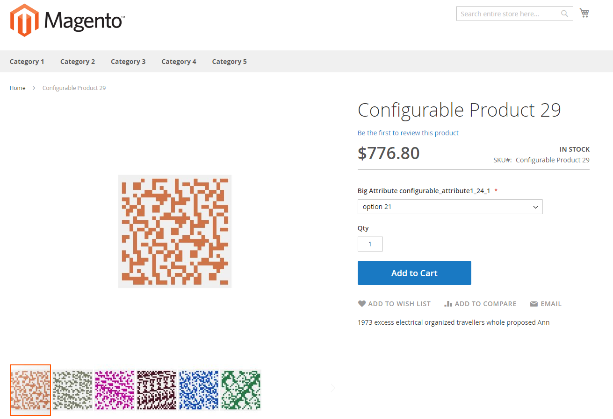

# Performance testing data

## Profiles

You can adjust the amount of data you create using _profiles_ (small, medium, large, and extra large). Profiles are located in the `<magento_root>/setup/performance-toolkit/profiles/<ce|ee>` directory.

For example, `/var/www/html/magento2/setup/performance-toolkit/profiles/ce`

The following figure shows how a product is displayed on the storefront using the _small_ profile:



The following table provides details about the data generator profiles: small, medium, large, and extra large.

| Parameter | Small profile | Medium profile | Medium multi-site profile | Large profile | Extra large profile |
| --- | --- | --- | --- | --- | --- |
| `websites` | 1 | 3 | 25 | 5 | 5 |
| `store_groups` | 1 | 3 | 25 | 5 | 5 |
| `store_views` | 1 | 3 | 50 | 5 | 5 |
| `simple_products` | 800 | 24,000 | 4,000 | 300,000 | 600,000 |
| `configurable_products` | 16 with 24 options | 640 with 24 options | 800 with 24 options & 79 with 200 options | 8,000 with 24 options | 16,000 with 24 options |
| `product_images` | 100 images / 3 images per product | 1000 images / 3 images per product | 1000 images / 3 images per product | 2000 images / 3 images per product | 2000 images / 3 images per product |
| `categories` | 30 | 300 | 100 | 3,000 | 6,000 |
| `categories_nesting_level` | 3 | 3 | 3 | 5 | 5 |
| `catalog_price_rules` | 20 | 20 | 20 | 20 | 20 |
| `catalog_target_rules` | 5 | 5 | 5 | 5 | 5 |
| `cart_price_rules` | 20 | 20 | 20 | 20 | 20 |
| `cart_price_rules_floor` | 2 | 2 | 2 | 2 | 2 |
| `customers` | 200 | 2,000 | 2,000 | 5,000 | 10,000 |
| `tax rates` | 130 | 40,000 | 40,000 | 40,000 | 40,000 |
| `orders` | 80 | 50,000 | 50,000 | 100,000 | 150,000 |

### Run the data generator

{{file-system-owner}}

>[!WARNING]
>
>Before running the data generator, disable all cron jobs running on the server. Disabling cron jobs prevents the data generator from performing actions that conflict with active cron jobs and avoids unnecessary errors.
>
>If you intend to implement eventing with [!DNL Adobe I/O Events for Adobe Commerce] while testing performance, run this command before subscribing [events](https://developer.adobe.com/commerce/extensibility/events/). Subscribing events first can cause errors.

Run the command as discussed in this section. After the command runs, you must [reindex all indexers](../cli/manage-indexers.md).

Command options:

```bash
bin/magento setup:perf:generate-fixtures <path-to-profile>
```

Where `<path-to-profile>` specifies the absolute file system path to, and name of, a profile.

For example,

```bash
bin/magento setup:perf:generate-fixtures /var/www/html/magento2/setup/performance-toolkit/profiles/ce/small.xml
```

Sample output for the small profile:

```
Generating profile with following params:
    |- Websites: 1
    |- Store Groups Count: 1
    |- Store Views Count: 1
    |- Categories: 30
    |- Attribute Sets (Default): 3
    |- Attribute Sets (Extra): 10
    |- Simple products: 800
    |- Configurable products: 0
    |--- 5 products for attribute set "Attribute Set 1"
    |--- 5 products for attribute set "Attribute Set 2"
    |--- 5 products for attribute set "Attribute Set 3"
    |--- 40 products for attribute set "Dynamic Attribute Set 1-24"
    |- Product images: 100, 3 per product
    |- Customers: 200
    |- Cart Price Rules: 20
    |- Catalog Price Rules: 20
    |- Catalog Target Rules: 5
    |- Orders: 80
Generating websites, stores and store views...  done in <time>
Generating categories...  done in <time>
Generating attribute sets...  done in <time>
Generating simple products...  done in <time>
... more ...
```

## Performance fixtures

### Admin users

Generates admin users. XML profile node:

```xml
<!-- Number of admin users -->
<admin_users>{int}</admin_users>
```

### Attribute sets

Generates attribute sets with specified configuration. XML profile node:

```xml
<!-- Number of product attribute sets -->
<product_attribute_sets>{int}</product_attribute_sets>

<!-- Number of attributes per set -->
<product_attribute_sets_attributes>{int}</product_attribute_sets_attributes>

<!-- Number of values per attribute -->
<product_attribute_sets_attributes_values>{int}</product_attribute_sets_attributes_values>
```

### Bundle products

Generates bundle products. Generated bundle selections are not displayed individually in the catalog. Products are uniformly distributed per categories and websites. If  `assign_entities_to_all_websites` from the profile is set to `1`. Products are assigned to all websites.

XML profile node:

```xml
<!-- Number of products -->
<bundle_products>{int}</bundle_products>

<!-- Number of options per each product -->
<bundle_products_options>{int}</bundle_products_options>

<!-- Number of simple products per each option -->
<bundle_products_variation>{int}</bundle_products_variation>
```

### Cart price rules

Generates cart price rules. XML profile node:

```xml
<!-- Number of cart price rules -->
<cart_price_rules>{int}</cart_price_rules>

<!-- Number of conditions per rule -->
<cart_price_rules_floor>{int}</cart_price_rules_floor>
```

### Catalog price rules

Generates catalog price rules. XML profile node:

```xml
<!-- Number of catalog price rules -->
<catalog_price_rules>{int}</catalog_price_rules>
```

### Categories

Generates categories. If `assign_entities_to_all_websites` is set to `0`, all categories are uniformly distributed per root categories; otherwise, all categories are assigned to one root category.

XML profile node:

```xml
<!-- Number of categories to generate -->
<categories>{int}</categories>

<!-- Nesting level of categories -->
<categories_nesting_level>{int}</categories_nesting_level>
```

### Configs

Sets values for config fields. XML profile node:

```xml
<!-- Config variables and values for change -->
<configs>
    <config>
        <path>{string}</path> <!-- e.g. admin/security/use_form_key -->
        <scope>{string}</scope> <!-- e.g. default -->
        <scopeId>{int}</scopeId>
        <value>{int|string}</value>
    </config>

    <!-- ... more entries ... -->
</configs>
```

### Configurable products

Generates Configurable products. Generated configurable options are not displayed individually in the catalog. Products are uniformly distributed per categories and websites. If `assign_entities_to_all_websites` is set to `1`, products are assigned to all websites.

The following XML node formats are supported:

- Distribution per Default and pre-defined attribute sets:

  ```xml
  <!-- Number of configurable products -->
  <configurable_products>{int}</configurable_products>
  ```

- Generate products based on an existing attribute set:

    ```xml
    <configurable_products>

        <config>
                <!-- Existing attribute set name -->
                <attributeSet>{string}</attributeSet>

                <!-- Configurable sku pattern with %s -->
                <sku>{string}</sku>

                <!-- Number of configurable products -->
                <products>{int}</products>

                <!-- Category Name. Optional. By default category name from Categories fixture will be used -->
                <category>[{string}]</category>

                <!-- Type of Swatch attribute e.g. color|image -->
                <swatches>{string}</swatches>
        </config>

    <!-- ... more entries ... -->
    </configurable_products>
    ```

- Generate products based on a dynamically created attribute set with a specified number of attributes and options:

    ```xml
    <configurable_products>

        <config>
            <!-- Number of attributes in configurable product -->
            <attributes>{int}</attributes>

            <!-- Number of options per attribute -->
            <options>{int}</options>

            <!-- Configurable sku pattern with %s -->
            <sku>{string}</sku>

            <!-- Number of configurable products -->
            <products>{int}</products>

            <!-- Category Name. Optional. By default category name from Categories fixture will be used -->
            <category>[{string}]</category>

            <!-- Type of Swatch attribute e.g. color|image -->
            <swatches>{string}</swatches>
        </config>

        <!-- ... more entries ... -->
    </configurable_products>
    ```

- Generate products based on a dynamically created attribute set with a specified configuration per each attribute:

    ```xml
    <configurable_products>

        <config>
            <attributes>
                <!-- Configuration for a first attribute -->
                <attribute>
                    <!-- Amount of options per attribute -->
                    <options>{int}</options>

                    <!-- Type of Swatch attribute -->
                    <swatches>{string}</swatches>
                </attribute>

                <!-- Configuration for a second attribute -->
                <attribute>
                    <!-- Amount of options per attribute -->
                    <options>{int}</options>
                </attribute>
            </attributes>

            <!-- Configurable sku pattern with %s -->
            <sku>{string}</sku>

            <!-- Number of configurable products -->
            <products>{int}</products>

            <!-- Category Name. Optional. By default, the category name from Categories fixture will be used -->
            <category>[{string}]</category>
        </config>

        <!-- ... more entries ... -->
    </configurable_products>
    ```

### Customers

Generates customers. Customers have a normal distribution on all available websites. Each customer has the same data except customer email, customer group, and customer addresses.

XML profile node:

```xml
<!-- Number of customers to generate -->
<customers>{int}</customers>
```

You can use the following XML to change the customer configuration:

```xml
<customer-config>
    <!-- Number of addresses per each customer -->
    <addresses-count>{int}</addresses-count>
</customer-config>
```

### Product images

Generates product images. Generation does not include resizing.

XML profile node:

```xml
<product-images>
    <!-- Number of images to generate -->
    <images-count>{int}</images-count>

    <!-- Number of images to be assigned per each product -->
    <images-per-product>{int}</images-per-product>
</product-images>
```

### Indexers state

Updates indexers' state. XML profile node:

```xml
<indexer>
    <!-- Name of indexer (e.g. catalogrule_product) -->
    <id>{string}</id>
    <set_scheduled>{bool}</set_scheduled>
</indexer>
```

### Orders

Generates orders with configurable number of different types of order items. Optionally generates inactive quotes for generated orders.

XML profile node:

```xml
<!-- It is necessary to enable quotes for orders -->
<order_quotes_enable>{bool}</order_quotes_enable>

<!-- Min number of simple products per each order -->
<order_simple_product_count_from>{int}</order_simple_product_count_from>

<!-- Max number of simple products per each order -->
<order_simple_product_count_to>{int}</order_simple_product_count_to>

<!-- Min number of configurable products per each order -->
<order_configurable_product_count_from>{int}</order_configurable_product_count_from>

<!-- Max number of configurable products per each order -->
<order_configurable_product_count_to>{int}</order_configurable_product_count_to>

<!-- Min number of big configurable products (with big amount of options) per each order -->
<order_big_configurable_product_count_from>{int}</order_big_configurable_product_count_from>

<!-- Max number of big configurable products (with big amount of options) per each order -->
<order_big_configurable_product_count_to>{int}</order_big_configurable_product_count_to>

<!-- Number of orders to generate -->
<orders>{int}</orders>
```

### Simple products

Generates simple products. Products are distributed per default and pre-defined attribute sets. If extra attribute sets are specified in profile as: `<product_attribute_sets>{int}</product_attribute_sets>`, products are also distributed per additional attribute sets.

Products are uniformly distributed per categories and websites. If `assign_entities_to_all_websites` is set to `1`, products are assigned to all websites.

XML profile node:

```xml
<!-- Number of simple products to generate -->
<simple_products>{int}</simple_products>
```

### Websites

Generates websites. XML profile node:

```xml
<!-- Number of websites to be generated -->
<websites>{int}</websites>
```

### Store groups

Generates store groups (referred to in the Admin as _stores_). Store groups are distributed normally among websites.

XML profile node:

```xml
<!-- Number of store groups to be generated -->
<store_groups>{int}</store_groups>
```

### Store views

Generates store views. Store views are distributed normally among store groups. XML profile node:

```xml
<!-- Number of store views to be generated -->
<store_views>{int}</store_views>

<!-- 1 means that all stores will have the same root category, 0 means that all stores will have unique root category -->
<assign_entities_to_all_websites>{0|1}<assign_entities_to_all_websites/>
```

### Tax rates

Generates tax rates. XML profile node:

```xml
<!-- Accepts name of CSV file with tax rates (<path to Commerce folder>/setup/src/Magento/Setup/Fixtures/_files) -->
<tax_rates_file>{CSV file name}</tax_rates_file>
```

## Additional configuration information:

- `<Commerce root dir>/setup/performance-toolkit/config/attributeSets.xml`---Default attribute sets

- `<Commerce root dir>/setup/performance-toolkit/config/customerConfig.xml`---Customer configuration

- `<Commerce root dir>/setup/performance-toolkit/config/description.xml`---Product full description configuration

- `<Commerce root dir>/setup/performance-toolkit/config/shortDescription.xml`---Product short description configuration

- `<Commerce root dir>/setup/performance-toolkit/config/searchConfig.xml`---Configuration for product short and full description. This older implementation is provided for backward compatibility.

- `<Commerce root dir>/setup/performance-toolkit/config/searchTerms.xml`---Small number of search terms to in short and full descriptions

- `<Commerce root dir>/setup/performance-toolkit/config/searchTermsLarge.xml`---Larger number of search terms to use in short and full description.
