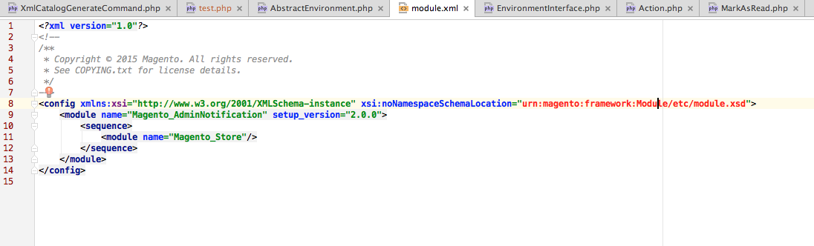
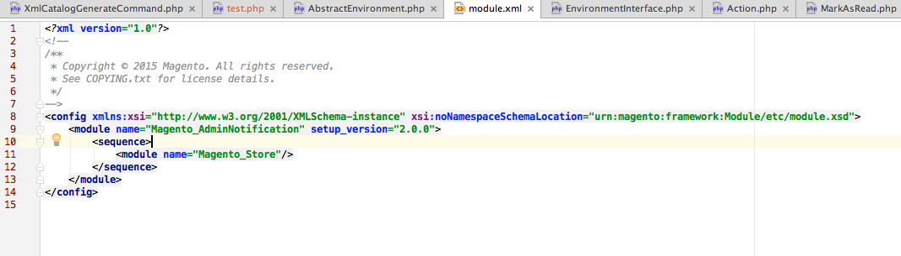
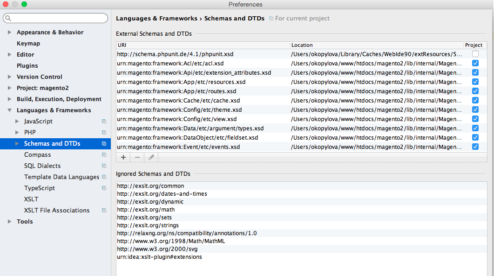

# Overview of URN highlighter

{{file-system-owner}}

Commerce code references all XSD schemas as [Uniform Resource Names (URNs)](https://www.ietf.org/rfc/rfc2141.txt). If you are developing code and need to reference XSDs, this command configures your integrated developer environment (IDE) to recognize and highlight URNs. This makes development easier.

By default, an IDE like PhpStorm is not configured to recognize URNs and, as a result, they display in red text as follows:



The `bin/magento dev:urn-catalog:generate` command enables your IDE (currently, only PhpStorm and Visual Studio Code) to recognize and highlight URNs like the following:



Specifically, this command creates the following PhpStorm configuration:



## Configure your IDE

Currently, only PhpStorm and Visual Studio Code are supported.

Command syntax:

```bash
bin/magento dev:urn-catalog:generate <path>
```

Where `<path>` is the path to your PhpStorm `misc.xml` file, which is located relative to your project root. Typically, `<path>` is `.idea/misc.xml`.

>[!INFO]
>
>To keep your "Schemas and DTDs" up do date, run the `dev:urn-catalog:generate` command every time you add, modify, or remove Commerce 2 modules containing `*.xsd` files.
