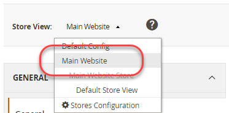
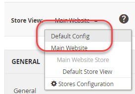
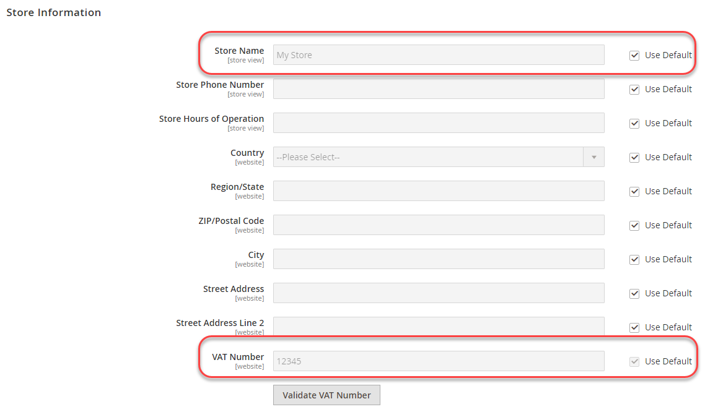
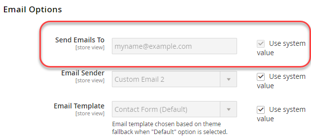
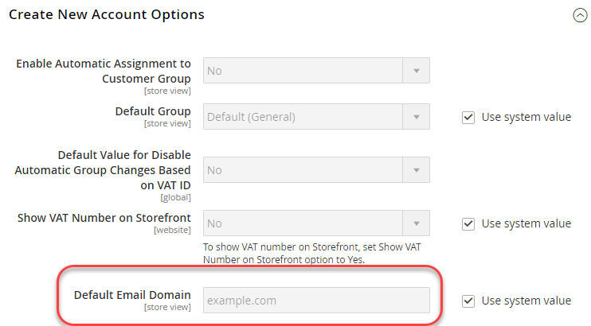

# Example using environment variables

This example shows how to set shared, system-specific, and sensitive values in your development system, then set all the values in your production system using a combination of the shared configuration, `config.php`, and PHP environment variables.

These configuration settings can be shared between the development and production systems:

VAT Number and Store Name from **Stores** > Settings > **Configuration** > General > **General**

These configuration settings are either system-specific or sensitive, as indicated:

- Send Emails To (sensitive) from **Stores** > Settings > **Configuration** > General > **Contacts**
- Default Email Domain (system-specific) from **Stores** > Settings > **Configuration** > Customers > **Customer Configuration** > **Create New Account Options**

You can use the same procedure to configure any settings in the following references:

- [Sensitive and system-specific configuration paths reference](../reference/config-reference-sens.md)
- [Payment configuration paths reference](../reference/config-reference-payment.md)
- [General configuration paths reference](../reference/config-reference-general.md)
- [Commerce Enterprise B2B Extension configuration paths reference](../reference/config-reference-b2b.md)

## Before you begin

Before you begin, set up file system permissions and ownership as discussed in [Prerequisite for development, build, and production systems](../deployment/prerequisites.md).

## Assumptions

This topic provides an example of modifying the production system configuration. You can choose different configuration options if you wish.

For the purposes of this example, we assume the following:

- You use Git source control
- The development system is available in a Git remote repository named `mconfig`
- Your Git working branch is named `m2.2_deploy`

## Step 1: Set the configuration in the development system

To set the default locale and weight units in your development system:

1. Log in to the Admin.
1. Click **Stores** > Settings > **Configuration** > General > **General**.
1. If you have more than one website available, use the **Store View** list in the upper left corner to switch to a different website as the following figure shows.

   

1. In the right pane, expand **Store Information**.
1. If necessary, clear the **Use Default** checkbox next to the **VAT Number** field.
1. Enter a number in the field (for example, `12345`).
1. In the **Store Name** field, enter a value (like `My Store`).
1. Click **Save Config**.
1. Use the **Store View** list to select the **Default Config** as the following figure shows.

   

1. In the left navigation, under General, click **Contacts**.
1. Clear the **Use Default** checkbox next to the **Send Emails To** field.
1. Enter an e-mail address in the field.
1. Click **Save Config**.
1. In the left pane, click Customers > **Customer Configuration**.
1. In the right pane, expand **Create New Account Options**.
1. Clear the **Use system value** checkbox next to the **Default Email Domain** field.
1. Enter a domain name in the field.
1. Click **Save Config**.
1. If prompted, flush the cache.

## Step 2: Update the configuration

Now that you have changed the configuration in the Admin, write the shared configuration to a file as discussed in this section.

{{$include /help/_includes/config-save-config.md}}

Note that even though `app/etc/env.php` (the system-specific configuration) was updated, do not check it in to source control. You will create the same configuration settings on your production system later in this procedure.

## Step 3: Update your build system and generate files

Now that you have committed your changes to the shared configuration to source control, you can pull those changes in your build system, compile code, and generate static files. The last step is to pull those changes to your production system.

{{$include /help/_includes/config-update-build-system.md}}

## Step 4: Update the production system

The last step in the process is to update your production system. You must do it in two parts:

- Update the sensitive and system-specific settings
- Update the shared settings

### Update the sensitive and system-specific settings

To set the sensitive and system-specific settings using environment variables, you must know the following:

- Scope for each setting

   If you followed the instructions in Step 1, the scope for Send Emails To is global (that is, the Default Config scope) and the scope for Default Email Domain is website.

   You must know the website's code to set the Default Email Domain configuration value. See [Use environment variables to override configuration settings](../reference/override-config-settings.md#environment-variables) for more information on finding it.

- Configuration path for each setting

   The configuration paths used in this example follow:

   | Setting name  | Configuration path |
   |--------------|--------------|
   | Send Emails To | `contact/email/recipient_email` |
   | Default Email Domain | `customer/create_account/email_domain` |

   You can find all sensitive and system-specific configuration paths in [Sensitive and system-specific configuration paths reference](../reference/config-reference-sens.md).

#### Convert configuration paths to variable names

As discussed in [Use environment variables to override configuration settings](../reference/override-config-settings.md#environment-variables), the format of variables is:

```text
<SCOPE>__<SYSTEM__VARIABLE__NAME>
```

The value of `<SCOPE>` is `CONFIG__DEFAULT__` for global scope or `CONFIG__WEBSITES__<WEBSITE CODE>` for website scope.

To find the value of `<SYSTEM__VARIABLE__NAME>`, replace each `/` character in the configuration path with two underscores.

The variable names follow:

| Name  | Config path | Variable name |
|--------------|--------------|--------------|
| Send Emails To | `contact/email/recipient_email` | `CONFIG__DEFAULT__CONTACT__EMAIL__RECIPIENT_EMAIL` |
| Default Email Domain | `customer/create_account/email_domain` | `CONFIG__WEBSITES__BASE__CUSTOMER__CREATE_ACCOUNT__EMAIL_DOMAIN` |

>[!INFO]
>
>The preceding table has a sample website code, `BASE`, for the Default Email Domain configuration setting. Replace `BASE` with the appropriate website code for your store.

#### Set the variables using environment variables

You can set the variable values in the `index.php` using the following format:

```php
$_ENV['VARIABLE'] = 'value';
```

**To set variable values**:

1. Log in to your production system as, or switch to, the file system owner.
1. Open `<Commerce root dir>/pub/index.php` in a text editor.
1. Anywhere in `index.php`, set values for the variables similar to the following:

   ```php
   $_ENV['CONFIG__DEFAULT__CONTACT__EMAIL__RECIPIENT_EMAIL'] = 'myname@example.com';
   $_ENV['CONFIG__WEBSITES__BASE__CUSTOMER__CREATE_ACCOUNT__EMAIL_DOMAIN'] = 'magento.com';
   ```

1. Save your changes to `pub/index.php` and exit the text editor.
1. Continue with the next section.

### Update the shared settings

This section discusses how to pull all the changes you made on your development and build systems, which updates the shared configuration settings (Store Name and VAT Number).

{{$include /help/_includes/config-update-prod-system.md}}

### Verify configuration settings in the Admin

This section discusses how you can verify the configuration settings in your production system Admin.

**To verify the configuration settings**:

1. Log in to your production system's Admin.
1. Click **Stores** > Settings > **Configuration** > General > **General**.
1. Use the **Store View** list in the upper left corner to switch to a different website.

   The shared configuration options you set in the development system are displayed similar to the following.

   

   >[!INFO]
   >
   >The **Store Name** field is editable in the website scope but if you switch to the Default Config scope, it is not editable. This is the result of how you set the options in the development system. The value of **VAT Number** is not editable in website scope.

1. If you have not already done so, switch to Default Config scope.
1. In the left navigation, under General, click **Contacts**.

   The **Send Emails To** field is not editable, as the following figure shows. This is a sensitive setting.

   

1. In the left pane, click Customers > **Customer Configuration**.
1. In the right pane, expand **Create New Account Options**.

   The value of the **Default Email Domain** field is displayed as follows. This is a system-specific setting.

   

<!-- Last updated from includes: 2024-07-18 15:50:54 -->
