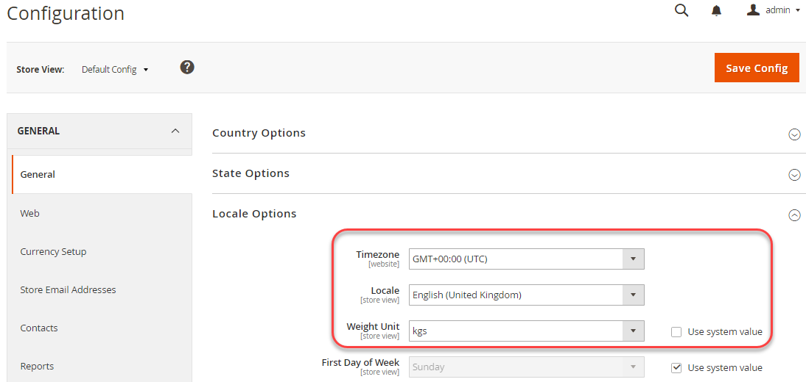
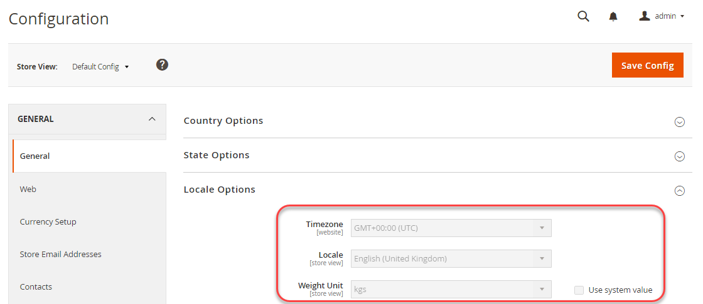

# Example using a shared configuration

This example shows how to change the following settings in your development system, update the shared configuration file, `config.php`, in your build system, and implement the same settings in your production system:

- Timezone
- Weight unit

These settings are available in the Admin in **Stores** > Settings > **Configuration** > General > **General**.

You can use the same procedure to configure any non-sensitive, non-system-specific settings in the following references:

- [Other configuration paths reference](../reference/config-reference-general.md)
- [Payment configuration paths reference](../reference/config-reference-payment.md)
- [Commerce Enterprise B2B Extension configuration paths reference](../reference/config-reference-b2b.md)

## Before you begin

Before you begin, set up file system permissions and ownership as discussed in [Prerequisites for development, build, and production systems](../deployment/prerequisites.md).

## Assumptions

This topic provides an example of modifying the production system configuration. You can choose different configuration options if you wish.

For the purposes of this example, we assume the following:

- You use Git source control
- The development system is available in a Git remote repository named `mconfig`
- Your Git working branch is named `m2.2_deploy`

## Step 1: Set the configuration in the development system

To set the timezone and weight units in your development system:

1. Log in to the Admin.
1. Click **Stores** > Settings > **Configuration** > General > **General**.
1. In the right pane, expand **Locale Options**.

   The following figure shows an example.

   

1. From the **Timezone** list, click **GMT+00:00 (UTC)**.
1. Clear the **Use system value** checkbox next to the **Weight Unit** field.
1. From the **Weight Unit** list, click **kgs**.
1. Click **Save Config**.
1. If prompted, flush the cache.

## Step 2: Update the shared configuration

Generate the shared configuration file, `app/etc/config.php`, in your development system and transfer it using source control to your build system as discussed in this section.

{{$include /help/_includes/config-save-config.md}}

## Step 3: Update your build system and generate files

Now that you have committed your changes to the shared configuration to source control, you can pull those changes in your build system, compile code, and generate static files. The last step is to pull those changes to your production system. As a result, your production system's configuration will match your development system.

{{$include /help/_includes/config-update-build-system.md}}

## Step 4: Update the production system

The last step in the process is to update your production system from source control. This pulls all the changes you made on your development and build systems, which means your production system is completely up-to-date.

{{$include /help/_includes/config-update-prod-system.md}}

### Verify the changes in the Admin

**To verify these settings are not editable in the Admin**:

1. Log in to the Admin.
1. Click **Stores** > Settings > **Configuration** > General > **General**.
1. In the right pane, expand **Locale Options**.

   The options you just set are displayed as follows:

   

  >[!INFO]
  >
  >To change a setting that is locked in the Admin, use the [`magento config:set --lock` command](../cli/set-configuration-values.md).

<!-- Last updated from includes: 2024-07-18 15:50:54 -->
