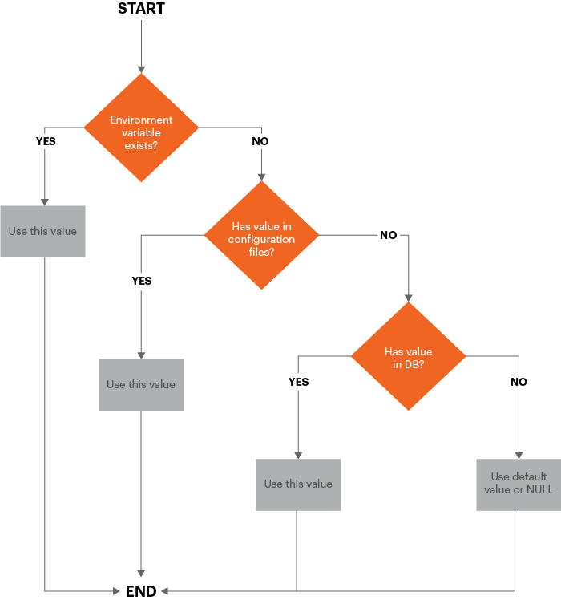
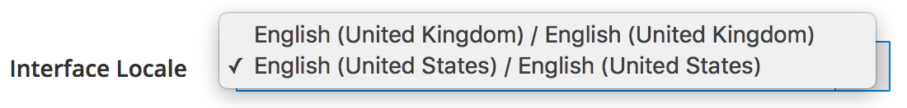
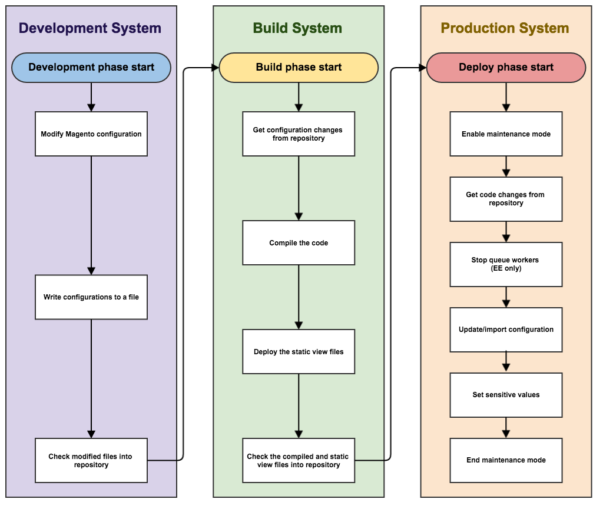

# Technical details

This topic discusses technical implementation details about pipeline deployment in Magento 2.2 and later. Improvements can be divided into the following areas:

- [Configuration management](#configuration-management)
- [Changes in the Admin](#changes-in-the-admin)
- [Install and remove cron](#install-and-remove-cron)

This topic also discusses the [recommended workflow](#recommended-workflow) for pipeline deployment and provides some examples to help you understand how it works.

Before you get started, review the [Prerequisites for your development, build, and production systems](../deployment/prerequisites.md).

## Configuration management

To enable you to synchronize and maintain the configuration of your development and production systems, use the following override scheme.



As the diagram shows, the configuration values are used in the following order:

1. Environment variables, if they exist, override all other values.
1. From the shared configuration files `env.php` and `config.php`. Values in `env.php` override values in `config.php`.
1. From values stored in the database.
1. If no value exists in any of those sources, the default value or NULL is used.

### Manage the shared configuration

The shared configuration is stored in `app/etc/config.php`, which should be in source control.

Set the shared configuration in the Admin in your development (or Adobe Commerce on cloud infrastructure _integration_) system and write the configuration to `config.php` using the [`magento app:config:dump` command](../cli/export-configuration.md).

### Manage the system-specific configuration

The system-specific configuration is stored in `app/etc/env.php`, which should _not_ be in source control.

Set the system-specific configuration in the Admin in your development (or Adobe Commerce on cloud infrastructure integration) system and write the configuration to `env.php` using the [`magento app:config:dump` command](../cli/export-configuration.md).

This command also writes sensitive settings to `env.php`.

### Manage the sensitive configuration

The sensitive configuration is also stored in `app/etc/env.php`.

You can manage the sensitive configuration in any of the following ways:

- Environment variables
- Save the sensitive configuration in `env.php` on your production system using the [`magento config:set:sensitive` command](../cli/set-configuration-values.md)

### Configuration settings locked in the Admin

Any configuration settings in `config.php` or `env.php` are locked in the Admin; that is, those settings cannot be changed in the Admin.
Use the [`magento config:set` or `magento config:set --lock`](../cli/export-configuration.md# config-cli-config-set) command to change the settings in the `config.php` or `env.php` files.

## Changes in the Admin

We changed the following behavior in the Admin in production mode:

- You cannot enable or disable cache types in the Admin
- Developer settings are unavailable (**Stores** > Settings > **Configuration** > Advanced > **Developer**), including:

  - Minify CSS, JavaScript, and HTML
  - Merge CSS and JavaScript
  - Server-side or client-side LESS compilation
  - Inline translations
  - As discussed previously, any configuration setting in `config.php` or `env.php` is locked and cannot be edited in the Admin.
  - You can change the Admin locale only to languages used by deployed themes

    The following figure shows an example of the **Account Setting** > **Interface Locale** list in the Admin showing only two deployed locales:

    

- You cannot change locale configurations for any scope using the Admin Panel.

    We recommend making these changes before switching to Production mode.

    You can still configure the locale using environment variables or the `config:set` CLI command with the path `general/locale/code`.

## Install and remove cron

In version 2.2 for the first time, we help you set up your Magento cron job by providing the [`magento cron:install` command](../cli/configure-cron-jobs.md). This command sets up a Magento crontab as the user who runs the command.

Also, you can remove the crontab using the `magento cron:remove` command.

## Recommended pipeline deployment workflow

The following diagram shows how we recommend you use pipeline deployment to manage the configuration.



### Development system

On your development system, you make configuration changes in the Admin and generate the shared configuration, `app/etc/config.php` and the system-specific configuration, `app/etc/env.php`. Check Magento code and the shared configuration into source control and push it to the build server.

You should also install extensions and customize Magento code on the development system.

On your development system:

1. Set the configuration in the Admin.

1. Use the `magento app:config:dump` command to write the configuration to the file system.

   - `app/etc/config.php` is the shared configuration, which contains all settings _except_ sensitive and system-specific settings. This file should be in source control.
   - `app/etc/env.php` is the system-specific configuration, which contains settings that are unique to a particular system (for example, hostnames and port numbers). This file should _not_ be in source control.

1. Add your modified code and the shared configuration to source control.

1. To remove generated php code and static assets files while in development, run the following commands:

   ```bash
   rm -r var/view_preprocessed/*
   rm -r pub/static/*/*
   rm -r generated/*/*
   ```

After running the commands to clear the assets, Commerce generates working files.

>[!WARNING]
>
>Be careful with the above approach. Deleting the `.htacces`s file in the `generated` or `pub` folder may cause issues.

### Build system

The build system compiles code and generates static view files for themes registered in Magento. It does not need a connection to the Commerce database; it needs only the Commerce codebase.

On your build system:

1. Pull the shared configuration file from source control.
1. Use the `magento setup:di:compile` command to compile code.
1. Use the `magento setup:static-content:deploy -f` command to update static file view files.
1. Check the updates into source control.

>[!INFO]
>
>See [Deployment strategies for static view files](../cli/static-view-file-strategy.md).

### Production system

On your production system (that is, your live store) you pull generated assets and code updates from source control and set system-specific and sensitive configuration settings using the command line or environment variables.

On your production system:

1. Start maintenance mode.
1. Pull code and configuration updates from source control.
1. If you use Adobe Commerce, stop queue workers.
1. Use the `magento app:config:import` command to import configuration changes in the production system.
1. If you installed components that changed the database schema, run `magento setup:upgrade --keep-generated` to update the database schema and data, preserving generated static files.
1. To set system-specific settings, use either the `magento config:set` command or environment variables.
1. To set sensitive settings, use either the `magento config:sensitive:set` command or environment variables.
1. Clean (also referred to as _flush_) the Magento cache.
1. End maintenance mode.

## Configuration management commands

We provide the following commands to help you manage the configuration:

- [`magento app:config:dump`](../cli/export-configuration.md) to write Admin configuration settings to `config.php` and `env.php` (except for sensitive settings)
- [`magento config:set`](../cli/set-configuration-values.md) to set the values of system-specific settings on the production system.

   Use the optional `--lock` option to lock the option in the Admin (that is, make the setting uneditable). If a setting is already locked, use the `--lock` option to change the setting.

- [`magento config:sensitive:set`](../cli/set-configuration-values.md) to set the values of sensitive settings on the production system.
- [`magento app:config:import`](../cli/import-configuration.md) to import configuration changes from `config.php` and `env.php` to the production system.

## Configuration management examples

This section shows examples of managing the configuration so you can see how changes are made to `config.php` and `env.php`.

### Change the default locale

This section shows the change made to `config.php` when you change the default weight unit using the Admin (**Stores** > Settings > **Configuration** > General > **General** > **Locale Options**).

After you make the change in the Admin, run `bin/magento app:config:dump` to write the value to `config.php`. The value is written to the `general` array under `locale` as the following snippet from `config.php` shows:

```php
'general' =>
    array (
        'locale' =>
        array (
            'code' => 'en_US',
            'timezone' => 'America/Chicago',
            'weight_unit' => 'kgs'
        )
    )
```

### Change several configuration settings

This section discusses making the following configuration changes:

- Adding a website, store, and store view (**Stores** > Settings > **All Stores**)
- Changing the default email domain (**Stores** > Settings > **Configuration** > Customers > **Customer Configuration**)
- Setting the PayPal API Username and API password (**Stores** > Settings > **Configuration** > Sales > **Payment Methods** > **PayPal** > **Required PayPal Settings**)

After you make the change in the Admin, run `bin/magento app:config:dump` on your development system. This time, not all of your changes are written to `config.php`; in fact, only the website, store, and store view are written to that file as the following snippets show.

### config.php

`config.php` contains:

- Changes to the website, store, and store view.
- Non-system-specific search engine settings
- Non-sensitive PayPal settings
- Comments that inform you of sensitive settings that were omitted from `config.php`

`websites` array:

```php
      'new' =>
      array (
        'website_id' => '2',
        'code' => 'new',
        'name' => 'New website',
        'sort_order' => '0',
        'default_group_id' => '2',
        'is_default' => '0',
      ),
```

`groups` array:

```php
      2 =>
      array (
        'group_id' => '2',
        'website_id' => '2',
        'code' => 'newstore',
        'name' => 'New store',
        'root_category_id' => '2',
        'default_store_id' => '2',
      ),
```

`stores` array:

```php
     'newview' =>
      array (
        'store_id' => '2',
        'code' => 'newview',
        'website_id' => '2',
        'group_id' => '2',
        'name' => 'New store view',
        'sort_order' => '0',
        'is_active' => '1',
      ),
```

`payment` array:

```php
      'payment' =>
      array (
        'paypal_express' =>
        array (
          'active' => '0',
          'in_context' => '0',
          'title' => 'PayPal Express Checkout',
          'sort_order' => NULL,
          'payment_action' => 'Authorization',
          'visible_on_product' => '1',
          'visible_on_cart' => '1',
          'allowspecific' => '0',
          'verify_peer' => '1',
          'line_items_enabled' => '1',
          'transfer_shipping_options' => '0',
          'solution_type' => 'Mark',
          'require_billing_address' => '0',
          'allow_ba_signup' => 'never',
          'skip_order_review_step' => '1',
        ),
```

### env.php

The default email domain system-specific configuration setting is written to `app/etc/env.php`.

The PayPal settings are written to neither file because the `magento app:config:dump` command does not write sensitive settings. You must set the PayPal settings on the production system using the following commands:

```bash
bin/magento config:sensitive:set paypal/wpp/api_username <username>
```

```bash
bin/magento config:sensitive:set paypal/wpp/api_password <password>
```
