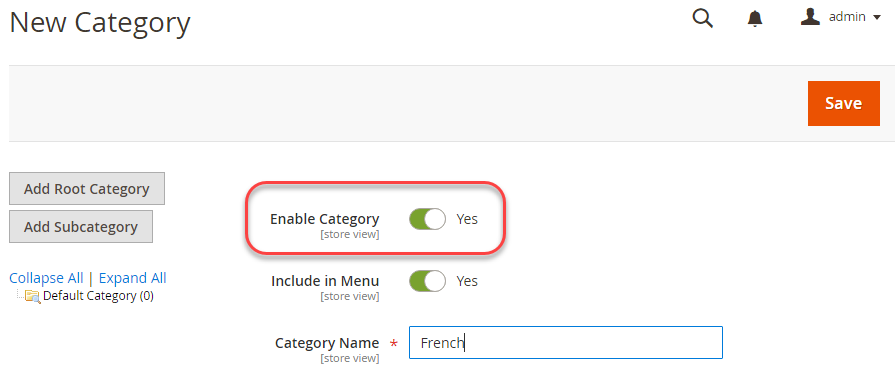
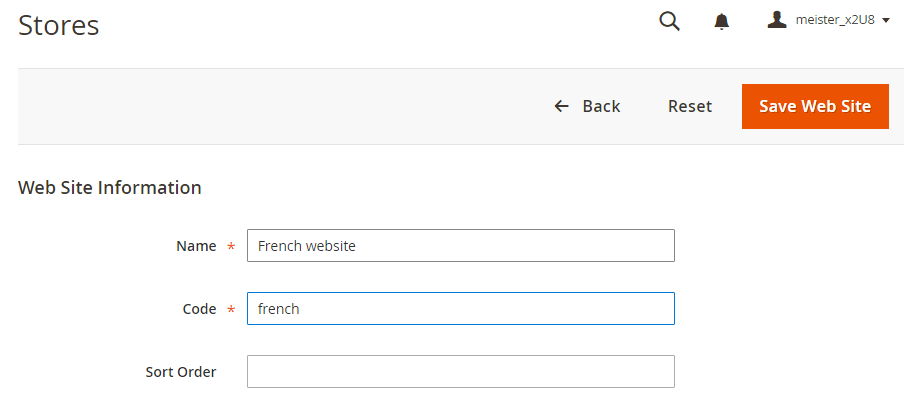
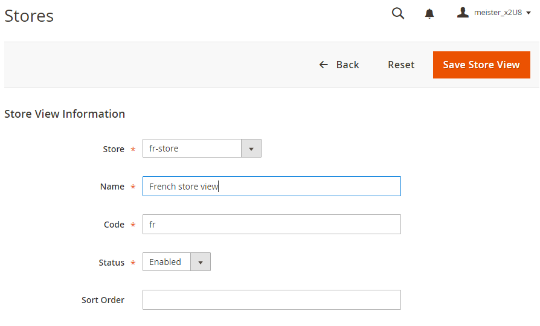
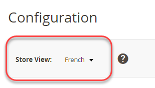
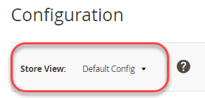
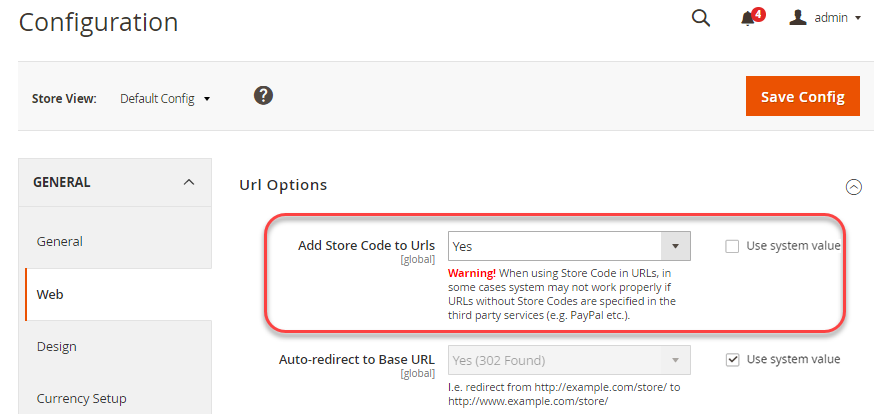

# Set up multiple views in the Admin

This task requires you to create a root category (and additional categories, if desired) for each store. The tasks discussed in this topic provide one way to set up multiple stores. For additional information, see the following resources in the Commerce User Guide:

- [Categories](https://experienceleague.adobe.com/en/docs/commerce-admin/catalog/categories/categories)
- [Adding Websites](https://experienceleague.adobe.com/en/docs/commerce-admin/stores-sales/site-store/stores#add-websites)
- [Store URLs](https://experienceleague.adobe.com/en/docs/commerce-admin/stores-sales/site-store/store-urls)
- [Content](https://experienceleague.adobe.com/en/docs/commerce-admin/content-design/content-menu)

>[!INFO]
>
>For example purposes only, we use a French website with website code `french` in this topic. For step-by-step tutorials, see [Tutorial: Set up multiple websites with Apache](ms-apache.md) and [Tutorial: Set up multiple websites with nginx](ms-nginx.md)

## Step 1: Create root categories

Creating a root category is optional, but we show how to do it in this tutorial in the event you want each website to have a unique root category. You can create additional categories if you choose.

To create a root category:

1. Log in to the Admin as a user authorized to create categories.
1. Click **Catalog** > **Categories**.
1. Click **Add Root Category**.
1. In the **Category Name** field, enter a unique name to identify this category.
1. Make sure that Enable Category is set to **Yes**.

   For information about the other options on this page, see [Root Categories](https://experienceleague.adobe.com/en/docs/commerce-admin/catalog/categories/category-root).

   The following figure shows an example.

   

1. Click **Save**.
1. Repeat these tasks as many times as necessary to create root categories for your stores.

## Step 2: Create websites

To create a website:

1. Log in to the Admin as a user authorized to create websites, stores, and store views.
1. Click **Stores** > **Settings** > **All Stores**.
1. On the _Stores_ page, click **Create Website**.

   - **Name**—Enter a name to identify the website.
   - **Code**—Enter a unique code; for example, if you have a French store, you can enter `french`
   - **Sort Order**—Enter an optional numerical sort order.

   The following figure shows an example.

   

1. Click **Save Web Site**.
1. Repeat these tasks as many times as necessary to create your websites.

## Step 3: Create stores

To create a store:

1. In the _Admin_ panel, click **Stores** > **Settings** > **All Stores**.
1. On the _Stores_ page, click **Create Store**.

   - **Web Site**—Click the name of the website with which to associate this store.
   - **Name**—Enter a name to identify the store.
   - **Code**—Enter a unique code to identify the store.
   - **Root Category**—Click the name of the root category for this store.

   The following figure shows an example.

   

1. Click **Save Store**.
1. Repeat these tasks as many times as necessary to create your stores.

## Step 4: Create store views

To create a store view:

1. In the _Admin_ panel, click **Stores** > **Settings** > **All Stores**.
1. On the Stores page, click **Create Store View**.

   - **Store**—Click the name of the store with which to associate this store view.
   - **Name**—Enter a name to identify this store view.
   - **Code**—Enter a unique name to identify this store view.
   - **Status**—Select **Enabled**.

   The following figure shows an example.

   

1. Click **Save Store View**.
1. Repeat these tasks as many times as necessary to create your store views.

## Step 5: Change the website base URL

To access a website using a unique URL like `http://french.magento.mg`, you must change the base URL for each site in the Admin.

To change the website base URL:

1. In the _Admin_ panel, click **Stores** > **Settings** > **Configuration** > **General** > **Web**.
1. From the **Store View** list at the top of the page, click the name of one of your websites as the following figure shows.

   

1. In the right pane, expand **Base URLs**.
1. In the _Base URLs_ section, clear **Use system value**.
1. Enter the `http://french.magento.mg` URL in the **Base URL** and **Base Link URL** fields.

1. Repeat the previous step in the _Base URLs (Secure)_ section.

   >[!INFO]
   >
   >If you are setting up a base URL for deployment Adobe Commerce on cloud infrastructure, you must replace the first period with three dashes. For example, if your base URL is `french.branch-sbg7pPa-f3dueAiM03tpy.us.magentosite.cloud`, enter `http://french---branch-sbg7pPa-f3dueAiM03tpy.us.magentosite.cloud`. If you are setting up a base URL for local testing, use a period.

1. Click **Save Config**.

1. Repeat these tasks for other websites.

## Step 6: Add the store code to the base URL

Commerce gives you the option to add the store code to the site base URL, which simplifies the process of setting up multiple stores. Using this option, you do not have to create directories on the Commerce file system to store `index.php` and `.htaccess`.

This prevents `index.php` and `.htaccess` from getting out of sync with the Commerce codebase in future upgrades.

See the [Commerce User Guide](https://experienceleague.adobe.com/en/docs/commerce-admin/stores-sales/site-store/store-urls).

To add the store code to the base URL:

1. In the _Admin_ panel, click **Stores** > **Settings** > **Configuration** > **General** > **Web**.
1. From the **Store View** list at the top of the page, click **Default Config** as the following figure shows.

   

1. In the right pane, expand **Url Options**.
1. Clear the **Use system value** checkbox next to _Add Store Code to Urls_.
1. From the _Add Store Code to Urls_ list, click **Yes**.

   

1. Click **Save Config**.
1. If prompted, flush the cache. (**System** > **Cache Management**).

## Step 7: Change the default store view base URL

You must perform this step last because you will lose access to the Admin; your access returns after you set up virtual hosts as discussed in the web-server-specific topics.

To change the default store view base URL:

1. In the _Admin_ panel, click **Stores** > **Settings** > **Configuration** > **General** > **Web**.

1. From the _Store View_ list at the top of the page, click **Default Config**.

   

1. In the right pane, expand **Base URLs**.
1. In the _Base URLs_ section, clear **Use system value**.
1. Enter the `http://magento.mg` URL in the **Base URL** and **Base Link URL** fields.

1. Repeat the previous step in the **Base URLs (Secure)** section.

   >[!INFO]
   >
   >If you are setting up a base URL for Adobe Commerce on cloud infrastructure, you must replace the first period with three dashes. For example, if your base URL is `french.branch-sbg7pPa-f3dueAiM03tpy.us.magentosite.cloud`, enter `http://french---branch-sbg7pPa-f3dueAiM03tpy.us.magentosite.cloud`

1. Click **Save Config**.

>[!INFO]
>
>The website, store, and store view code can include letters (a-z or A-Z), numbers (0-9), and underscores (_) only. Also, the first character must be a letter. If uppercase or camelcase is used, internally the match is case-insensitive to accommodate override of configuration settings through environment variables. See [Use environment variables to override configuration settings](../reference/override-config-settings.md#environment-variables).