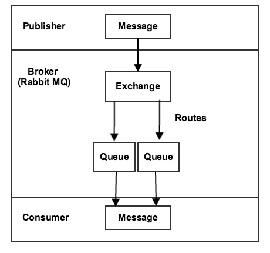
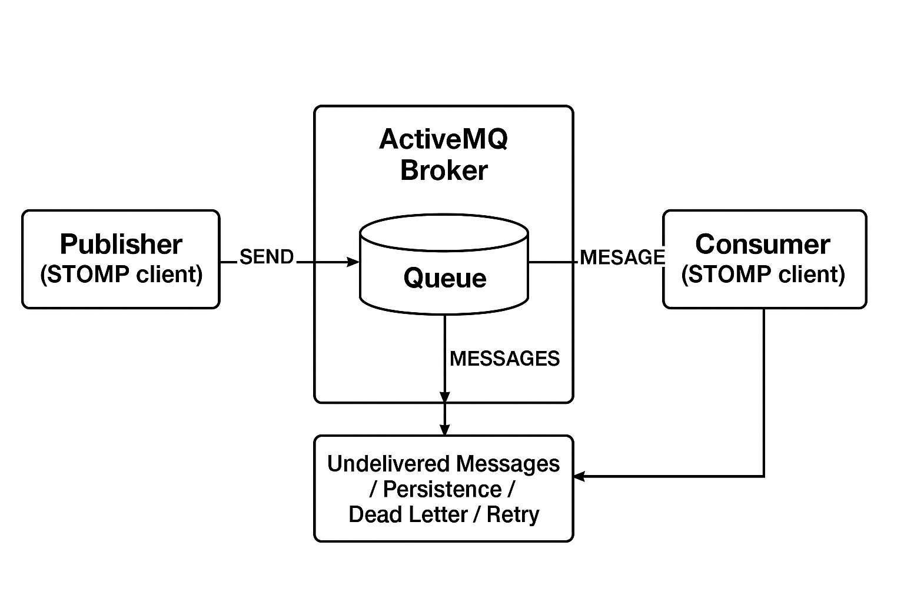

# Message queues overview

The Message Queue Framework (MQF) is a system that allows a module to publish messages to queues. It also defines the [consumers](consumers.md) that will receive the messages asynchronously. The MQF supports multiple messaging brokers:

- **[[!DNL RabbitMQ]](https://www.rabbitmq.com)** - The primary messaging broker, which provides a scalable platform for sending and receiving messages. It includes a mechanism for storing undelivered messages and is based on the Advanced Message Queuing Protocol (AMQP) 0.9.1 specification.
- **[Apache ActiveMQ Artemis](https://activemq.apache.org/components/artemis/)** - An alternative messaging broker that uses the STOMP (Simple Text Oriented Messaging Protocol) for reliable and scalable messaging. Introduced in Adobe Commerce 2.4.6 and later versions.

## RabbitMQ (AMQP)

The following diagram illustrates the Message Queue Framework:

- A publisher is a component that sends messages to an exchange. It knows which exchange to publish to and the format of the messages it sends.

- An exchange receives messages from publishers and sends them to queues. Although [!DNL RabbitMQ] supports multiple types of exchanges, Commerce uses topic exchanges only. A topic includes a routing key, which contains text strings separated by dots. The format for a topic name is `string1.string2`: for example, `customer.created` or `customer.sent.email`.

   The broker allows you to use wildcards when setting rules for forwarding messages. You can use an asterisk (`*`) to replace _one_ string or a pound sign (`#`) to replace 0 or more strings. For example, `customer.*` would filter on `customer.create` and `customer.delete`, but not `customer.sent.email`. However `customer.#` would filter on `customer.create`,  `customer.delete`, and `customer.sent.email`.

- A queue is a buffer that stores messages.

- A consumer receives messages. It knows which queue to consume. It can map processors of the message to a specific queue.

## Apache ActiveMQ Artemis (STOMP)

As an alternative to RabbitMQ, Adobe Commerce also supports [Apache ActiveMQ Artemis](https://activemq.apache.org/components/artemis/) as a messaging broker using the STOMP (Simple Text Oriented Messaging Protocol).

>[!NOTE]
>
>ActiveMQ Artemis was introduced in Adobe Commerce 2.4.6 and later versions.

The following diagram illustrates the STOMP Framework with ActiveMQ Artemis:

### STOMP Framework components

- A **publisher** is a component that sends messages to a destination (queue or topic). It knows which destination to publish to and the format of the messages it sends.

- A **destination** in STOMP serves a similar role to exchanges in AMQP, receiving messages from publishers and routing them. STOMP uses direct destination addressing with a hierarchical naming pattern using dots: for example, `customer.created` or `inventory.updated`.

   Adobe Commerce uses **ANYCAST** addressing mode for STOMP destinations, which provides point-to-point message delivery. In ANYCAST mode, messages are delivered to only one consumer from a pool of available consumers, enabling load balancing and work distribution across multiple consumer instances.

- A **queue** is a buffer that stores messages. With ANYCAST addressing, the queue ensures messages are delivered to only one consumer, even when multiple consumers are connected to the same destination.

- A **consumer** receives messages from destinations. It knows which destination to subscribe to and can process messages with different acknowledgment modes (auto, client, or client-individual).

## MySQL adapter (fallback)

A basic message queue system can also be set up without using external message brokers. In this system, a MySQL adapter stores messages in the database. Three database tables (`queue`, `queue_message`, and `queue_message_status`) manage the message queue workload. Cron jobs ensure the consumers are able to receive messages. This solution is not very scalable. External message brokers like [!DNL RabbitMQ] or Apache ActiveMQ Artemis should be used whenever possible for production environments.

## Related information

For installation and configuration instructions:

- [Install and configure RabbitMQ](../../installation/prerequisites/rabbitmq.md)
- [Install and configure ActiveMQ Artemis](../../installation/prerequisites/activemq.md)
- [Manage message queues](manage-message-queues.md)
- [Message queue consumers](consumers.md)
