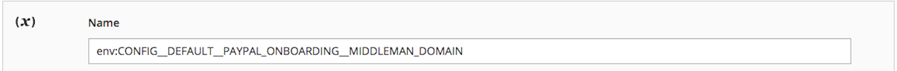

# Override configuration settings

This topic discusses how to derive an environment variable name knowing a configuration path. You can override Adobe Commerce configuration settings using environment variables. For example, you can override the value of a payment processor's live URL on your production system.

You can override the value of _any_ configuration setting using environment variables; however, Adobe recommends you maintain consistent settings using the shared configuration file, `config.php`, and the system-specific configuration file, `env.php`, as discussed in [Deployment general overview](../deployment/overview.md).

>[!TIP]
>
>Check out the [Configure environments](https://experienceleague.adobe.com/docs/commerce-cloud-service/user-guide/configure/env/stage/variables-intro.html) topic in the _Commerce on Cloud Infrastructure guide_.

## Environment variables

An environment variable name consists of its scope followed by its configuration path in a particular format. The following sections discuss how to determine a variable name in more detail.

You can use variables for any of the following:

- [Sensitive values](config-reference-sens.md) must be set using either environment variables or the [`magento config:sensitive:set`](../cli/set-configuration-values.md) command.
- System-specific values must be set using:

  - Environment variables
  - The [`magento config:set`](../cli/set-configuration-values.md) command
  - The Admin followed by the [`magento app:config:dump` command](../cli/export-configuration.md)

Configuration paths can be found in:

- [Sensitive and system-specific configuration paths reference](config-reference-sens.md)
- [Payment configuration paths reference](config-reference-payment.md)
- [Commerce B2B Extension configuration paths reference](config-reference-b2b.md)
- [Other configuration paths reference](config-reference-general.md)

### Variable names

The general format of system settings variable names follows:

`<SCOPE>__<SYSTEM__VARIABLE__NAME>`

`<SCOPE>` can be either:

- Global scope (that is, the global setting for _all_ scopes)

   Global scope variables have the following format:

  `CONFIG__DEFAULT__<SYSTEM__VARIABLE__NAME>`

- A specific scope (that is, the setting affects only a specified store view or website)

   Store view scope variables, for example, have the following format:

   `CONFIG__STORES__ <STORE_VIEW_CODE>__<SYSTEM__VARIABLE__NAME>`

   For more information about scopes, see:

  - [Step 1: Find the website or store view scope value](#step-1-find-the-website-or-store-view-scope-value)
  - [Commerce User Guide topic on scope](https://experienceleague.adobe.com/en/docs/commerce-admin/start/setup/websites-stores-views#scope-settings)
  - [Scope quick reference](https://experienceleague.adobe.com/en/docs/commerce-admin/config/scope-change#scope-quick-reference)

`<SYSTEM__VARIABLE__NAME>` is the configuration path with double underscore characters substituted for `/`. For more information, see [Step 2: Set system variables](#step-2-set-global-website-or-store-view-variables).

### Variable format

`<SCOPE>` is separated from `<SYSTEM__VARIABLE__NAME>` by two underscore characters.

`<SYSTEM__VARIABLE__NAME>` is derived from a configuration setting's _configuration path_, which is a `/` delimited string that uniquely identifies a particular setting. Replace each `/` character in the configuration path with two underscore characters to create the system variable.

If a configuration path contains an underscore character, the underscore character remains in the variable.

A complete list of configuration paths can be found in:

- [Sensitive and system-specific configuration paths reference](config-reference-sens.md)
- [Payment configuration paths reference](config-reference-payment.md)
- [Commerce Enterprise B2B Extension configuration paths reference](config-reference-b2b.md)
- [Other configuration paths reference](config-reference-general.md)

## Step 1: Find the website or store view scope value

This section discusses how you can find and set system configuration values per _scope_ (store view or website). To set global scope variables, see [Step 2: Set global, website, or store view variables](#step-2-set-global-website-or-store-view-variables).

Scope values come from the `store`, `store_group`, and `store_website` tables.

- The `store` table specifies store view names and codes
- The `store_website` table specifies website names and codes

You can also find the code values using the Admin.

How to read the table:

- `Path in Admin` column

   Values before the comma are paths in the Admin navigation. Values after the comma are options in the right pane.

- `Variable name` column is the name of the corresponding environment variable.

   You have the option of specifying system values for these configuration parameters as environment variables if you wish.

  - The entire variable name is always ALL CAPS
  - Start a variable name with `CONFIG__` (note two underscore characters)
  - You can find the `<STORE_VIEW_CODE>` or `<WEBSITE_CODE>` portion of a variable name in either the Admin or the Commerce database, as indicated in the following sections.
  - You can find `<SYSTEM__VARIABLE__NAME>` as discussed in [Step 2: Set global, website, or store view variables](#step-2-set-global-website-or-store-view-variables).

### Find a website or store view scope in the Admin

The following table summarizes how to find website or store view value in the Admin.

| Description  | Path in Admin | Variable name |
|--------------|--------------|----------------------|
| Create, edit, delete store views | **[!UICONTROL Stores]** > **[!UICONTROL All Stores]** | `CONFIG__STORES__<STORE_VIEW_CODE>__<SYSTEM__VARIABLE__NAME>`  |
| Create, edit, delete websites | **[!UICONTROL Stores]** > **[!UICONTROL All Store]s** | `CONFIG__WEBSITES__<WEBSITE_CODE>__<SYSTEM__VARIABLE__NAME>` |

For example, to find a website or store view scope value in the Admin:

1. Log in to the Admin as a user authorized to view websites.
1. Click **[!UICONTROL Stores]** > **[!UICONTROL All Store]s**.
1. Click the name of a website or store view.

   The right pane is displayed similar to the following.

   

1. The scope name is displayed in the **[!UICONTROL Code]** field.
1. Continue with [Step 2: Set global, website, or store view variables](#step-2-set-global-website-or-store-view-variables).

### Find a website or store view scope in the database

To get these values from the database:

1. Log in to your development system as the file system owner if you have not done so already.
1. Enter the following command:

   ```bash
   mysql -u <database-username> -p
   ```

1. At the `mysql>` prompt, enter the following commands in the order shown:

   ```shell
   use <database-name>;
   ```

1. Use the following SQL queries to find the relevant values:

   ```shell
   SELECT * FROM STORE;
   SELECT * FROM STORE_WEBSITE;
   ```

   A sample follows:

   ```shell
   mysql> SELECT * FROM STORE_WEBSITE;
   +------------+-------+--------------+------------+------------------+------------+
   | website_id | code  | name         | sort_order | default_group_id | is_default |
   +------------+-------+--------------+------------+------------------+------------+
   |          0 | admin | Admin        |          0 |                0 |          0 |
   |          1 | base  | Main Website |          0 |                1 |          1 |
   |          2 | test1 | Test Website |          0 |                3 |          0 |
   +------------+-------+--------------+------------+------------------+------------+
   ```

1. Use the value from the `code` column as the scope name, not the `name` value.

   For example, to set a configuration variable for Test Website, use the following format:

   ```shell
   CONFIG__WEBSITES__TEST1__<SYSTEM__VARIABLE__NAME>
   ```

    where `<SYSTEM__VARIABLE__NAME>` comes from the next section.

## Step 2: Set global, website, or store view variables

This section discusses how to set system variables.

- To set values for the global scope (that is, all websites, stores, and store views), start the variable name with `CONFIG__DEFAULT__`.

- To set a value for a particular store view or website, start the variable name as discussed in [Step 1: Find the scope value](#step-1-find-the-website-or-store-view-scope-value):

  - `CONFIG__WEBSITES`
  - `CONFIG__STORES`

- The last part of the variable name is the configuration path, which is unique for each configuration setting.

[See some examples](#examples).

The following table shows a few sample variables.

| Description  | Path in Admin (omitting **Stores** > **Settings** > **Configuration**) | Variable name |
|--------------|--------------|----------------------|
| Elasticsearch server hostname  | Catalog > **Catalog**, **Elasticsearch Server Hostname** |  `<SCOPE>__CATALOG__SEARCH__ELASTICSEARCH_SERVER_HOSTNAME` |
| Elasticsearch server port |  Catalog > **Catalog**, **Elasticsearch Server Port** | `<SCOPE>__CATALOG__SEARCH__ELASTICSEARCH_SERVER_PORT`  |
| Shipping country origin  | Sales > **Shipping Settings** |  `<SCOPE>__SHIPPING__ORIGIN__COUNTRY_ID` |
| Custom Admin URL | Advanced > **Admin** | `<SCOPE>__ADMIN__URL__CUSTOM`  |
| Custom Admin Path  | Advanced > **Admin** | `<SCOPE>__ADMIN__URL__CUSTOM_PATH` |

## Examples

This section shows how to find values of some sample variables.

### Elasticsearch server hostname

To find the variable name for global HTML minification:

1. Determine the scope.

   It is the global scope so the variable name starts with `CONFIG__DEFAULT__`

1. The rest of the variable name is `CATALOG__SEARCH__ELASTICSEARCH_SERVER_HOSTNAME`.

   **Result**: The variable name is `CONFIG__DEFAULT__CATALOG__SEARCH__ELASTICSEARCH_SERVER_HOSTNAME`

### Shipping country origin

To find the variable name for the shipping country origin:

1. Determine the scope.

   Find the scope in the [database](#find-a-website-or-store-view-scope-in-the-database) as discussed in Step 1: Find the website or store view scope value. (You can also find the value in the Admin as shown in the [table in Step 2: Set global, website, or store view variables](#step-2-set-global-website-or-store-view-variables.

   For example, the scope might be `CONFIG__WEBSITES__DEFAULT`.

1. The rest of the variable name is `SHIPPING__ORIGIN__COUNTRY_ID`.

   **Result**: The variable name is `CONFIG__WEBSITES__DEFAULT__SHIPPING__ORIGIN__COUNTRY_ID`

## How to use environment variables

Set configuration values as variables using PHP's [`$_ENV`](https://php.net/manual/en/reserved.variables.environment.php) associate array. You can set the values in any PHP script that runs when Commerce runs.

>[!TIP]
>
>Setting variable values in `index.php` or `pub/index.php` does not always function as expected since different application entry points can be used depending on the web server configuration. By placing `$_ENV` directives in the `app/bootstrap.php` file, regardless of different application entry points, the `$_ENV` directives always execute since the `app/bootstrap.php` file loads as part of the Commerce architecture.

An example of setting two `$_ENV` values follows:

```php
$_ENV['CONFIG__DEFAULT__CATALOG__SEARCH__ELASTICSEARCH_SERVER_HOSTNAME'] = 'http://search.example.com';
$_ENV['CONFIG__DEFAULT__GENERAL__STORE_INFORMATION__MERCHANT_VAT_NUMBER'] = '1234';
```

A step-by-step example is shown in [Set configuration values using environment variables](../deployment/example-environment-variables.md).

>[!WARNING]
>
>- To use values that you set in the `$_ENV` array, you must set `variables_order = "EGPCS"`(Environment, Get, Post, Cookie, and Server) in your `php.ini` file. For details, see [PHP documentation](https://www.php.net/manual/en/ini.core.php).
>
>- For Adobe Commerce on cloud infrastructure, if you are attempting to override configuration settings using the [Project Web Interface](https://experienceleague.adobe.com/docs/commerce-cloud-service/user-guide/project/overview.html#configure-the-project), you must prepend the variable name with `env:`. For example:
>
>
