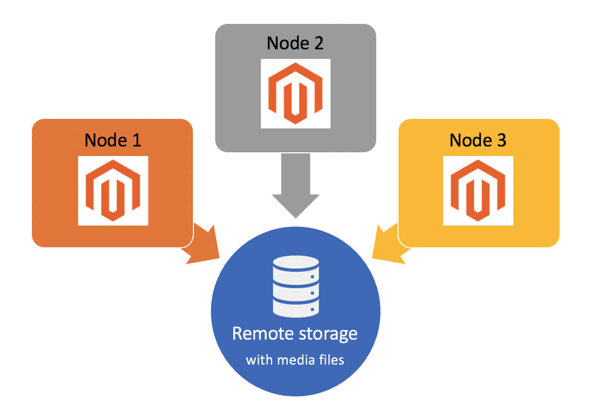

# Configure Remote Storage

The Remote Storage module provides the option to store media files and schedule imports and exports in a persistent, remote storage container using a storage service, such as AWS S3.

By default, the Adobe Commerce application stores media files in the same filesystem that contains the application. This is inefficient for complex, multi-server configurations, and can result in degraded performance when sharing resources. With the Remote Storage module, you can store media files in the `pub/media` directory and import/export files in the `var` directory of the remote object storage to take advantage of server-side image resizing.

>[!BEGINSHADEBOX]

You cannot have both remote storage _and_ database storage enabled at the same time. You must disable database storage before enabling remote storage.

```bash
bin/magento config:set system/media_storage_configuration/media_database 0
```

Enabling remote storage might affect your established development experience. For example, certain PHP file functions might not work as expected. The usage of Commerce Framework for file operations must be enforced. The list of prohibited PHP native functions is available in the [magento-coding-standard](https://github.com/magento/magento-coding-standard/blob/develop/Magento2/Sniffs/Functions/DiscouragedFunctionSniff.php) repository.

>[!ENDSHADEBOX]

>[!INFO]
>
>- Remote storage is available for Commerce version 2.4.2 and later only. See the [2.4.2 release notes](https://experienceleague.adobe.com/en/docs/commerce-operations/release/notes/magento-open-source/2-4-2).
>
>- The Remote storage module has _limited_ support on Adobe Commerce on cloud infrastructure. Adobe cannot fully troubleshoot the third-party storage adapter service. See [Configure remote storage for Commerce on Cloud infrastructure](cloud-support.md) for guidance implementing remote storage for cloud projects.



## Remote storage options

You can configure remote storage using the `remote-storage` option with the [`setup` CLI command](../../installation/tutorials/deployment.md). The `remote-storage` option uses the following syntax:

```text
--remote-storage-<parameter-name>="<parameter-value>"
```

The `parameter-name` refers to the specific remote storage parameter name. The following table lists the parameters available for configuring remote storage:

| Command-line Parameter | Parameter name | Description | Default value |
|--- |--- |--- |--- |
| `remote-storage-driver` | driver | Adapter name<br>Possible values:<br>**file**: Disables remote storage and uses the local filesystem<br>**aws-s3**: Use the [Amazon Simple Storage Service (Amazon S3)](remote-storage-aws-s3.md) | none |
| `remote-storage-bucket` | bucket | Object storage or container name | none |
| `remote-storage-prefix` | prefix | Optional prefix (location inside of object storage) | empty |
| `remote-storage-region` | region | Region name | none |
| `remote-storage-key` | access key | Optional access key | empty |
| `remote-storage-secret` | secret key | Optional secret key | empty |

### Storage adapters

The default storage location is in the local filesystem. A _storage adapter_ enables you to connect to a storage service and store your files anywhere. [!DNL Commerce] supports configuring the following storage services:

- [Amazon Simple Storage Service (Amazon S3)](remote-storage-aws-s3.md)

## Enable remote storage

You can install remote storage during an Adobe Commerce installation or add remote storage to an existing Commerce instance. The following examples demonstrate each method using a set of `remote-storage` parameters with Commerce `setup` CLI commands. Minimally, you must supply the storage `driver`, `bucket`, and `region`.

- Example: Install Commerce with remote storage

  ```bash
  bin/magento setup:install --remote-storage-driver="aws-s3" --remote-storage-bucket="myBucket" --remote-storage-region="us-east-1"
  ```

- Example: Enable remote storage on existing Commerce

  ```bash
  bin/magento setup:config:set --remote-storage-driver="aws-s3" --remote-storage-bucket="myBucket" --remote-storage-region="us-east-1"
  ```

>[!TIP]
>
>For Adobe Commerce on cloud infrastructure, see [Configure remote storage for Commerce on Cloud infrastructure](cloud-support.md).

## Migrate content

After you enable remote storage for a specific adapter, you can use the CLI to migrate existing _media_ files to the remote storage.

```bash
./magento2ce/bin/magento remote-storage:sync
```

>[!INFO]
>
>The sync command only migrates files in the `pub/media` directory, _not_ the import/export files in the `var` directory. See [Scheduled Import/Export](https://experienceleague.adobe.com/docs/commerce-admin/systems/data-transfer/data-scheduled-import-export.html) in the _Commerce 2.4 User Guide_.

<!-- link definitions -->

[import-export]: https://docs.magento.com/user-guide/system/data-scheduled-import-export.html
