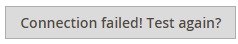
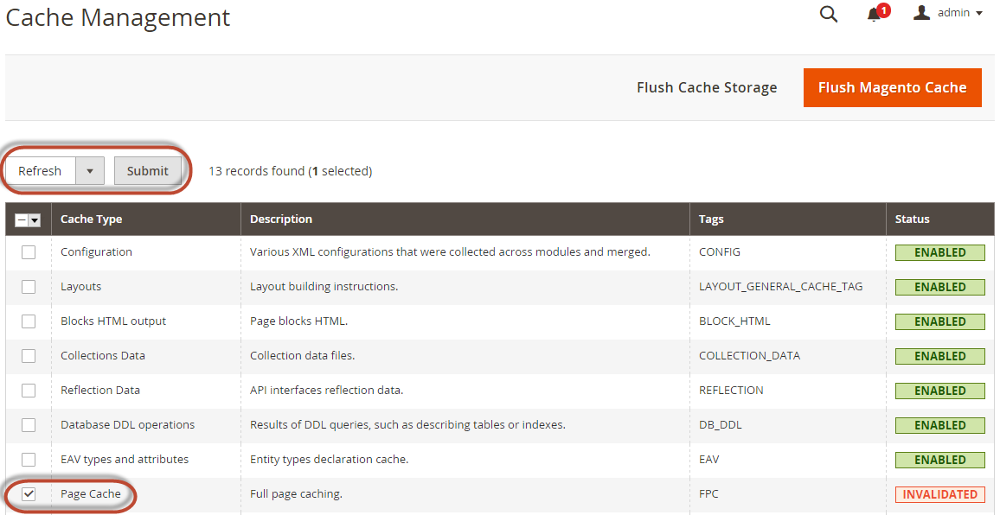

# Search engine configuration

This section discusses the minimum settings that you must choose to test Elasticsearch or OpenSearch with on-premises deployments of Adobe Commerce.

>[!TIP]
>
>In versions 2.4.4 and 2.4.3-p2, all fields labeled **Elasticsearch** also apply to OpenSearch.
>When support for Elasticsearch 8.x was introduced in version 2.4.6, new labels were created to distinguish between Elasticsearch and OpenSearch configurations.

For additional details about configuring your search engine, see the [User Guide](https://experienceleague.adobe.com/docs/commerce-admin/catalog/catalog/search/search-configuration.html).

## Configure your search engine from the Admin

>[!TIP]
>
>For instructions on upgrading to a new search engine version, see [upgrade prerequisites](../../upgrade/prepare/prerequisites.md).

To configure your system to use Elasticsearch or OpenSearch:

1. Log in to the Admin as an administrator.
1. Click **[!UICONTROL Stores]** > [!UICONTROL Settings] > **[!UICONTROL Configuration]** > **[!UICONTROL Catalog]** > **[!UICONTROL Catalog]** > **[!UICONTROL Catalog Search]**.
1. From the **[!UICONTROL Search Engine]** list, select the corresponding version of your search engine.

   The following table lists the required options to configure and test the connection with Commerce. Unless you changed the server settings of your search engine, the defaults should work. Skip to the next step.

   |Option|Description|
   |--- |--- |
   |**[!UICONTROL Server Hostname]**|Enter the fully qualified hostname or IP address of the machine running Elasticsearch or OpenSearch.<br>Adobe Commerce on cloud infrastructure: Get this value from your integration system.|
   |**[!UICONTROL Server Port]**|Enter the web server proxy port. The default is 9200<br>Adobe Commerce on cloud infrastructure: Get this value from your integration system.|
   |**[!UICONTROL Index Prefix]**|Enter the search engine index prefix. If you use a single instance for more than one Commerce installation (Staging and Production environments), you must specify a unique prefix for each installation. Otherwise, you can use the default prefix magento2.|
   |**[!UICONTROL Enable HTTP Auth]**|Click **[!UICONTROL Yes]** only if you enabled authentication for your search engine server. If so, provide a username and password in the provided fields.|
   |**[!UICONTROL Server Timeout]**|Enter the amount of time (in seconds) to wait when attempting to establish a connection to the Elasticsearch or OpenSearch server.|

1. Click **[!UICONTROL Test Connection]**.

   Sample response:

   

   Continue with:

   - [Configure Apache for your search engine](../../installation/prerequisites/search-engine/configure-apache.md)
   - [Configure nginx for your search engine](../../installation/prerequisites/search-engine/configure-nginx.md)

   or you see:

   

If so, try the following:

- Make sure the search engine server is running.
- If the server is on a different host from Commerce, log in to the Commerce server and ping the search engine host. Resolve network connectivity issues and test the connection again.
- Examine the command window in which you started Elasticsearch or OpenSearch for stack traces and exceptions. You must resolve those before you continue. In particular, make sure you started your search engine as a user with `root` privileges.
- Make sure that [UNIX firewall and SELinux](../../installation/prerequisites/search-engine/overview.md#firewall-and-selinux) are both disabled, or set up rules to enable your search engine and Commerce to communicate with each other.
- Verify the value of the **[!UICONTROL Server Hostname]** field. Make sure that the server is available. You can try the server's IP address instead.
- Use the `netstat -an | grep <listen-port>` command to verify that the port specified in the **[!UICONTROL Server Port]** field is not being used by another process.

  For example, to see if your search engine is running on its default port, use the following command:

  ```bash
  netstat -an | grep 9200
  ```

  If it is running on port 9200, it displays similar to the following:

  ```
  `tcp        0      0 :::9200            :::-         LISTEN`
  ```

## Reindex catalog search and refresh the full page cache

After you change the search engine configuration, you must reindex the catalog search index and refresh the full page cache using the Admin or command line.

To refresh the cache using the Admin:

1. In the Admin, click **[!UICONTROL System]** > **[!UICONTROL Cache Management]**.
1. Select the checkbox next to **[!UICONTROL Page Cache]**.
1. From the **[!UICONTROL Actions]** list in the upper right, click **Refresh**.

   

To clean the cache using the command line: [`bin/magento cache:clean`](../cli/manage-cache.md#clean-and-flush-cache-types)

To reindex using the command line:

1. Log in to your Commerce server as, or switch to, the [file system owner](../../installation/prerequisites/file-system/overview.md).
1. Enter any of the following commands:

   Enter the following command to reindex the catalog search index only:

   ```bash
   bin/magento indexer:reindex catalogsearch_fulltext
   ```

   Enter the following command to reindex all indexers:

   ```bash
   bin/magento indexer:reindex
   ```

1. Wait until reindexing completes.

   >[!INFO]
   >
   >Unlike the cache, indexers are updated by a cron job. Make sure [cron is enabled](../cli/configure-cron-jobs.md) before you start using your search engine.
