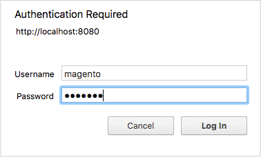

# Secure cron PHP

This topic discusses securing `pub/cron.php` to prevent it from being used in a malicious exploit. If you do not secure cron, any user could potentially run cron to attack your Commerce application.

The cron job runs several scheduled tasks and is a vital part of your Commerce configuration. Scheduled tasks include, but are not limited to:

- Reindexing
- Generating e-mails
- Generating newsletters
- Generating sitemaps

>[!INFO]
>
>Refer to [Configure and run cron](../cli/configure-cron-jobs.md#run-cron-from-the-command-line) for more information about cron groups.

You can run a cron job in the following ways:

- Using the [`magento cron:run`](../cli/configure-cron-jobs.md#run-cron-from-the-command-line) command either from the command line or in a crontab
- Accessing `pub/cron.php?[group=<name>]` in a web browser

>[!INFO]
>
>You do not need to do anything if you use the [`magento cron:run`](../cli/configure-cron-jobs.md#run-cron-from-the-command-line) command to run cron because it uses a different process that is already secure.

## Secure cron with Apache

This section discusses how to secure cron using HTTP Basic authentication with Apache. These instructions are based on Apache 2.2 with CentOS 6. For more information, refer to one of the following resources:

- [Apache 2.2 authentication and authorization tutorial](https://httpd.apache.org/docs/2.2/howto/auth.html)
- [Apache 2.4 authentication and authorization tutorial](https://httpd.apache.org/docs/2.4/howto/auth.html)

### Create a password file

For security reasons, you can locate the password file anywhere except your web server docroot. In this example, we are storing the password file in a new directory.

Enter the following commands as a user with `root` privileges:

```bash
mkdir -p /usr/local/apache/password
```

```bash
htpasswd -c /usr/local/apache/password/passwords <username>
```

Where `<username>` can be the web server user or another user. In this example, we use the web server user, but the choice of user is up to you.

Follow the prompts on your screen to create a password for the user.

To add another user to your password file, enter the following command as a user with `root` privileges:

```bash
htpasswd /usr/local/apache/password/passwords <username>
```

### Add users to create an authorized cron group (optional)

You can enable more than one user to run cron by adding these users to your password file, including a group file.

To add another user to your password file:

```bash
htpasswd /usr/local/apache/password/passwords <username>
```

To create an authorized group, create a group file anywhere outside the web server docroot. The group file specifies the name of the group and the users in the group. In this example, the group name is `MagentoCronGroup`.

```bash
vim /usr/local/apache/password/group
```

Contents of the file:

```text
MagentoCronGroup: <username1> ... <usernameN>
```

### Secure cron in `.htaccess`

To secure cron in `.htaccess` file:

1. Log in to your Commerce server as, or switch to, the file system owner.
1. Open `<magento_root>/pub/.htaccess` in a text editor.

   (Because `cron.php` is located in the `pub` directory, edit this `.htaccess` only.)

1. _Cron access for one or more users._ Replace the existing `<Files cron.php>` directive with the following:

   ```conf
   <Files cron.php>
      AuthType Basic
      AuthName "Cron Authentication"
      AuthUserFile /usr/local/apache/password/passwords
      Require valid-user
   </Files>
   ```

1. _Cron access for a group._ Replace the existing `<Files cron.php>` directive with the following:

   ```conf
   <Files cron.php>
      AuthType Basic
      AuthName "Cron Authentication"
      AuthUserFile /usr/local/apache/password/passwords
      AuthGroupFile <path to optional group file>
      Require group <name>
   </Files>
   ```

1. Save your changes to `.htaccess` and exit the text editor.
1. Continue with [Verify cron is secure](#verify-cron-is-secure).

## Secure cron with Nginx

This section discusses how to secure cron using the Nginx web server. You must perform the following tasks:

1. Set up an encrypted password file for Nginx
1. Modify your nginx configuration to reference the password file when accessing `pub/cron.php`

### Create a password file

Consult one of the following resources to create a password file before continuing:

- [How To Set Up Password Authentication with Nginx on Ubuntu 14.04 (DigitalOcean)](https://www.digitalocean.com/community/tutorials/how-to-set-up-password-authentication-with-nginx-on-ubuntu-14-04)
- [Basic HTTP Authentication with Nginx (howtoforge)](https://www.howtoforge.com/basic-http-authentication-with-nginx)

### Secure cron in `nginx.conf.sample`

Commerce provides an optimized sample nginx configuration file out of the box. We recommend modifying it to secure cron.

1. Add the following to your [`nginx.conf.sample`](https://github.com/magento/magento2/blob/2.4/nginx.conf.sample) file:

   ```conf
   #Securing cron
   location ~ cron\.php$ {
      auth_basic "Cron Authentication";
      auth_basic_user_file /etc/nginx/.htpasswd;

      try_files $uri =404;
      fastcgi_pass   fastcgi_backend;
      fastcgi_buffers 1024 4k;

      fastcgi_read_timeout 600s;
      fastcgi_connect_timeout 600s;

      fastcgi_index  index.php;
      fastcgi_param  SCRIPT_FILENAME  $document_root$fastcgi_script_name;
      include        fastcgi_params;
   }
   ```

1.Restart nginx:

   ```bash
   systemctl restart nginx
   ```

1. Continue with [Verify cron is secure](#verify-cron-is-secure).

## Verify cron is secure

The easiest way to verify that `pub/cron.php` is secure is to verify that it is creating rows in the `cron_schedule` database table after you set up password authentication. This example uses SQL commands to check the database, but you can use whatever tool you like.

>[!INFO]
>
>The `default` cron you are running in this example runs according to the schedule defined in `crontab.xml`. Some cron job runs only once a day. The first time you run cron from the browser, the `cron_schedule` table is updated, but subsequent `pub/cron.php` requests run at the configured schedule.

**To verify cron is secure**:

1. Log in to the database as the Commerce database user or as `root`.

   For example,

   ```bash
   mysql -u magento -p
   ```

1. Use the Commerce database:

   ```shell
   use <database-name>;
   ```

   For example,

   ```shell
   use magento;
   ```

1. Delete all rows from the `cron_schedule` database table:

   ```shell
   TRUNCATE TABLE cron_schedule;
   ```

1. Run cron from a browser:

   ```shell
   http[s]://<Commerce hostname or ip>/cron.php?group=default
   ```

   For example:

   ```shell
   http://magento.example.com/cron.php?group=default
   ```

1. When prompted, enter an authorized user's name and password. The following figure shows an example.

   

1. Verify that rows were added to the table:

   ```shell
   SELECT * from cron_schedule;

   mysql> SELECT * from cron_schedule;
   +-------------+-----------------------------------------------+---------+----------+---------------------+---------------------+-------------+-------------+
   | schedule_id | job_code                             | status  | messages | created_at        | scheduled_at      | executed_at | finished_at |
   +-------------+-----------------------------------------------+---------+----------+---------------------+---------------------+-------------+-------------+
   |         1 | catalog_product_outdated_price_values_cleanup | pending | NULL    | 2017-09-27 14:24:17 | 2017-09-27 14:24:00 | NULL      | NULL      |
   |         2 | sales_grid_order_async_insert             | pending | NULL    | 2017-09-27 14:24:17 | 2017-09-27 14:24:00 | NULL      | NULL      |
   |         3 | sales_grid_order_invoice_async_insert       | pending | NULL    | 2017-09-27 14:24:17 | 2017-09-27 14:24:00 | NULL      | NULL      |
   |         4 | sales_grid_order_shipment_async_insert      | pending | NULL    | 2017-09-27 14:24:17 | 2017-09-27 14:24:00 | NULL      | NULL      |
   |         5 | sales_grid_order_creditmemo_async_insert     | pending | NULL    | 2017-09-27 14:24:17 | 2017-09-27 14:24:00 | NULL      | NULL      |
   |         6 | sales_send_order_emails                  | pending | NULL    | 2017-09-27 14:24:17 | 2017-09-27 14:24:00 | NULL      | NULL      |
   |         7 | sales_send_order_invoice_emails            | pending | NULL    | 2017-09-27 14:24:17 | 2017-09-27 14:24:00 | NULL      | NULL      |
   |         8 | sales_send_order_shipment_emails           | pending | NULL    | 2017-09-27 14:24:17 | 2017-09-27 14:24:00 | NULL      | NULL      |
   |         9 | sales_send_order_creditmemo_emails         | pending | NULL    | 2017-09-27 14:24:17 | 2017-09-27 14:24:00 | NULL      | NULL      |
   |        10 | newsletter_send_all                     | pending | NULL    | 2017-09-27 14:24:17 | 2017-09-27 14:25:00 | NULL      | NULL      |
   |        11 | captcha_delete_old_attempts               | pending | NULL    | 2017-09-27 14:24:17 | 2017-09-27 14:30:00 | NULL      | NULL      |
   |        12 | captcha_delete_expired_images             | pending | NULL    | 2017-09-27 14:24:17 | 2017-09-27 14:30:00 | NULL      | NULL      |
   |        13 | outdated_authentication_failures_cleanup     | pending | NULL    | 2017-09-27 14:24:17 | 2017-09-27 14:24:00 | NULL      | NULL      |
   |        14 | magento_newrelicreporting_cron            | pending | NULL    | 2017-09-27 14:24:17 | 2017-09-27 14:24:00 | NULL      | NULL      |
   +-------------+-----------------------------------------------+---------+----------+---------------------+---------------------+-------------+-------------+
   14 rows in set (0.00 sec)
   ```

## Run cron from a web browser

You can run cron at any time, such as during development, using a web browser.

>[!WARNING]
>
>Do _not_ run cron in a browser without securing it first.

If you are using an Apache web server, you must remove the restriction from the `.htaccess` file before you can run cron in a browser:

1. Log in to your Commerce server as a user with permissions to write to the Commerce file system.
1. Open any of the following in a text editor (depending on your entry point to Magento):

   ```text
   <magento_root>/pub/.htaccess
   <magento_root>/.htaccess
   ```

1. Delete or comment out the following:

   ```conf
   ## Deny access to cron.php
     <Files cron.php>
        order allow,deny
        deny from all
     </Files>
   ```

   For example,

   ```conf
   ## Deny access to cron.php
      #<Files cron.php>
         # order allow,deny
         # deny from all
      #</Files>
   ```

1. Save your changes and exit the text editor.

   You can then run cron in a web browser as follows:

   ```text
   <your hostname or IP>/<Commerce root>/pub/cron.php[?group=<group name>]
   ```

Where:

- `<your hostname or IP>` is the hostname or IP address of your Commerce installation
- `<Commerce root>` is the web server docroot-relative directory to which you installed the Commerce software

   The exact URL that you use to run the Commerce application depends on how you configured your web server and virtual host.

- `<group name>` is any valid cron group name (optional)

For example,

```http
https://magento.example.com/magento2/pub/cron.php?group=index
```

>[!INFO]
>
>You must run cron twice: first to discover tasks to run and again to run the tasks themselves. Refer to [Configure and run cron](../cli/configure-cron-jobs.md) for more information about cron groups.
