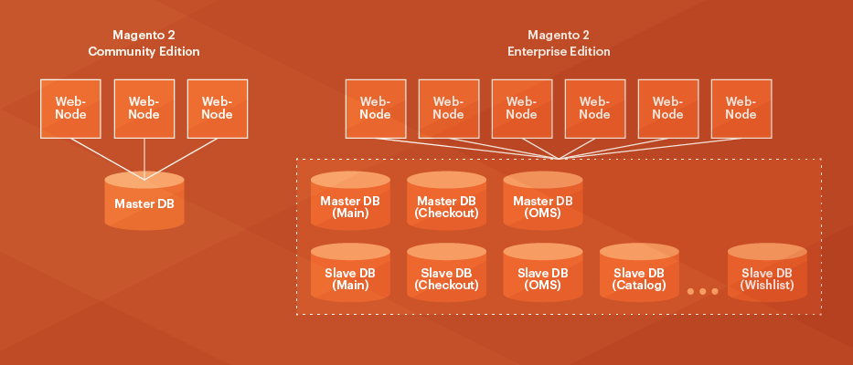

# Overview of the split database solution

{{ee-only}}

{{deprecate-split-db}}

Adobe Commerce offers several scalability advantages, including the ability to use three separate master databases for different functional areas of the Commerce application.

Checkout, orders, and product data can each use a separate master database that you can optionally replicate. This separation independently scales load from website checkouts, order management activities, website browsing, and merchandising activities, depending on your needs. These changes provide considerable flexibility in how the database tier can be scaled.

>[!INFO]
>
>Adobe Commerce on cloud infrastructure does _not_ support this feature.

The `ResourceConnections` class provides the unified MySQL database connection to the Commerce application. For queries to the master databases, we implement the Command Query Responsibility Segregation (CQRS) database pattern. This pattern handles the logic for routing the read and write queries to the appropriate databases. Developers do not need to know which configuration is being used and there are no separate read and write database connections.

If you set up optional database replication, you get the following advantages:

- Data backup
- Data analysis without affecting the master database
- Scalability

MySQL databases replicate asynchronously, which means slaves do not need to be connected permanently to receive updates from the master.

The following figure shows how this feature works.

In Magento Open Source, only one master database is used.

Adobe Commerce uses three master databases and a configurable number of slave databases for replication. Adobe Commerce has a single interface for database connections, resulting in faster performance and better scalability.

## Configuration options

Because of the way the split database performance solution is designed, your custom code and installed components _cannot_ do any of the following:

- Write directly to the database (instead, you must use the Adobe Commerce database interface)
- Use JOINs that affect the sales or quote databases
- Use foreign keys to tables in the checkout, sales, or main databases

>[!WARNING]
>
>Contact component developers to verify whether their components do any of the preceding. If so, you must choose only one of the following:
>
>- Ask the component developers to update their components.
>- Use the components as-is _without_ the split database solution.
>- Remove the components so you can use the split database solution.

This also means you can either:

- Configure the split database solution _before_ putting Commerce into production.

  Adobe recommends configuring split databases as soon as possible after you install the Commerce software.

- [Manually configure](multi-master-manual.md) the split database solution.

  You must perform this task if you have already installed components or if Commerce is already in production. (_Do not_ update a production system; make the updates in a development system and synchronize the changes after you have tested them.)

  >[!WARNING]
  >
  >You must back up the two additional database instances manually. Commerce backs up only the main database instance. The [`magento setup:backup --db`](../../installation/tutorials/backup.md) command and Admin options do not back up the additional tables.

## Prerequisites

The split database requires you to set up three MySQL master databases on any host (all three on the Commerce server, each database on a separate server, and so on). These are the _master_ databases and they are used as follows:

- One master database for checkout tables
- One master database for sales tables (also referred to as _Order Management System_, or _OMS_, tables)
- One master database for the remainder of the Commerce 2 application tables

In addition, you can optionally set up any number of _slave_ databases that serve as load balancers and backups.

This guide discusses how to set up the master databases only. We provide sample configurations and references for you to set up slave databases if you wish.

In this guide, the three master databases are named:

- `magento_quote`
- `magento_sales`
- `magento`

(You can name your databases anything you wish.)
