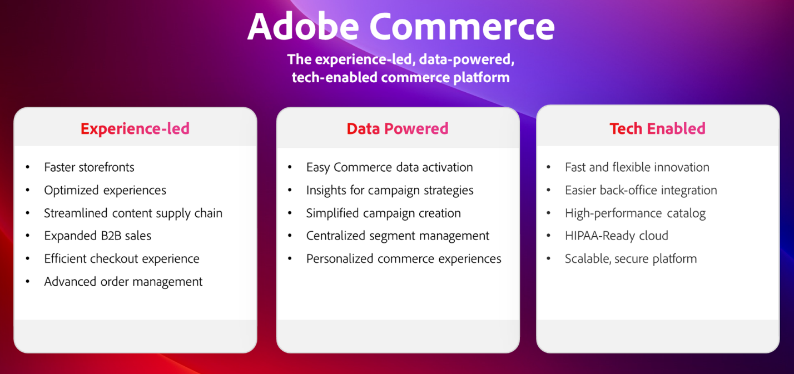
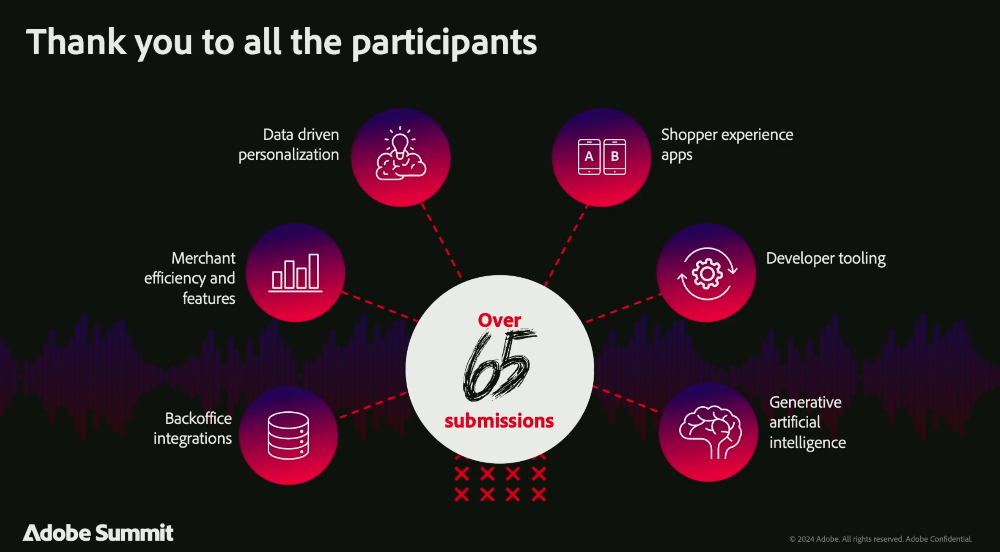

# 2024 Adobe Summit Summary for Adobe Commerce

Adobe Summit 2024 was a remarkable event, bringing together the Adobe Commerce community, including industry-leading customers, visionary partners, and our Adobe Commerce team to connect, explore, and learn. All of the content featuring sessions with Hanesbrands, Coca-Cola, Nestle, Unilever, Canon, and more are [**now available on demand**](https://business.adobe.com/summit/2024/sessions.html?Track=Commerce)!

Here were some top highlights from Adobe Summit 2024.

## Adobe Commerce roadmap session

We kicked off the conference with an innovation-packed [**Adobe Commerce Roadmap session**](https://business.adobe.com/summit/2024/sessions/adobe-commerce-2024-product-roadmap-review-s432.html) where we showcased how Adobe Commerce is empowering companies to innovate faster and accelerate sales with an experience-led platform.

Watch this session to learn how Adobe Commerce is delivering:

- **[Faster storefront experiences](https://experienceleague.adobe.com/developer/commerce/storefront/):** Our new high-performance storefront architecture, Edge Delivery Services, boosts site speed, SEO rankings, and organic traffic. Plus, a new integration with Adobe Experience Manager Assets streamlines your content supply chain with access to GenAI content development and workflow management.

- **[Hyper-personalized buying journeys](https://experienceleague.adobe.com/en/docs/commerce-admin/customers/customers-menu/personalize-scale):** Automatically collect and share real-time storefront clicks, backend order history, and now, customer profile data with other Adobe Experience Cloud solutions. Automate omni-channel campaign set-up with Use Case Playbooks and personalize commerce mobile apps and upsell/cross-sell offers using Adobe Real-Time CDP audiences.

- **[Simplified composable development](https://developer.adobe.com/commerce/extensibility/app-development/learning-path/):** Innovate faster with lower costs using Adobe Developer App Builder. Simplify integrations to your ERP and other backend systems with the new back-office integration starter kit. Configure webhooks and customize the Admin UI through a unified developer experience including API orchestration, event management, and serverless extensibility.

- **[Advanced B2B Commerce and Order Management](https://experienceleague.adobe.com/en/docs/commerce-admin/b2b/introduction):** Boost B2B sales with advanced quoting tools and parent-child account configuration to support large, global accounts and B2B2X use cases. Connect to IBM Sterling Order Management faster than ever with our new pre-built integration to maximize operational efficiency with real-time inventory management, automated order fulfillment, returns management, and a full set of dashboards and workflows.

## Powerful customer and partner sessions

Our innovative community of Adobe Commerce customers and partners also shared their strategies, best practices, and learnings.

Explore the full slate of Commerce sessions [here](https://business.adobe.com/summit/2024/sessions.html?Track=Commerce) and check out some of the hottest sessions below:

- [How Unilever Digitized Its Distributive Trade Route to Market Globally](https://business.adobe.com/summit/2024/sessions/how-unilever-digitized-its-distributive-trade-rout-s430.html) with Prashaant Huria, VP & CTO, Unilever; *Prashant was selected as [Experience Maker of the Year](https://www.adobeexperienceawards.com/stories2024) in APAC*

- [E-Comm Masterclass: Hanesbrands Creates the World's Fastest Storefront](https://business.adobe.com/summit/2024/sessions/ecomm-masterclass-hanesbrands-creates-the-worlds-f-s435.html) with Emmylou Jordan, Sr. Manager Global Business Insights and Data Analytics, Hanesbrands

- [Coca-Cola: Unlocking Data to Create Consumer-Centric Commerce Experiences](https://business.adobe.com/summit/2024/sessions/cocacola-unlocking-data-to-create-consumercentric-s434.html) with Vinay Gopinath, Director of Global Adtech/Martech Platforms, The Coca-Cola Company

- [How Canon Increased Conversion Rates and Traffic Using Adobe Commerce](https://business.adobe.com/summit/2024/sessions/how-canon-increased-conversion-rates-and-traffic-u-s438.html) with Matthew Mandato, Manager of Martech Engagement Ops, Canon USA

- [Nestle Purina: Build a Composable Platform for Business Agility with Adobe Commerce](https://business.adobe.com/summit/2024/sessions/purina-takes-composable-commerce-approach-to-boost-s437.html) with Ben Robie, Sr. Technical Manager D2C, Nestle Purina

## Innovation showcase with Adobe Commerce Rockstars

Every year, we shine a light on what the most innovative customer and partner developers are creating with Adobe Commerce. Check out the **[Adobe Commerce Rockstar Showcase](https://business.adobe.com/summit/2024/sessions/adobe-commerce-rockstar-showcase-s431.html)** where we heard from the Top 3 submissions, selected from over 65:

- **Storefront Innovation with Edge Delivery Services and Luma Bridge**

  Martin Altmann, Principal Consultant & Adobe Practice Lead, Comwrap Reply

- **App Builder Integrations for Lean Order Management**

  Shikha Raina, Architect, Bounteous

- **Master GPT GenAI Recommended Product Content Creation**

  Yaroslav Rogoza, CTO, Atwix

See who was crowned the 2024 Adobe Commerce Rockstar!

Relive all the great sessions by **[diving into the on-demand content](https://business.adobe.com/summit/2024/sessions.html?Track=Commerce)** and always stay up-to-date on the latest innovations for Adobe Commerce on [**Experience League**](https://experienceleague.adobe.com/en/docs/commerce-admin/start/about).
