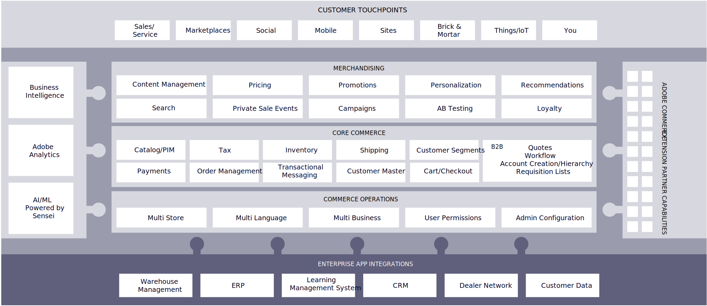

# Adobe Commerce capabilities

Adobe Commerce is one of the most trusted and reliable ecommerce platforms on the market. That trust and reliability has been proven in the growth of the businesses that use it. According to[Hosting Tribunal](https://hostingtribunal.com/blog/magento-statistics/#gref), brands leveraging Adobe Commerce as their ecommerce platform grow three times faster compared to brands on other platforms.

Adobe Commerce’s ability to handle any complexity your brand might face has made it a popular choice as companies enhance their sophistication. Whether brands are focused on a single site in one region or need to connect multiple sites or stores across the globe, Adobe Commerce has the infrastructure to create a seamless and connected experience. As a partner, we then leverage our expertise to customize the site to fit your unique needs.

Adobe has been well known from creative products, but it also has a significant digital business providing content management, analytics, campaign orchestration, account-based marketing personalization capabilities, and, of course, commerce.

But what makes an experience good and differentiated from competitors?

- It needs to be rich and engaging
- It should be driven by data and contextual for the visitor
- It needs to be intelligent
- It needs to be seamless across touchpoints and wherever your visitors are

To build great shopping experiences, enterprises need powerful, modern platforms that are open, extensible, scalable, and secure, not to mention modern tooling for agile development. Adobe Commerce is the perfect platform to fill all of those needs.

Adobe Commerce is a fully featured, market-tested ecommerce platform that’s built to deliver rich, personalized commerce experiences across every channel and business model. Adobe Commerce can serve as either an end-to-end commerce application or a reference application within a larger business landscape. It is modular and flexible with an extensive API built in REST and GraphQL and it can be used with a variety of heads—anything from WordPress and Drupal to Adobe Experience Manager and others.

## Capabilities map

The Adobe Commerce application is made up of a collection of features that are self-contained modules.

