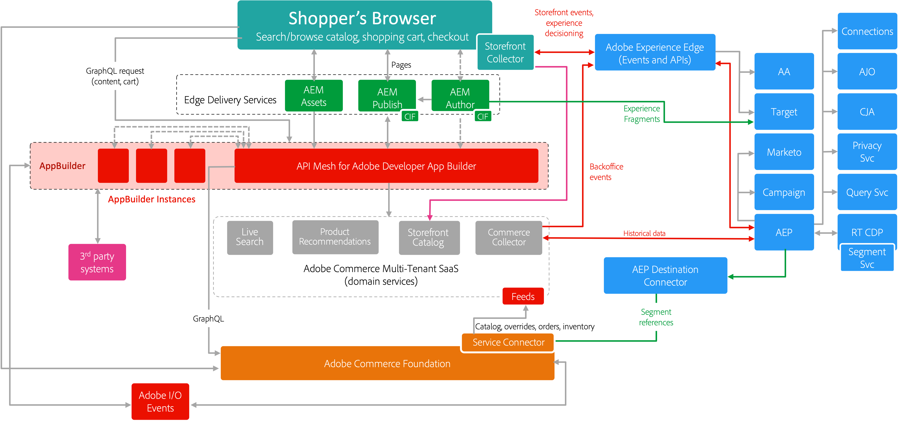

# Adobe Commerce enterprise architecture blueprint

The goal is to take what we've learned working with large enterprise customers and scale our GTM efforts to show CIOs and technical evaluators how Commerce connects to all Experience Cloud solutions. 

The expected outcome is to convince customers and partners of the value of Adobe solutions and to adopt our new innovations to support their business goals.

{zoomable="yes"}

{width="50%" zoomable="yes"}

## Cloud foundation

[Adobe Commerce on cloud infrastructure](https://experienceleague.adobe.com/docs/commerce-cloud-service/user-guide/overview.html) provides an automated hosting platform with a self-service approach to building, deploying, monitoring, and managing your Commerce application in a cloud-native environment.

## Composability

Adobe Commerce is a composable ecommerce platform designed to launch ecommerce features faster, easily share data between third-party systems, and lower the cost of ownership for integrations and customizations.

Traditional composable applications are built using point-to-point integrations between multiple services. This approach leads to a brittle integration layer with increasing technical debt. Adobe Commerce provides developers with comprehensive extension points as well as an extensibility platform to orchestrate API, events, and data resulting in a flexible composable architecture. The Adobe Commerce platform includes:

- Comprehensive [API](https://developer.adobe.com/commerce/webapi/) coverage
- [Webhooks](https://developer.adobe.com/commerce/extensibility/webhooks/) to customize native commerce processes
- [Admin UI](https://developer.adobe.com/commerce/extensibility/admin-ui-sdk/) extensibility
- Over 700 [events](https://experienceleague.adobe.com/docs/commerce-learn/tutorials/adobe-developer-app-builder/io-events/getting-started-io-events.html)

## SaaS features

Adobe provides a collection of merchandising and data services to help you support key components of your business:

- [Data Connection](https://experienceleague.adobe.com/docs/commerce-merchant-services/data-connection/overview.html)—Unlock insights about your shoppers' buying behavior and create personalized shopping experiences across all channels with other Adobe Digital Experience products.
- [Live Search](https://experienceleague.adobe.com/docs/commerce-merchant-services/live-search/overview.html)—Deliver smarter, faster and relevant results for shoppers with this AI-powered search tool.
- [Product Recommentations](https://experienceleague.adobe.com/docs/commerce-merchant-services/product-recommendations/overview.html)—Add AI-fueled recommendations based on shopper behavior, popular trends, product similarity, and more.
- [Catalog Service](https://experienceleague.adobe.com/docs/commerce-merchant-services/catalog-service/guide-overview.html)—Give your customers an optimized product experience while boosting performance, improving scalability, and increasing conversions.
- [Payment Services](https://experienceleague.adobe.com/docs/commerce-merchant-services/payment-services/guide-overview.html)—Drive customer satisfaction by offering various payment methods, including interest-free payment installments, and a single view into payment processing, orders, and invoices.

## Storefront technology

To offer a truly powerful and complete commerce experience, Adobe offers a [new storefront](https://experienceleague.adobe.com/developer/commerce/dropins/) that not only includes the same benefits and capabilities delivered by [Edge Delivery Services](https://aem.live) with document-based authoring, a performance-first architecture, and out-of-the-box native experimentation; but also leverages the scale and performance of Adobe Commerce SaaS products and the flexibility and convenience of drop-in components that deliver commerce capabilities required to transact online.
