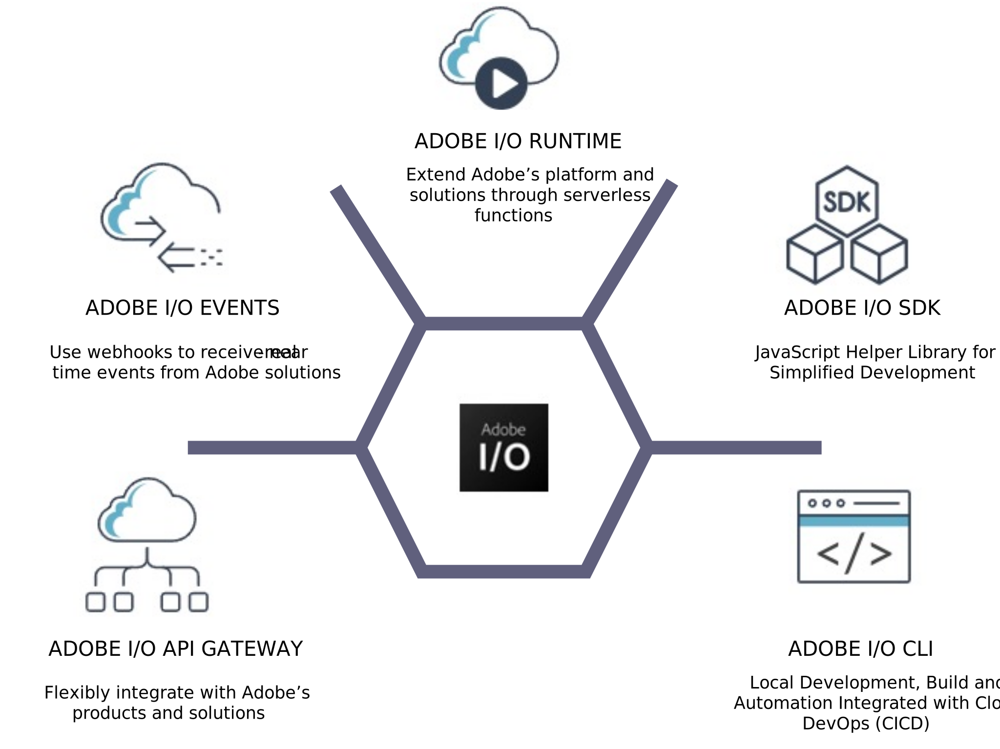

# Extensibility strategy

Adobe Commerce’s extensibility platform allows brands to efficiently customize processes, integrate systems, and deploy new capabilities while maintaining SaaS-like upgradeability.

