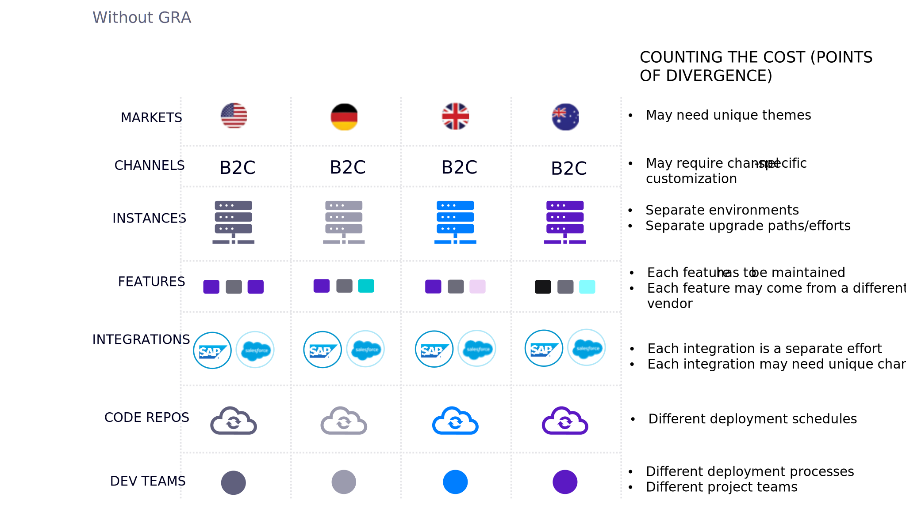
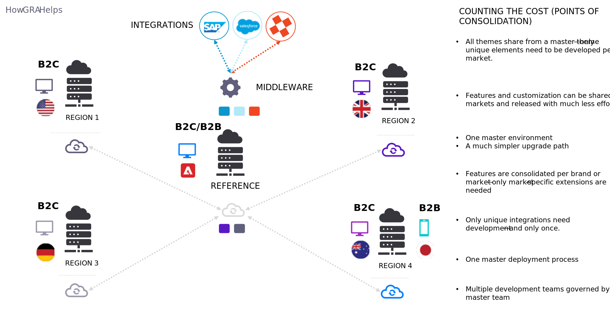

# Global Reference Architecture (GRA)

When running businesses that have multiple sites for multiple brands in multiple local markets (with localized currencies, languages, media, shared catalogues, and unique carts) and who want to avoid unnecessary costs for implementing same feature and integrations—Global Reference Architecture (GRA) is always a good option.

GRA is:

- An implementation approach
- A deployment strategy
- A process governance model

GRA is not:

- A product “feature”
- Unique to any commerce platform
- Only for global business use cases

GRA impacts:

- How code is delivered

  - Built around purpose-specific code repositories, which deliver different experiences.

- How business systems are integrated

  - Consolidates connections to business systems by brand and/or region.

- How customization is developed and maintained

  - Ensures customizations are centralized and domain-specific so that all customization effort is done from a holistic point of view for the business.

- How new markets are enabled

  - Simplifies the release of multiple channels and markets that would otherwise cost considerably more time and money.
