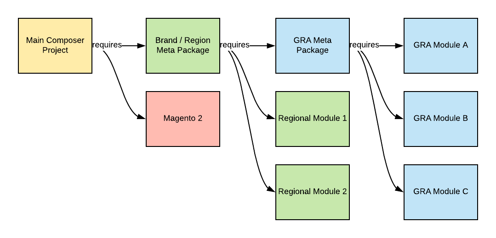
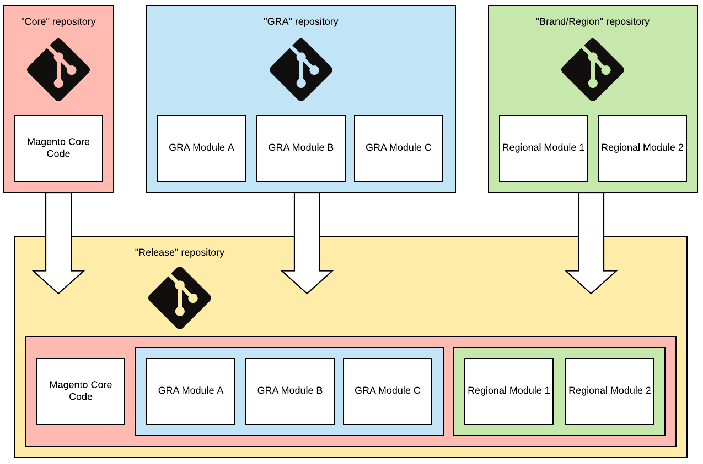
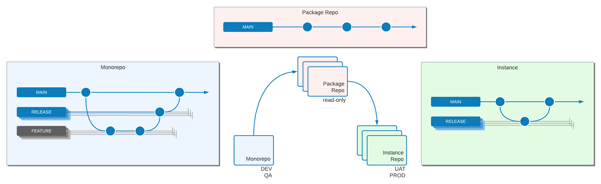
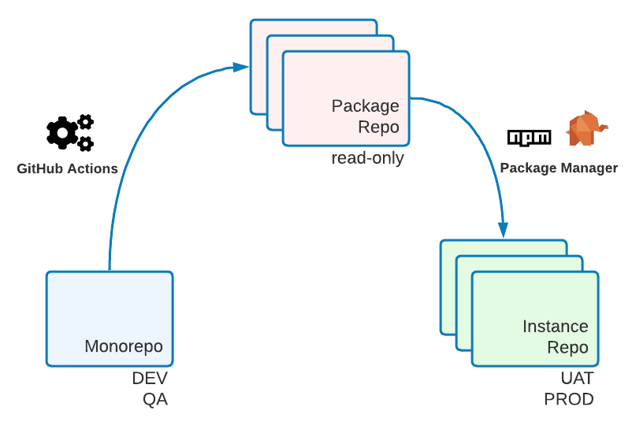

# Global reference architecture examples

This topic describes common ways of organizing a [global reference architecture (GRA)](overview.md) code base. Although the [separate packages](#option-1-separate-packages) option is preferred, some situations require one of the other options described below.

## Definitions

{{$include /help/_includes/gra-definitions.md}}

## Option 1: Separate packages

See [Composer project structure](composer/project-structure.md) best practices for setting up this method.



The most flexible way to manage GRA Composer packages is through metapackages. Metapackages contain a `composer.json` file only, which defines other package dependencies. Create metapackages using [Private Packagist](https://packagist.com/) repositories.

### Main project `composer.json`

```json
{
    "name": "example-client/region-1",
    "description": "Example Client Region 1",
    "type": "project",
    "require": {
        "magento/product-enterprise-edition": "2.3.5",
        "example-client/meta-region-1": "~1.0"
    },
    "minimum-stability": "dev",
    "prefer-stable": true,
    "repositories": [
        {"type": "composer", "url": "https://repo.packagist.com/example-client/"},
        {"packagist.org": false}
    ]
}
```

### `example-client/meta-region-1 composer.json`

```json
{
    "name": "example-client/meta-region-1",
    "description": "Region 1 meta package",
    "type": "metapackage",
    "require": {
        "example-client/meta-gra": "~1.0",
        "example-client/theme-frontend-region1",
        "example-client/language-es-es",
        "ingenico/ogone-client"
    }
}
```

### `example-client/meta-gra composer.json`

```json
{
    "name": "example-client/meta-gra",
    "description": "GRA meta package",
    "type": "metapackage",
    "require": {
        "geoip2/geoip2": "~2.0",
        "magento-services/module-stackify-logger": "~1.1",
        "example-client/sap-connector",
        "example-client/service-chat",
        "example-client/store-locator"
    }
}
```

Each module, language pack, theme, and library has its own Git repository. Each Git repository synchronizes to the Private Packagist repository automatically and generates a package there as long as there is a `composer.json` file in the root of the Git repository.

## Options 2: Bulk packages

Below is an example of multiple modules inside a single Composer package.

The limitation is that only packages of the same type can be bundled. So either Adobe Commerce modules, themes, language packs, or libraries. Do not include combinations of different types within a package.

The file structure inside the vendor directory should look like the following example. However, check your project to see what should be included in your Git repository):

```tree
.
└── example-client/
    └── gra/
        └── src/
            ├── SapConnector/
            │   ├── etc/
            │   └── registration.php
            ├── ServiceChat/
            │   ├── etc/
            │   └── registration.php
            ├── StoreLocator/
            │   ├── etc/
            │   └── registration.php
            └── composer.json
```

The `composer.json` file should look like this:

```json
{
    "name": "example-client/gra",
    "description": "GRA Modules",
    "require": {
        "magento/magento-composer-installer": "*"
    },
    "type": "magento2-module",
    "autoload": {
        "files": [
            "src/SapConnector/registration.php",
            "src/ServiceChat/registration.php",
            "src/StoreLocator/registration.php"
        ],
        "psr-4": {
            "ExampleClient\\SapConnector\\": "src/SapConnector",
            "ExampleClient\\ServiceChat\\": "src/ServiceChat",
            "ExampleClient\\StoreLocator\\": "src/StoreLocator"
        }
    }
}
```

## Option 3: Split Git

This architecture uses four Git repositories to store code:

- `core`: Contains the Adobe Commerce core installation. Is used to upgrade Adobe Commerce versions.
- `GRA`: Contains GRA code. All GRA modules, language packs, white label themes, and libraries.
- `brand/region`: Each brand or region has its own repository with only brand- or region-specific code.
- `release`: All of the above are merged into this Git repository. Only merge commits are allowed here.



To set up this option:

1. Create the four repository types in Git. Create the `core` and `GRA` repositories only once. Create one `brand/region` and one `release` repository for each brand.

   Suggested repository names:

   - `m2-core`
   - `m2-gra`
   - `m2-region-x`/`m2-brand-x` (for example, `m2-emea`/`m2-adobe`)
   - `m2-release-region-x`/`m2-release-brand-x` (for example, `m2-release-emea`/`m2-release-adobe`)

1. Create a `release/` directory and run the following to create a shared Git history for all repos.

   ```bash
   git init
   git remote add origin git@github.com:example-client/m2-release-brand-x.git
   git remote add core git@github.com:example-client/m2-core.git
   git remote add gra git@github.com:example-client/m2-gra.git
   git remote add region-x git@github.com:example-client/m2-region-x.git
   touch .gitkeep
   git add .gitkeep
   git commit -m 'initialize repository'
   git push -u origin master
   git push core master
   git push gra master
   git push region-x master
   ```

1. Clone each repository, except `core`, in a different directory on your computer.

   ```bash
   git clone git@github.com:example-client/m2-release-brand-x.git
   git clone git@github.com:example-client/m2-region-x.git
   git clone git@github.com:example-client/m2-gra.git
   ```

1. [Install Adobe Commerce with Composer](../../../installation/composer.md). Remove the `.gitignore` file, add the `core` remote, add and commit the code, and push.

   ```bash
   composer create-project --repository-url=https://repo.magento.com/ magento/project-enterprise-edition m2-core
   cd m2-core
   git init
   rm .gitignore
   git remote add origin git@github.com:example-client/m2-core.git
   git fetch
   git checkout .gitkeep
   git add --all
   git commit -m 'install Adobe Commerce'
   git push
   ```

1. In the `GRA` repository, create the following directories:

   - `app/code/`
   - `app/design/`
   - `app/i18n/`
   - `lib/`
   
1. Add code. Remove the `.gitignore` file, add and commit the code, add the remote, and push.

1. In the `brand/region` repository. Do the same as in `GRA` repository and keep in mind that no files may overlap with the `GRA` repository.

1. In the `release` repository, apply the merge.

   ```bash
   git clone git@github.com:example-client/m2-release-brand-x.git
   cd m2-release-brand-x
   git remote add core git@github.com:example-client/m2-core.git
   git remote add gra git@github.com:example-client/m2-gra.git
   git remote add region-x git@github.com:example-client/m2-region-x.git
   git fetch --all
   git merge core/master gra/master brand-a/master
   git push
   ```

1. You can remove the `.gitkeep` file now.

1. Now, you can deploy the `release` repository to the production, test, QA, and development servers. Upgrading `core`, `GRA`, and `brand` code is as easy running the following commands:

   ```bash
   git fetch --all
   git merge core/master gra/master brand-a/master
   git push
   ```

## Option 4: Monorepo (recommended)

This strategy closely mimics the way that the Magento Open Source Git repository works.

All code is developed and tested in a single repository. Automation distills packages from this single repository, which can be installed on UAT and production environments using Composer.



The monorepo option offers you the ease of working in a single repository, while also providing the flexibility of composing instances with packages.

Versioning and package distillation is done through automation, using GitHub Actions or GitLab Actions.



See the following resources for more information about this automation:

- [https://github.com/symplify/monorepo-builder](https://github.com/symplify/monorepo-builder)
- [https://github.com/danharrin/monorepo-split-github-action](https://github.com/danharrin/monorepo-split-github-action)

>[!TIP]
>
>Setting up a monorepo is advanced, but offers the most flexibility at the lowest overhead cost.

## Do not mix strategies

It is not advisable to use a combined approach using Composer for GRA packages and the `app/` directory for brand or region packages.

You not only get all _advantages_ but also all _disadvantages_ of both methods. You should pick one or the other (Git or Composer), to work optimally.

## Solutions to avoid

- **Module naming conventions to signify GRA or brand**

  Naming modules to signify GRA or brand leads to lack of flexibility. Instead, use Composer metapackages to determine which group a module belongs to. For example, for customer VF, package `vf/meta-gra` contains references to all GRA packages and can be installed using the `composer require vf/meta-gra` command. Package `vf/meta-kipling` contains references to all Kipling specific packages and to the `vf/meta-gra` package. Modules are named `vf/module-sales` and `vf/module-sap` for example. This naming convention allows you to move packages between brand and GRA status, with low impact.

- **Adobe Commerce core upgrades per instance**

  Schedule Adobe Commerce core upgrades, including patch upgrades, for different brands or regions to be executed as close together as possible. Supporting multiple Adobe Commerce versions for shared modules leads to forking of modules due to compatibility constraints and more than doubles the maintenance effort. Prevent this increased effort by making sure that all instances are running on the same Adobe Commerce version before continuing regular development.
