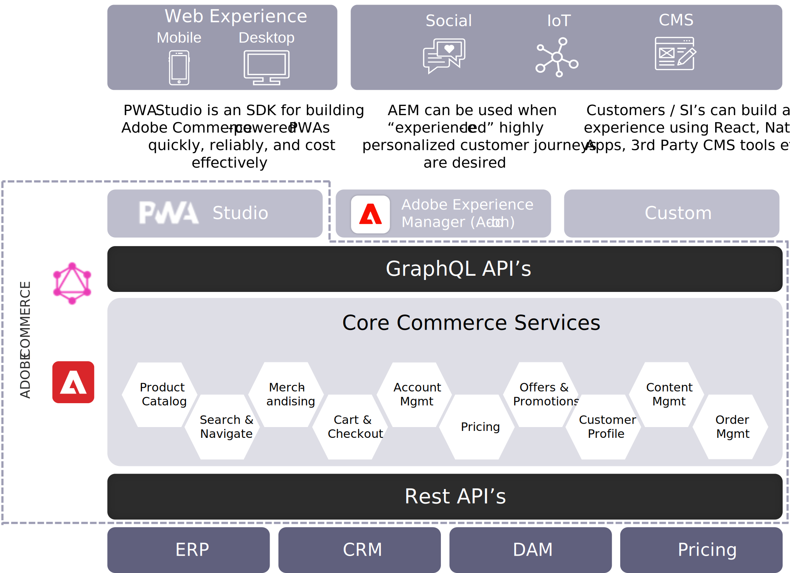

# Headless Adobe Commerce Architecture

The benefit of Adobe Commerce’s architecture is that it’s not an all-or-nothing proposition and a merchant can find the right mix of solutions for their business. They can build a PWA Studio-powered PWA for their primary site experience or use Adobe Experience Manager as the layer in complex customer journeys, all while building out a custom frontend to experiment with new touchpoints. No other platform can match the time to market benefits and the flexibility that Adobe Commerce offers with its headless architecture.

Each approach is not mutually exclusive. Customers can build their own frontend (head), use PWA Studio for web/mobile experiences, and/or use Adobe Experience Manager for the glass (in either a full or hybrid deployment).

Adobe Commerce has always allowed for headless deployments with REST APIs. While REST is powerful, especially for bulk processing, when it comes to headless, GraphQL APIs enable faster development through an intuitive developer experience, greater flexibility by allowing for changes that don’t impact existing APIs, and better performance by minimizing the amount of data retrieved to only exactly what is needed.

GraphQL is an industry standard for performant APIs, which is used by many of the top ecommerce platforms. That's a good thing since this means that it's a proven solution and expertise exists in the market.

While Adobe Commerce does have a coupled storefront as an option, it is by no means required that a merchant use that Adobe Commerce legacy frontend. A merchant can take advantage of Adobe Commerce’s best-in-class commerce services to handle the backend business processes and, using our storefront APIs, integrate their own decoupled storefront to drive the frontend experience.

Now, let’s take a look at the various headless options.

## PWA Studio

The first is a progressive web application built with PWA Studio. Part of this is enabled by the fact that a PWA is a headless storefront decoupled from the commerce backend. With PWA Studio, merchants can build high performing, reliable, and cost effective PWAs on top of Adobe Commerce to deliver best-in-class web experiences, both on mobile and desktop. As time goes on, this will overtake the coupled storefront as the default option.

Most merchants understand the direction that the industry is heading toward with regards to PWAs and many potential blockers are being removed rapidly.

Week over week, the number of partners building expertise in PWA Studio grows and we have an accelerating number of customer launches. The most recent update to PWA Studio included extensibility that will help make significant progress in compatibility with Adobe Commerce Marketplace extensions.

Many merchants may feel they aren’t ready for headless and PWAs because they require heavy reliance on developers. One of the huge benefits of having both the commerce application and the head developed by Adobe Commerce is that it helps ensure compatibility across commerce capabilities.

In order to make PWAs more accessible and easier to manage for our merchants, we empower business users to manage day-to-day content changes, create new landing pages, and more using Page Builder. These two powerful capabilities together enable speed to market across all devices and experiences.

## Adobe Experience Manager

A powerhouse combination for your content and digital asset management needs, Adobe Experience Manager helps merchants get personalized, content-led experiences into market faster, combining digital asset management with the power of machine learning, Adobe Sensei-powered content, and customer journey management.

Adobe Commerce plus Adobe Experience Manager is a powerful story in that the commerce engine allows businesses to enable commerce though customer interfaces that are powered by Adobe Experience Manager.

## Custom Heads

The final option to discuss here is the option of building a custom frontend. This option is for businesses that have existing expertise and in-house developers skilled in a particular frontend stack, like React. If they don’t have skills in Adobe Commerce’s traditional frontend development, they can decide that it's more cost effective to build their own custom React frontend.

Naturally, this model requires strong customer or systems integration frontend development skills and resources, and you don’t get the benefit of native compatibility with things like Page Builder that you get with PWA Studio. Any time a merchant is building something completely custom, they may lose time-to-market advantages.

Custom front ends also enable innovations and experimentation. There’s a lot of talk about AR/VR or voice commerce, and an architecture like Adobe Commerce’s allows merchants to explore these options without impacting their existing webstores.
