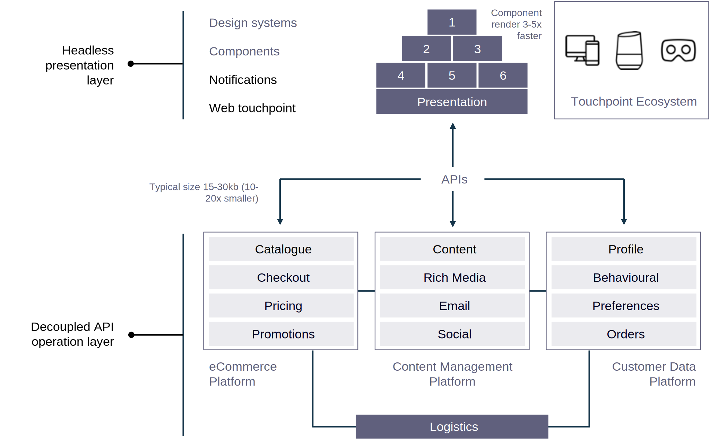
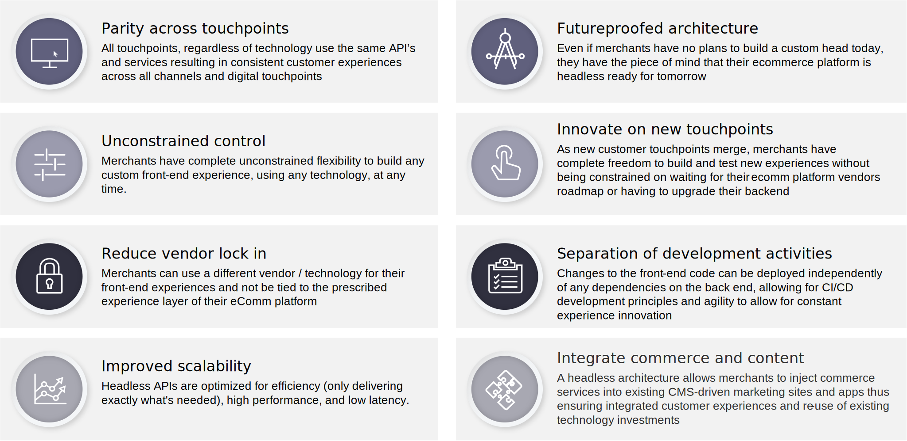

# Headless Commerce

## Why Headless?

For starters, legacy enterprise commerce is expensive and difficult to scale due to siloes; legacy structures are reinforced through platform limitations; and innovation becomes challenging.

Customers expect a business to interact with them and engage with them across all channels. Customer-centric organizations are looking to build future-proofed platforms that can adapt to changing customer expectations.

Headless commerce is API-based commerce. It decouples business logic, as well as transactional and data aspects of commerce, from presentation. Headless is an integrated framework that provides full flexibility for all channels and touchpoints, with a frontend experience layer that is separated from the platform itself. This allows brands the agility to deliver content such as products, data, and orders to any touchpoint both now and in the future, while being able to display it in any way they like.

Headless architecture is the technical separation of the head from the rest of the commerce application. Adobe Commerce is fully headless with a decoupled architecture that provides all commerce services and data through a GraphQL API layer. This architecture allows frontend teams to develop their frontends independently from Adobe Commerce, providing the agility to quickly build and test new touchpoints with emerging technologies.

Adobe Commerce GraphQL APIs can also be extended with microservices that are deployed on Adobe’s I/O Runtime. This provides unparalleled agility to integrate, extend, and customize omnichannel business processes without requiring code customizations to the backend, which ensures the core platform can be easily upgraded without impact to the frontend touchpoints. Adobe Commerce GraphQL APIs are open sourced and part of our community engineering program with significant contributions and oversight coming from our community of developers.

