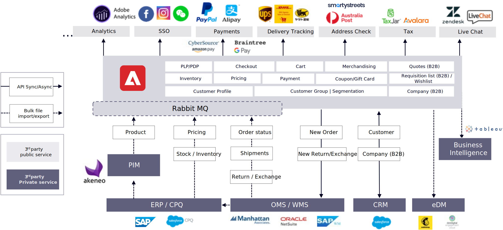
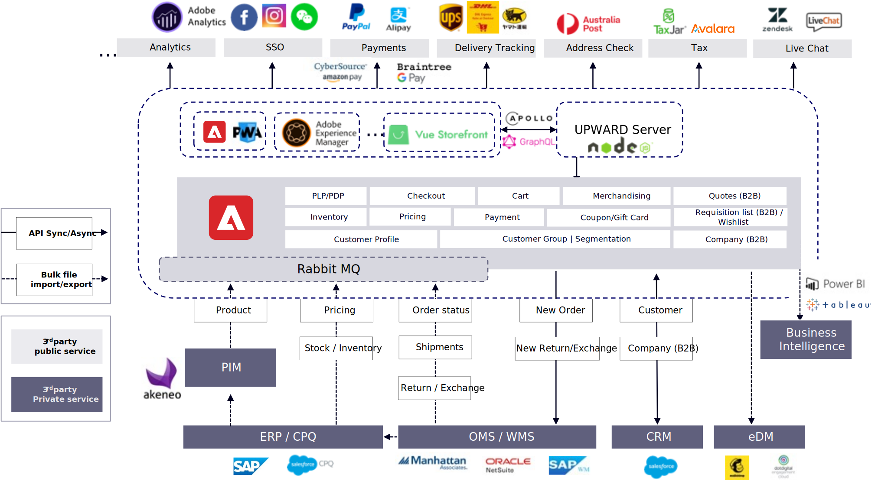

# Typical integration points and dataflows

There are two main approaches to integrations and dataflows, which are very similar but have one key difference.

## Monolithic 

The following diagram describes a monolithic approach that uses Adobe Commerce as both the backend system and storefront application:

## Headless 

The following diagram describes a headless approach that uses Adobe Commerce as the backend system integrated with a DXP/CMS/custom application as the storefront application:

The only difference between the monolithic and headless approach is storefront integration, which impacts the user experience for customers. Monolithic uses Adobe Commerce storefront directly to integrate with third-party services, while headless depends on its own storefront to customize and integrate with the same services. Some services like payment and single sign-on (SSO) need both storefront and Adobe Commerce customization to finalize the integration flow.

## Third-party systems

Some popular services already have great extensions to support Adobe Commerce or popular storefront solutions, such as PWA Studio, Adobe Experience Manager, and Vue Storefront, which can be found from their extension marketplace or from related third-party websites. Even if there is no existing extension, the effort to implement the integration between Adobe Commerce and other headless storefronts are similar. All third-party services usually have documents to explain how to integrate with them. Those service are just some examples; various countries and markets may have different choices.

## Enterprise integrations

For enterprise systems integrations, which are also usually called backend integrations, there is an impact on the business data flow. Based on different business type and needs, it can use three different integration options, which we already introduced.

Product-mandatory data like SKUs, inventory, and base prices usually come from ERPs, while sales prices are usually managed by each sales channel (for example, Adobe Commerce) or CPQ (B2B or private sales). Because product-mandatory data (except inventory) does not change very often, best practice is to use scheduled batch updates through the REST API or bulk-file import. For inventory, best practice is to have a full update on a daily basis for product inventory that is shared with different sales channel to avoid over-sales. Additionally, have incremental changes from your ERP scheduled within 24 hours.

Product catalog, metadata, and marketing content can be managed separately by each sales channel (for example, Adobe Commerce) or from a central PIM. As metadata is also not changed frequently, best practice is to use scheduled batch updates through the REST API or bulk-file import.

Order data includes order, quote (B2B), shipment, return, and exchange data that is usually managed from a centralized OMS and WMS system. Order data should be synchronized as soon as possible, so REST API is usually the best option. For better performance, consider reducing the number of API calls. For the order status, shipments, return, and exchange data, consider scheduling REST batch update APIs in hours or minutes.

B2B data is usually managed from a centralized CRM. A real-time API is used to verify existing customers and create new customers. For B2B, it might require introducing more APIs to synchronize different company employee, group, and price list between Adobe Commerce and your CRM or CPQ.

There are some other system integrations like eDM for email marketing and business intelligence for business data analysis—which are usually done either via REST API or file export/import, which usually supported by existing extensions.
