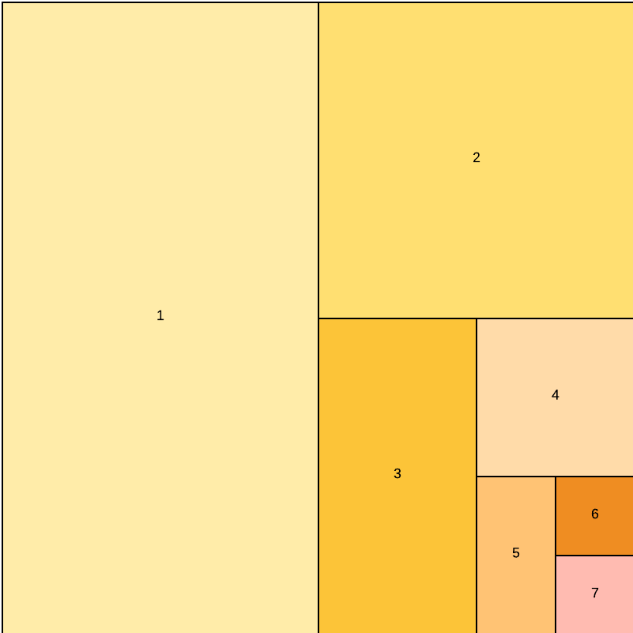

# Debugging best practices for Adobe Commerce

This topic explains ways to systematically and effectively debug the Adobe Commerce framework. The goal is to help you get to the root of a problem quickly and minimize investigation time.

## Troubleshooting: Usual suspects

This section describes the most common issues that you might encounter during development.

### Cache

- Flush the cache before further investigation
- Consider the APC cache, CDN, Varnish, generated code, and the `var/view_preprocessed` and `pub/static/` directories
- Stop and restart queue handlers after flushing the cache or modifying code

The following code sample provides helpful commands related to managing the cache (do not run on production environments):

```bash
# restart php-fpm to flush APC
sudo service php-fpm restart
 
# restart varnish to force full flush
sudo service varnish restart
 
# clear generated files
rm -rf generated/*
 
# clear static file cache
rm -rf var/view_preprocessed/*
rm -rf pub/static/*
 
# flush redis cache
redis-cli -n <db_number> FLUSHDB
 
# flush redis cache and sessions
redis-cli FLUSHALL
 
# flush redis cache with telnet
telnet <ip_or_host> 6379
SELECT <db_number>
FLUSHDB
Ctrl + ]
quit
 
# flush redis cache and sessions with telnet
telnet <ip_or_host> 6379
FLUSHALL
Ctrl + ]
quit
 
# find consumers
pgrep -af queue:consumers:start
 
# kill all queue consumers (they will restart by cron job)
sudo pkill -f queue:consumers:start
 
# kill a specific queue consumer (it will restart by cron job)
sudo kill <process_id>
```

### Indexed data

Reindex everything if the issue might be index-related. Debugging indexed data typically happens on non-production environments. On production environments, you might want to investigate the origin of the index misalignment before you reindex. The characteristics of the faulty state can tell you something about the origin of the problem.

### Composer

You might have outdated code due to a branch change or because of core files that were edited in a previous debugging effort. To eliminate potential issues, run the following commands:

```bash
rm -rf vendor/*
composer clear-cache
composer install
```

### Generated content

Rebuild frontend files before debugging the generated content in JS, CSS, images, translations, and other files.

```bash
rm -rf generated/* var/cache/* var/page_cache/* var/session/* var/view_preprocessed/* pub/static/*
bin/magento setup:static-content:deploy
bin/magento cache:flush
```

### Developer mode

Make sure that your local installation is in `developer` mode.

### New module

If you have created a module, check for the following issues:

- Is the module enabled? 

   ```bash
   bin/magento module --enable Your_Module
   ```

  Check the `app/etc/config.php` file for your new module.

- Check the file and directory structure nesting. For example, are layout files in the `view/layout/` directory instead of the `view/frontend/layout` directory? Are templates in the `view/frontend/template` directory instead of the `view/frontend/templates` directory?

## Troubleshooting: Half-splitting

If the usual suspects do not offer a solution to the problem, the fastest way to proceed is by half-splitting (or bisecting) the problem. With this method, you eliminate large chunks and divide what is left to locate the root cause instead of going through the code in a linear fashion.

See the following diagrams:




There are several approaches to bisecting, but Adobe recommends following this order: 

- Bisect by topic
- Bisect by commits
- Bisect by files

### Step 1: Bisect by topic

If the problem might not be code-related, eliminate the large chunks first. Some of the large chunks to think of include:

- **Adobe Commerce framework**—Is the problem related to Adobe Commerce at all or could it be related to another connected system?
- **Server and client**—Clear the browser cache and storage. Is the problem resolved? That might rule out a server-related cause. Does the problem still exist? No need to waste any more time in browser debugging.
- **Session**—Does the problem occur for every user? If not, your problem might be limited to session- or browser-related topics.
- **Cache**—Does disabling all caches change anything? If so, you can focus on cache-related topics.
- **Database**—Does the problem occur on every environment running the same code? If not, look for problems in configuration and other database-related topics.
- **Code**—Look for code issues if none of the above resolved the problem.

### Step 2: Bisect by commits

If the problem started between now and two months ago, roll the code back to two months ago. Verify whether the problem still exists. Go forward one month. Does the problem occur there? If not, go forward two weeks. Does it occur now? Go back one week. Still there? Go back four days. At some point, you have only one commit left that is likely to contain code related to the problem. Your root cause is now likely limited to the files edited in that commit.

You can substitute weeks and days with commits. For example, roll back 100 commits, forward 50, forward 25, back 12.

### Step 3: Bisect by files

- Divide Adobe Commerce by file types (core and non-core). First, disable all customer and marketplace modules. Does the problem still exist? It is most likely a non-core issue.
- Enable (roughly) half of the modules again in the `app/etc/config.php` file. Be aware of dependencies. It is best to enable module clusters with the same topic all at once. Does the problem still exist?
- Enable a quarter of the remaining modules. Does the problem still exist? Disable half of what you enabled. This method can help you isolate the root cause to a single module.

## Time savers

Apart from the troubleshooting techniques, this section provides some general rules that can help save time during debugging. 

### Limit data

Consider whether you need the full catalog or all store views to replicate the issue. You can debug indexing issues with a database clone where you have removed 95% of the catalog before you start debugging. This method saves considerable time during indexing processes. Create a duplicate of the client database with reduced store count and catalog. This might also apply to other entities (such as customers) depending on the area you are debugging.

### Ask for more information

Sometimes, an easy step to forget amidst all the code and technical work: ask for more information. Full-screen captures, a video, a video conference chat with the person that identified the issue, replication steps, questions about whether other seemingly unimportant things happened around the problematic event. Ask what someone expected to happen. Is this really a bug or maybe just a misunderstanding of the way that the code works?

### Language and interpretation

Is the description of the problem clear? Are you sure that no terms or descriptions can be interpreted in multiple ways. If so, make sure that you are talking about the same thing.

### Internet search

Do an internet search with terms related to the problem. Chances are that someone else has already encountered the same issue. Search through the [Adobe Commerce GitHub issues](https://github.com/magento/magento2/issues).

### Take a break

If you are looking at a problem for too long, it can be challenging to find a solution. Put down your work and pick up another task or take a walk. The answer might come to you when you forget about the issue for a while.

## Tools

The n98 magerun CLI Tools ([https://github.com/netz98/n98-magerun2](https://github.com/netz98/n98-magerun2)) provide useful capabilities to work with Adobe Commerce from the command line. Especially these commands:

```bash
n98-magerun2.phar dev:console
n98-magerun2.phar sys:cron:run
n98-magerun2.phar db:console
n98-magerun2.phar index:trigger:recreate
```


## Code snippets

The following topics provide code snippets that can be used to log or identify issues in Commerce projects.

### Check if an XML file is used by Commerce

Add an obvious syntax error in an XML file to see if it is used. Open a tag and do not close it for instance:

```xml
<?xml version="1.0"?>
<test
```

If this file is used, it generates an error. If it is not, your module might not be used or not be enabled for instance, or the XML file might be in the wrong location.

### Logging

>[!BEGINTABS]

>[!TAB Adobe Commerce]

```php
\Magento\Framework\App\ObjectManager::getInstance()
    ->get(\Psr\Log\LoggerInterface::class)->debug('message');
```

>[!TAB Monolog]

```php
$log = new \Monolog\Logger('custom', [new \Monolog\Handler\StreamHandler(BP.'/var/log/test.log')]);
$log->info('Your Logging Message', ['context' => ['email' => 'john@example.com']]);
```

>[!TAB Zend]

```php
$writer = new \Zend\Log\Writer\Stream(BP . '/var/log/test.log');
$logger = new \Zend\Log\Logger();
$logger->addWriter($writer);
$logger->info('Your text message');
$logger->info(print_r($yourArray, true));
```

>[!ENDTABS]

### Low-level logging

Two examples that always work in any PHP file:

```php
file_put_contents('/var/www/html/var/log/example.log', "example line\n", FILE_APPEND);
file_put_contents('/var/www/html/var/log/example.log', print_r($yourArray, true) . "\n", FILE_APPEND);
```

And for a stack trace:

```php
try {
    throw new \Exception('example');
} catch (\Exception $e) {
    file_put_contents('/var/www/html/var/log/example.log', $e->getTraceAsString() . "\n", FILE_APPEND);
}
```
