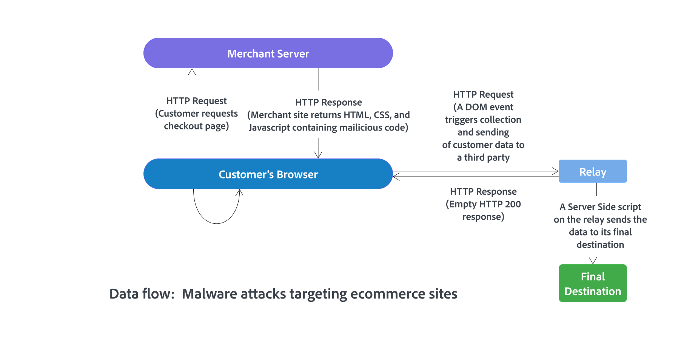

# Secure your Commerce site and infrastructure

Establishing and maintaining a secure environment for Adobe Commerce projects deployed on cloud infrastructure is a responsibility that is shared between Adobe Commerce customers, solution partners, and Adobe. The intent of this guide is to provide best practices for the customer's side of the equation.

Although you cannot eliminate all security risks, applying these best practices hardens the security posture of Commerce installations. A secure site and infrastructure makes a less attractive target for malicious attacks, ensures the security of the solution and customers' sensitive information, and helps minimize security-related incidents that can cause site disruptions and costly investigations.

>[!NOTE]
>
>For information about the roles and responsibilities for securing and maintaining Adobe Commerce projects on cloud infrastructure, see [Shared Responsibility Model](https://experienceleague.adobe.com/en/docs/commerce-operations/security-and-compliance/shared-responsibility#security-responsibilities-chart)) in the _Adobe Commerce Security and Compliance Guide_.

[All supported versions](../../../release/versions.md) of:

- Adobe Commerce on cloud infrastructure
- Adobe Commerce on-premises

## Priority recommendations

Adobe considers the following recommendations to be of highest priority for all customers. Implement these key security best practices in all Commerce deployments:

 **Enable two-factor authentication for your Admin and all SSH connections**

- [Security for Commerce Admin](https://experienceleague.adobe.com/docs/commerce-admin/systems/security/2fa/security-two-factor-authentication.html)

- [Secure SSH connections](https://experienceleague.adobe.com/docs/commerce-cloud-service/user-guide/project/multi-factor-authentication.html) (cloud infrastructure)

When MFA is enabled on a project, all Adobe Commerce on cloud infrastructure accounts with SSH access must follow an authentication workflow. This workflow requires either a two-factor authentication (2FA) code, or an API token and SSH certificate to access the environment.

 **Secure the Admin**

- [Configure a non-default admin URL](https://experienceleague.adobe.com/docs/commerce-admin/stores-sales/site-store/store-urls.html#use-a-custom-admin-url) instead of using the default `admin` or a common term such as `backend`. This configuration reduces exposure to scripts that attempt to gain unauthorized access to your site.

- [Configure Advanced security settings](https://experienceleague.adobe.com/docs/commerce-admin/systems/security/security-admin.html)—Add a secret key to URLs, require passwords to be case-sensitive, and limit Admin session length, password lifetime interval, and the number of login attempts allowed before locking an Admin user account. For increased security, configure the length of keyboard inactivity before the current session expires, and require the username and password to be case-sensitive.

- [Enable ReCAPTCHA](https://experienceleague.adobe.com/docs/commerce-admin/systems/security/captcha/security-google-recaptcha.html) to protect the Admin from automated brute force attacks.

- Follow the principle of least privilege when assigning [Admin permissions](https://experienceleague.adobe.com/docs/commerce-admin/systems/user-accounts/permissions.html) to roles and roles to Admin user accounts.

 **Upgrade to the latest release of Adobe Commerce**

Keep your code updated by [upgrading your Commerce project to the latest release](#upgrade-to-the-latest-release) of Adobe Commerce, Commerce Services, and extensions, including security patches, hotfixes, and other patches provided by Adobe.

 **Secure sensitive configuration values**

Use [configuration management](../../../configuration/cli/set-configuration-values.md) to lock critical configuration values.

The `lock config` and `lock env` CLI commands configure environment variables to prevent them from being updated from the Admin. The command writes the value to the `<Commerce base dir>/app/etc/env.php` file. (For Commerce on cloud infrastructure projects, see [Store Configuration Management](https://experienceleague.adobe.com/docs/commerce-cloud-service/user-guide/configure-store/store-settings.html#sensitive-data).)

 **Run security scans**

Use the [Commerce Security Scan service](https://experienceleague.adobe.com/docs/commerce-admin/systems/security/security-scan.html) to monitor all Adobe Commerce sites for known security risks and malware, and sign up to receive patch updates and security notifications.

## Ensure security of extensions and custom code

When you extend Adobe Commerce by adding third-party extensions from the Adobe Commerce Marketplace, or add custom code, ensure the security of these customizations by applying the following best practices:

 **Choose a partner or solution integrator (SI) well versed in security**—Ensure secure integrations and secure delivery of custom code by selecting organizations that follow secure development practices and have a solid track record of preventing and addressing security issues.

 **Use secure extensions**—Identify the most appropriate and secure extensions for Commerce deployments by consulting with your solution integrator or developer and following [Adobe Extensions best practices](../planning/extensions.md).

- Only source extensions from the Adobe Commerce Marketplace or through the solution integrator. If the extension is sourced through an integrator, ensure that ownership of the extension license is transferrable, in case the integrator changes.

- Reduce risk exposure by limiting the number of extensions and vendors.

- If possible, review extension code for security before integrating with the Commerce application.

- Ensure that PHP extension developers follow Adobe Commerce development guidelines, processes, and security best practices. Specifically, developers must avoid using PHP capabilities that can lead to remote code execution or weak cryptography. See [Security](https://developer.adobe.com/commerce/php/best-practices/security/) in the *Best Practices for Extension Developers Guide*.

 **Audit code**—Review your server and source code repository for development leftovers. Ensure that there are no accessible log files, publicly visible .git directories, tunnels to execute SQL statements, database dumps, php info files, or any other unprotected files that are not required, and that might be used in an attack.

## Upgrade to the latest release

Adobe continually releases updated solution components to improve security and better protect customers against possible compromise. Upgrading to the latest version of the Adobe Commerce application, installed services, and extensions and applying current patches is the first and best line of defense against security threats.

Commerce typically releases security updates on a quarterly basis but reserves the right to release hotfixes for major security threats based on priority and other factors.

See the following resources for information about available Adobe Commerce versions, release cycles, and the upgrade and patch process:

- [Released Versions](../../../release/versions.md)
- [Product Availability](../../../release/product-availability.md) (Adobe Commerce services and Adobe-authored extensions)
- [Adobe Commerce lifecycle policy](../../../release/lifecycle-policy.md)
- [Upgrade Guide](../../../upgrade/overview.md)
- [How to apply patches](../../../upgrade/patches/overview.md)

>[!TIP]
>
>Get the latest security information and mitigate against known security issues by subscribing to the [Adobe Security Notification Service](https://www.adobe.com/subscription/adbeSecurityNotifications.html).

## Develop a disaster recovery plan

If your Commerce site is compromised, control damage and restore normal business operations quickly by developing and implementing a comprehensive disaster recovery plan.

If a customer requires restoration of a Commerce instance due to a disaster, Adobe can provide the customer with backup files. The customer and solution integrator, if applicable, can perform the restore.

As part of a disaster recovery plan, Adobe highly recommends that customers [export their Adobe Commerce application configuration](../../../configuration/cli/export-configuration.md) to ease redeployment if it is required for business continuity purposes. The primary reason to export the configuration to the file system is that the system configuration takes precedence over the database configuration. In a read-only file system, the application must be redeployed to change sensitive configuration settings, providing an extra layer of protection.

### Additional information

**Adobe Commerce deployed on cloud infrastructure**

- [Backup and disaster recovery](https://experienceleague.adobe.com/docs/commerce-cloud-service/user-guide/architecture/pro-architecture.html#backup-and-disaster-recovery)

- [Store configuration management for Adobe Commerce on cloud infrastructure](https://experienceleague.adobe.com/docs/commerce-cloud-service/user-guide/configure-store/store-settings.html)

**Adobe Commerce deployed on premises**

- [Export configuration settings](../../../configuration/cli/export-configuration.md)

  - [Import configuration settings](../../../configuration/cli/import-configuration.md)

  - [Backup and rollback the file system, media, and database](../../../installation/tutorials/backup.md)

## Maintain a secure site and infrastructure

This section summarizes best practices for maintaining site and infrastructure security for an Adobe Commerce installation. Many of these best practices focus on securing the computer infrastructure in general, so some of the recommendations might already be implemented.

 **Block unauthorized access**—Work with your hosting partner to set up a VPN tunnel to block unauthorized access to the Commerce site and customer data. Set up an SSH tunnel to block unauthorized access to the Commerce application.

 **Use a Web Application Firewall**—Analyze traffic and discover suspicious patterns, such as credit card information being sent to an unknown IP address by using a Web Application Firewall.

Adobe Commerce installations deployed on cloud infrastructure can use built-in WAF services available with the [Fastly services integration](https://experienceleague.adobe.com/docs/commerce-cloud-service/user-guide/cdn/fastly.html)

 **Configure advanced password security settings**—Set up strong passwords and change them at least every 90 days, as recommended by the PCI Data Security Standard in section 8.2.4. See [Configure Admin security settings](https://experienceleague.adobe.com/docs/commerce-admin/systems/security/security-admin.html).

 **Use HTTPS**—If the Commerce site is newly implemented, launch the entire site using HTTPS. Not only does Google use HTTPS as a ranking factor, but many users do not even consider purchasing from a site unless it is secured with HTTPS.

## Protect against malware

Malware attacks targeting ecommerce sites are all too common, and threat actors continually develop new ways to harvest credit card and personal information from transactions.

However, Adobe has found that most site compromises are not due to an innovative hacker. Rather, threat actors often take advantage of existing, unpatched vulnerabilities, poor passwords, and weak ownership and permission settings in the file system.

In the most commonly experienced attacks, malicious code is injected into the absolute header or absolute footer of a customer store. There, the code collects form data that a customer enters in the storefront, including customer login credentials and checkout form data. Then, this data is sent to another location for malicious purposes rather than to the Commerce backend. Also, malware can compromise the Admin to execute code that replaces the original payment form with a fake form that overrides any protections set by the payment provider.

Client-side credit card skimmers are a type of malware that embeds code into merchant website content that can executed in a user's browser as shown in the following figure.

After certain actions occur such as a user submitting a form or modifying a field value, the skimmer serializes the data and sends it to third-party endpoints. These endpoints are typically other compromised websites that act as a relay to send the data to its final destination.

>[!TIP]
>
>If a Commerce site is impacted by a malware attack, follow the Adobe Commerce best practices for [responding to a security incident](../maintenance/respond-to-security-incident.md).

### Know the most common attacks

Below is a list of common categories of attacks that Adobe recommends all Commerce customers be aware of and take measures to protect against:

- **Site defacing**—An attacker damages a website by changing the visual appearance of the site or adding their own messages. Although access to the site and user accounts has been compromised, payment information often remains secure.

- **Botnets**—The customer's Commerce server becomes part of a botnet that sends spam email. Although user data is not typically compromised, the customer's domain name might be blocklisted by spam filters, preventing delivery of any email from the domain. Alternatively, the customer's site becomes part of a botnet causing a distributed denial of service (DDoS) attack on another site/s. The botnet may block inbound IP traffic to the Commerce server, preventing customers from being able to shop.

- **Direct server attacks**—Data is compromised, backdoors and malware are installed, and site operations are affected. Payment information that is not stored on the server is less likely to be compromised through these attacks.

- **Silent card capture**—In this most disastrous attack, intruders install hidden malware or card capture software, or worse, modify the checkout process to collect credit card data. Then, the data is sent to another site for sale on the dark web. Such attacks can go unnoticed for an extended time period and can result in major compromise of customer accounts and financial information.

- **Silent keylogging**—The threat actor installs key logging code on the customer server to gather Admin user credentials so they can log in and launch other attacks without being detected.

### Protect against password guessing attacks

Brute force password guessing attacks can result in unauthorized Admin access. Protect your site from these attacks by following these best practices:

- Identify and protect all points where the Commerce installation can be accessed from the outside world.

  You can secure access to the Admin, which generally requires the most protection, by following Adobe's [priority recommendations](#priority-recommendations) when configuring your Commerce project.

- Control access to the Commerce site by setting up an access control list that only allows access to users coming from a specified IP address or network.

  You can use a Fastly Edge ACL with a custom VCL code snippet to filter incoming requests and allow access by IP address. See [Custom VCL for allowing requests](https://experienceleague.adobe.com/docs/commerce-cloud-service/user-guide/cdn/custom-vcl-snippets/fastly-vcl-allowlist.html).

  >[!TIP]
  >
  >If you employ a remote workforce, ensure that the IP addresses of remote employees are included in the list of addresses with permission to access the Commerce site.

### Prevent clickjacking exploits

Adobe safeguards your store from clickjacking attacks by providing the `X-Frame-Options` HTTP request header that you can include in requests to your storefront. See [Prevent clickjacking exploits](../../../configuration/security/xframe-options.md) in the *Adobe Commerce Configuration Guide*.
