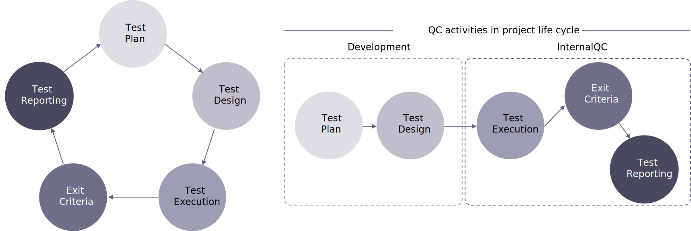

# Quality control process and tools

The quality control process in the previous diagram can be briefly described as follows.

<table>
<thead>
  <tr>
    <th>Software Development Process</th>
    <th>QC Workflow</th>
    <th>QC</th>
    <th>QC Leader</th>
  </tr>
</thead>
<tbody>
  <tr>
    <td>Development</td>
    <td>Planning</td>
    <td></td>
    <td>Review and contribute to test plans</td>
  </tr>
  <tr>
    <td></td>
    <td></td>
    <td></td>
    <td>Create test specifications (test cases/test scenarios)</td>
  </tr>
  <tr>
    <td></td>
    <td></td>
    <td></td>
    <td>Prepare and acquire test data</td>
  </tr>
  <tr>
    <td></td>
    <td>Test Analysis and Design</td>
    <td>Review and contribute to test plans</td>
    <td>Initiate the preparation, specifications</td>
  </tr>
  <tr>
    <td></td>
    <td></td>
    <td>Create test specifications (test cases/test scenarios)</td>
    <td>Write or review a Test strategy for the project</td>
  </tr>
  <tr>
    <td></td>
    <td></td>
    <td>Prepare and acquire test data</td>
    <td> Leading, guiding and monitoring the analysis, design</td>
  </tr>
  <tr>
    <td>Internal Testing</td>
    <td>Test Implementation and Execution</td>
    <td>Implements tests, execute and log the tests</td>
    <td>Monitoring implementation and execution of the tests</td>
  </tr>
  <tr>
    <td></td>
    <td></td>
    <td>Check performance and scan security- Evaluate the results and the deviations from expected results</td>
    <td>Ensure traceability of the tests to the test basis and keep track of bugs on the Bug tracking system</td>
  </tr>
  <tr>
    <td></td>
    <td></td>
    <td>Post bugs to bug tracking system (Jira/Redmine/Trello)</td>
    <td>Prioritize/schedule tests to align with the project planning defined by PM</td>
  </tr>
  <tr>
    <td></td>
    <td></td>
    <td>Re-testing (confirmation testing) after bug fixing</td>
    <td></td>
  </tr>
  <tr>
    <td></td>
    <td>Evaluating and Reporting</td>
    <td>Report test progress to QC lead and PM</td>
    <td>Evaluating test results and progress</td>
  </tr>
  <tr>
    <td></td>
    <td></td>
    <td></td>
    <td>Write test summary reports based on the information gathered during the test</td>
  </tr>
  <tr>
    <td>UAT</td>
    <td>UAT</td>
    <td>Verify Customer Feedbacks or Change Requests (CRs)</td>
    <td>Follow-up</td>
  </tr>
  <tr>
    <td></td>
    <td></td>
    <td>Perform re-testing and regression testing after changing the source code</td>
    <td>Controlling</td>
  </tr>
  <tr>
    <td></td>
    <td></td>
    <td>Update test specifications</td>
    <td></td>
  </tr>
  <tr>
    <td>Maintenance</td>
    <td>Maintenance</td>
    <td>Review and contribute to tasks</td>
    <td>Review and estimate time for tasks</td>
  </tr>
  <tr>
    <td></td>
    <td></td>
    <td>Create/update test specifications</td>
    <td>Follow-up test progress</td>
  </tr>
  <tr>
    <td></td>
    <td></td>
    <td>Execute tests for these tasks</td>
    <td></td>
  </tr>
  <tr>
    <td></td>
    <td></td>
    <td>Perform regression testing</td>
    <td></td>
  </tr>
</tbody>
</table>

Similar to the [tools](project-management-tools.md) we identified for the development process, we have selected a handful of choice solutions and platforms that we often utilize for quality control testing.

| Purpose                   | Tool                                              |
|---------------------------|---------------------------------------------------|
| Website performance index | Google PageSpeed, Webpagetest, JMeter             |
| Security                  | Adobe Commerce Security Scan Tool, SonarQube, ZAP |
| Issue management system   | JIRA                                              |
| UI testing                | Perfect Pixel, BrowserStack                       |
| API testing               | Postman, SoapUI                                   |
| Automation testing        | Selenium                                          |

## Website performance index

GooglePageSpeed reports on the performance of a page on both mobile and desktop devices and provides suggestions on how that page may be improved.

WebPageTest is a web performance tool that uses real browsers to access web pages and collect timing metrics.

JMeter is an Apache project that can be used as a load-testing tool for analyzing and measuring the performance of a variety of services, with a focus on web applications.

## Security

SonarQube and ZAP were introduced in the development process, but we are also including it here with more information about how it is involved in the QC process.

SonarQube is also used for continuous inspection of code quality to perform automatic reviews with static analysis of code to detect bugs, code smells, and security vulnerabilities.

OWASPZAP (Zed Attack Proxy) is intended to be used by both those new to application security, as well as professional penetration testers. Some of the built-in features include intercepting proxy server, traditional and AJAX Web crawlers, automated scanner, passive scanner, forced browsing, Fuzzier, WebSocket support, scripting languages, and Plug-n-Hack support.

## UI testing

Perfect Pixel allows developers and markup designers to put a semi-transparent image overlay over the top of the developed HTML and perform a pixel-perfect comparison between them.

BrowserStack is a cloud web and mobile testing platform that allows developers the ability to test their websites and mobile applications across on-demand browsers, operating systems, and real mobile devices.

## API testing 

Postman is the collaboration platform for API development. Postman simplifies each step of building an API and streamlines collaboration so you can create better APIs.

SoapUI is an open-source web service testing application for Simple Object Access Protocol (SOAP) and representational state transfers (REST). Its functionality covers web-service inspection; invoking, development, simulation, and mocking; functional testing; load and compliance testing.

## Automation Testing

Selenium is composed of several components (Selenium client API, Selenium WebDriver) with each taking on a specific role in aiding the development of web application test automation.
