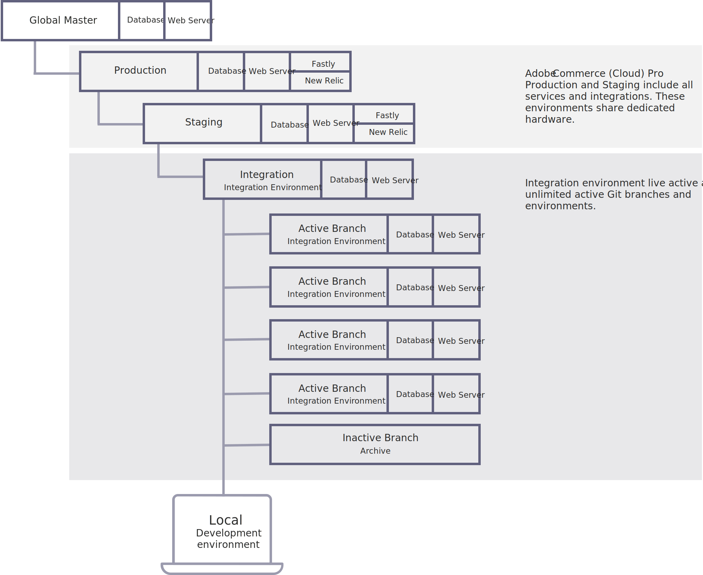
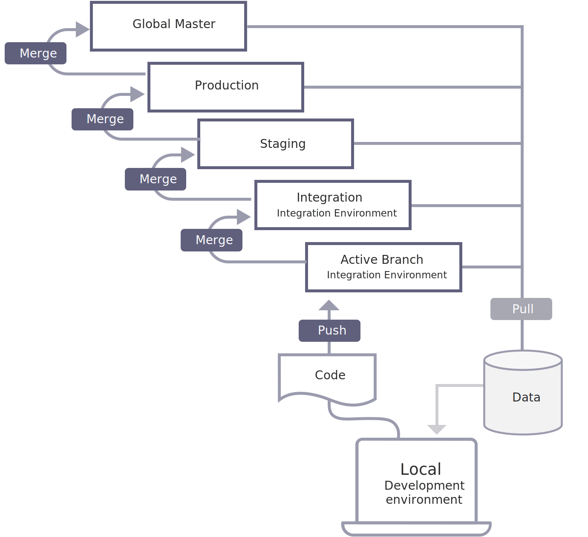

# Environments

Adobe Commerce on cloud infrastructure Pro architecture supports environments that you can use to develop, test, and launch your store. Each environment contains a database and a web server. The four environments leveraged by Adobe Commerce are:

- **Integration**—Provides a single environment branch and you can create up to four additional environment branches. This allows for a maximum of five active branches deployed to Platform-as-a-Service (PaaS) containers.

- **Staging**—Provides a single environment branch deployed to dedicated Infrastructure-as-a-Service (IaaS) containers.

- **Production**—Provides a single environment branch deployed to dedicated Infrastructure-as-a-Service (IaaS) containers.

- **Global Master**—Provides a master branch deployed to Platform-as-a-Service (PaaS) containers.

## Git branches

The Integration environment provides a single base integration branch containing your Adobe Commerce code deployed to Platform-as-a-Service (PaaS) containers.

The Adobe Commerce on cloud infrastructure environments support a flexible, continuous integration process. Begin by cloning the integration branch to your local project folder. Create a new branch, or multiple branches, to develop new features, configure changes, and add extensions. With a developed code branch and the corresponding configuration files, your code changes are ready to merge to the integration branch for more comprehensive testing.

