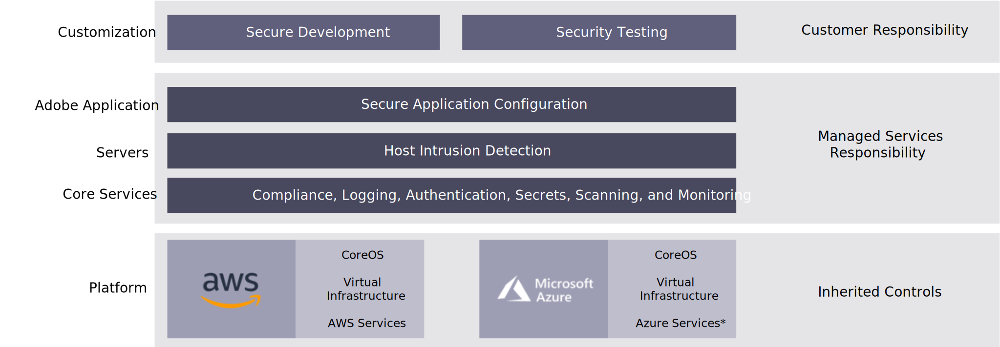

# Managed services

Adobe Commerce on cloud infrastructure managed services are secure by default.

## Shared responsibility

Adobe Commerce Pro plans rely on a shared responsibility security model. In this model, different parties have different areas of responsibility for maintaining the security of the system. This approach allows for both flexibility and use of best-of-breed cloud technologies.

### Adobe Managed Services responsibilities

Adobe Managed Services is responsible for the security and availability of the Adobe Commerce Pro cloud environment, the core Adobe Commerce Pro application code, and internal commerce systems. This includes, but is not limited to:

- Server-level patching
- Operating the necessary services to deliver Adobe Commerce Pro plans
- Vulnerability testing
- Security event logging and monitoring
- Incident management
- Operational monitoring
- 24/7 support
- Ensuring that the customer infrastructure is available in accordance with SLAs

Adobe Managed Services is also responsible for managing server firewall configurations (iptables) and perimeter firewall configurations (security groups). Adobe may also release security updates to the core application on a periodic basis. It is the customers responsibility to apply these patches. These areas are all covered by the PCI Certification of the Adobe Commerce on cloud infrastructure system.

### AWS responsibilities

Adobe Managed Services uses Amazon Web Services (AWS) for cloud server infrastructure. AWS is responsible for the security of the network, including routing, switching, and perimeter network security via firewall systems and intrusion detection systems (IDS). AWS is responsible for physical security to the data centers managing the Adobe Commerce cloud environments, as well as environmental security to ensure proper power, cooling, and mechanism controls are in place.

Adobe Commerce Pro plans use:

- Amazon Elastic Compute Cloud (EC2)
- Amazon Simple Storage Service (S3)
- Amazon Elastic Block Store (EBS)
- Amazon Virtual Private Cloud (VPC)
- Amazon Elastic Load Balancer (ELB)
- Amazon Cloud Trail Services. 

Amazon has an extensive compliance program, which includes PCI DSS, SOC 2, and ISO 27001 certifications.

### Solution partner/customer responsibilities

The customer is primarily responsible for the security of their customized implementation of the Adobe Commerce application running in the Adobe Commerce Pro plan cloud environment. This includes:

- Ensuring a secure configuration and coding of the application and security monitoring activities, including penetration testing and regular vulnerability scans.

- The security of any customization, extensions, other applications, or integrations used in their system.

- The security of their users and the granting of access to their configuration and application.

- The customer controls all code deployments to their non-production environments. This control also comes with the responsibility to apply application security patches to the core Adobe Commerce application, extensions, or any custom code.

- The customer should perform penetration tests of their customized application. These responsibilities can be addressed by technical resources by the customer, implementation partners, or Adobe Commerce professional services.

- Customers are responsible for the PCI requirements of their customized application and their own processes. The customer’s PCI compliance builds upon the PCI certifications of AWS and Adobe Commerce in order to minimize the areas that must be reviewed.
