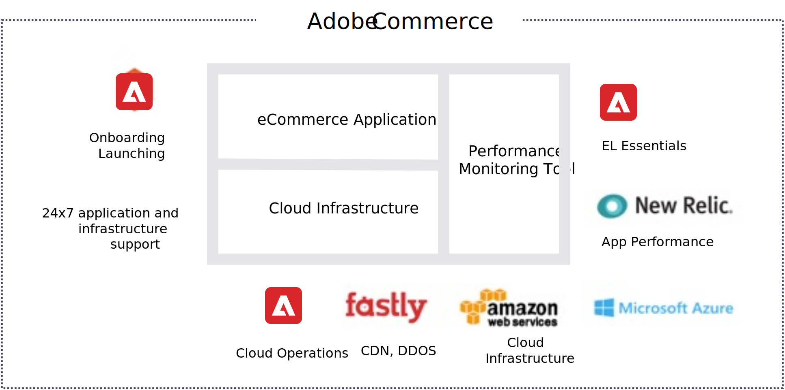
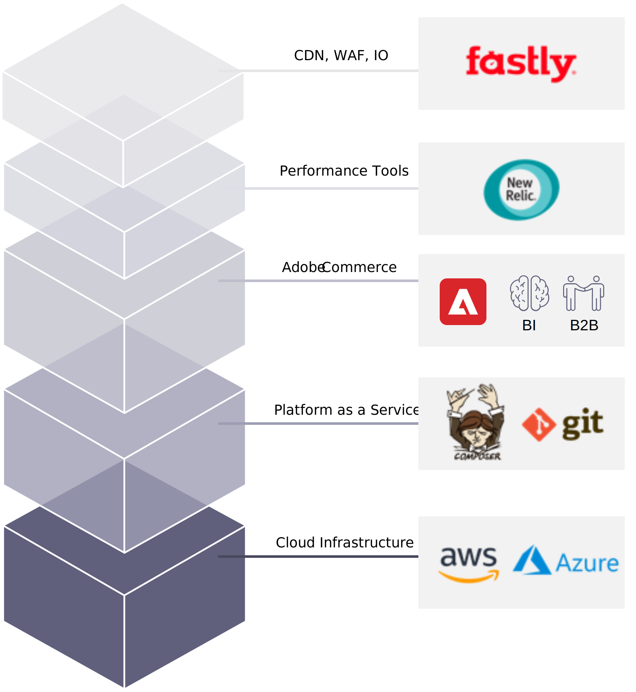

# Overview

One of the most popular managed-hosting options for Adobe Commerce on AWS is offered by Adobe Commerce itself. Adobe Commerce on cloud infrastructure is a fully managed automated hosting platform for the Adobe Commerce software.

Adobe Commerce on cloud infrastructure is a platform-as-a-service (PaaS) offering that enables rapid deployment of fully customizable, secure, and scalable web storefronts combined with a leading hosting and managed services infrastructure. It offers two plans with different infrastructures. Adobe Commerce Starter is best suited for smaller stores with less complexity and smaller catalogs. Adobe Commerce Pro is built for larger stores with more complexity, larger product catalogs, or traffic that peaks. Adobe Commerce will determine the appropriate architecture with input from partners.

Adobe Commerce is cloud-ready with a fully redundant multi-cloud hosting infrastructure that provides optimized performance, resilience, and elastic scalability. You can efficiently run your commerce platform on Fastly’s content delivery network (CDN), and with New Relic for monitoring and management you can keep your store environment running smoothly.

Adobe Commerce offers all the benefits of modern cloud computing that are most commonly associated with SaaS solutions: elastic scalability, high resilience and availability, PCI compliance, and global availability and automated patching, while still maintaining flexibility in software customization that our merchants require.

## Benefits

Other benefits of Adobe Commerce include:

- **Optimized for Adobe Commerce**. Adobe Commerce-developed build scripts and service configuration ensure every instance is correctly tuned and configured for optimal merchant performance.

- **Consistent, secure releases**. All code deployments are Git-based for consistency and repeatability, with read-only production environments for hardened security.

- **Flexibility for partners**. A full REST API and a scriptable command line interface ensures ease of integration with external systems and compatibility with existing code management workflows.

- **Flexible deployment toolset**. Rapidly spin up, merge, clone, and tear down unlimited environments at will for development tasks, QA testing, or production-issue diagnosis.

- **Continuous cloud delivery**. Move with confidence straight from development to UAT to production, in a continuous manner across code branches and development teams.

## Third-party services

Let’s also take a look at the software that makes Adobe Commerce’s benefits a reality.

- Fastly CDN: As customers access your site and stores, the requests hit Fastly to load cached pages faster. Fastly WAF also provides DDoS protection service.

- New Relic gives you a complete view of your applications and operating environment. It allows you to combine key metrics from mobile and browser applications with supporting services, data stores, and hosts so you can optimize performance holistically and ensure the success of every initiative.

- Composer manages dependencies and upgrades in Adobe Commerce and provides context about the included packages, what the packages do, and how they fit together.

- Git is your code in repositories. It allows local branching, convenient staging areas, and multiple workflows with automatic build and deploy for efficient rapid development and continuous deployment.

- Platform-as-a-Service (PaaS) provides a pre-provisioned infrastructure that includes PHP, MySQL, Redis, RabbitMQ, and Elasticsearch technologies.

- AWS or Azure’s cloud hosting powers the underlying Infrastructure-as-a-Service (IaaS), which offers a scalable and secure environment for online sales and retailing.
