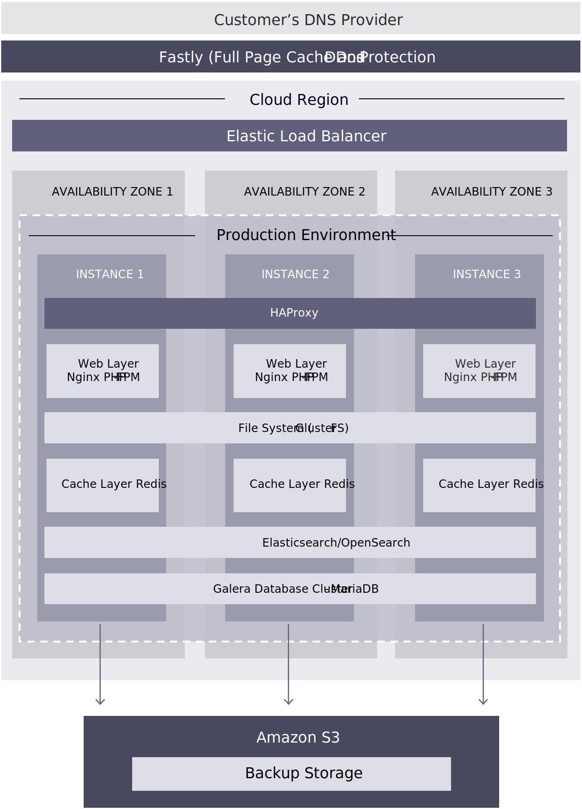

# Technologies

As we’ve mentioned, Adobe Commerce leverages a number of software solutions to support the platform. Specifically, as it pertains to production, we have broken down some of the technical solutions and features included in Adobe Commerce on cloud infrastructure that help make the most of your production environment.

## Software solutions

- **Nginx**—Web server using PHP-FPM. There is one instance with multiple workers.

- **GlusterFS**—File server for managing all static file deployments and synchronization with four directory mounts:
  - `var`
  - `pub/media`
  - `pub/static`
  - `app/etc`

- **Redis**—One server per VM with only one active and the other two as replicas.

- **Elasticsearch**—Search for Adobe Commerce version 2.2.x and later.

- **Galera**—Database cluster with one MariaDB MySQL database per node with an auto-increment setting of three for unique IDs across every database.

## Features and benefits

- With three dedicated instances in a VPC, there is an elastic load balancer across three separate availability zones or data centers.

- Higher resiliency is provided against events that may cause a single instance to fail. For example, an outage of an entire AWS availability zone or data center.

- Zero downtime scaling across the entire stack, including web, caching, search, and database, in less than 15 minutes.
