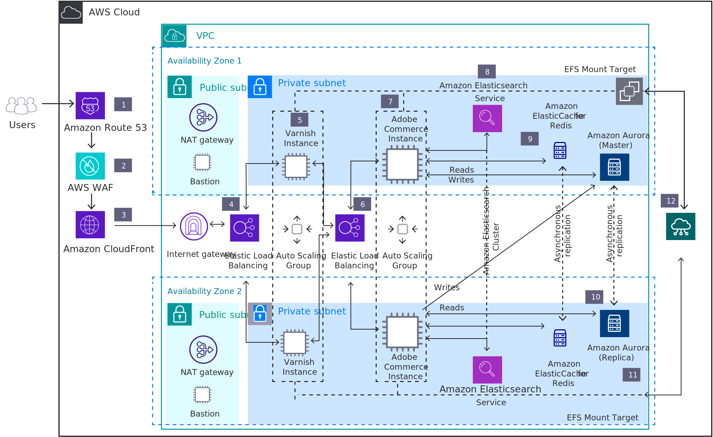

# Adobe Commerce on-premises infrastructure

The motivations for starting a new Adobe Commerce implementation or moving an existing on-premises Adobe Commerce implementation to the cloud are numerous, but the most common strategic drivers are reducing capital expenditure, decreasing ongoing cost, improving scalability and elasticity, improving time-to-market, and attaining improvements in security and compliance.

The following diagram shows the reference architecture for deploying Adobe Commerce on-premises on AWS infrastructure. Other cloud providers like Azure, Google Cloud, and Alibaba Cloud share a similar infrastructure design and homologous services.

Let’s dive deeper into the roles and functions of each aspect of the infrastructure shown above:

1. Amazon Route 53 provides DNS configuration.

1. AWS WAF is a web application firewall that protects Adobe Commerce against common web exploits.

1. Amazon CloudFront is a fast content delivery network (CDN) that speeds up the distribution of static and dynamic web content.

1. The first Elastic Load Balancing application load balancer distributes traffic across Varnish instances in an AWS Auto Scaling group in multiple Availability Zones.

1. Varnish Cache is a web application accelerator caching HTTP reverse proxy. The enterprise version, available via AWS marketplace, is recommended as it has better features to support cloud backends and cache-purging across dynamic hosts.

1. The second Elastic Load Balancing application load balancer distributes traffic from Varnish Cache across the AWS Auto Scaling group of Adobe Commerce instances in multiple Availability Zones.

1. Install the latest version of Magento Open Source or Adobe Commerce on Amazon EC2 instances. Installation consists of the Adobe Commerce application, Nginx webserver, and PHP. Build the Amazon Machine Image (AMI) to launch new instances in an Auto Scaling group.

1. Amazon Elasticsearch Service is a managed Elasticsearch service for Adobe Commerce catalog search.

1. Amazon ElastiCache for Redis provides a caching layer for database.

1. Use Amazon Aurora or AmazonRDS to simplify database administration (including high availability and multi-master configuration).

1. EFSMount Target facilitates mapping the Amazon Elastic File System (AmazonEFS) to Varnish and Adobe Commerce instances.

1. Use Amazon EFS to access shared configuration across Varnish and shared media assets across Adobe Commerce instances.

## Cloud services

In addition to providing a supporting technology platform for the enablement of DevOps processes on AWS around your Adobe Commerce environment, AWS provides a collection of services that can provide (in the absence of) or augment your existing software configuration management (SCM) solutions. This includes AWSCodeCommit, AWSCodeBuild, AWSCodePipeline, and AWSCodeDeploy, which allows for a managed source control, build, continuous integration/continuous deployment (CI/CD), and deployment services.

## Cloud migration

The value proposition for migrating Adobe Commerce to AWS is further enhanced by the availability of several services that provide operational insight and agility. What we mean is operational insight into the platform from not only a technical perspective (for example, requests per hour) but also a business operational perspective (for example, orders per hour), particularly when the two sets of data can be married. This provides a near-real-time look into campaign performance, platform operations costs, and a near infinite number of other indicators.

Adobe Commerce setup to AWS can replace specific application dependencies with fully managed alternatives available in the cloud. For example, rather than directly hosting a relational database on EC2 instances, the database for many applications can be easily replaced by Amazon Relational Database Service (AmazonRDS). The benefit to this strategy is that the operating responsibility of undifferentiated components can be offloaded to AWS without requiring significant changes to the core application.

There are several deployment options available for running Adobe Commerce (both Magento Open Source and Adobe Commerce versions) on AWS. The most appropriate choice depends on your requirements for cost, scale, availability, and flexibility, as well as the AWS and Adobe Commerce skills of your organization.
