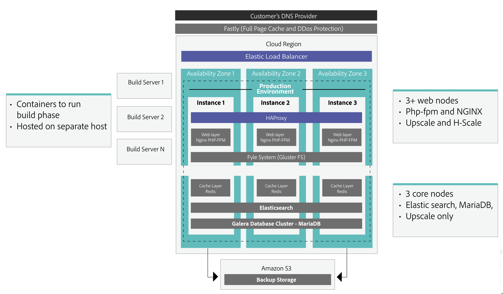

# Benchmark Summary 

Adobe Commerce 2.4.5 performance benchmark results reflect performance as measured on an Adobe Commerce 2.4.5 instance deployed on cloud infrastructure with Pro Scaled/Split Architecture, Multi-Source Inventory, and Adobe Stock enabled. The following information summarizes the results and provides information about the environment and data used during testing.

Adobe performance benchmarks are intended to help e-commerce managers and technical staff better understand the performance characteristics of the Commerce application and use that information to make effective choices when setting up an Adobe Commerce using cloud environments and services.

## Key Performance Metrics - Adobe Commerce 2.4.5

The following figure shows the Commerce store configuration for the performance benchmark and the key performance metrics measured during testing.

{width="700" zoomable="yes"}

Based on testing criteria that mimic an enterprise B2C organization, the system can handle requested traffic and order numbers during peak times, at a standard load flow. 

Highlights from the benchmark performance results:
- 3,481 orders per minute while maintaining response times of less than 2 seconds for the 99th percentile (99% of the requests were serviced with a response time of less than 2 seconds).
- Over 2 million page views per hour while maintaining response times of less than 2 seconds for the 99th percentile.
- During the benchmark, the customer profile had 242 million different price variations (<a href="https://experienceleague.adobe.com/docs/commerce-operations/implementation-playbook/best-practices/planning/product-sku-limits.html">effective SKUs</a>) for 250,000 products.
- System scaled to 10,500 GraphQL un-cached requests per minute while maintaining response times of less than 2 seconds for the 99th percentile.
- System scaled to support 500 concurrent admin users while maintaining response times of less than 2 seconds for the 99th percentile.

## Test Environment

Performance benchmark results were obtained by testing against an instance with Adobe Commerce 2.4.5 deployed on cloud infrastructure with Pro <a href="https://experienceleague.adobe.com/docs/commerce-cloud-service/user-guide/architecture/scaled-architecture.html">Scaled/Split Architecture</a>, <a href="https://experienceleague.adobe.com/docs/commerce-admin/inventory/introduction.html">Multi-Source Inventory</a>, and <a href="https://experienceleague.adobe.com/docs/commerce-admin/content-design/media/adobe-stock/adobe-stock.html">Adobe Stock</a> enabled. There were no additional customizations. 

Performance testing data for the test profile was generated using the <a href="https://experienceleague.adobe.com/docs/commerce-operations/configuration-guide/cli/generate-data.html">Performance Toolkit</a>.

Performance measurements are based on simulated day-to-day store activities for customers and business users. The values reflect a close to maximum throughput for each case, but do not reflect unique business models like private sales or flash sales.

- **LUMA Storefront**
  - 3000 Concurrent Users on Storefront
  - Set to 30% CDN cache hit rate.
    - Effective usage of the cache layer increases the page views number per hour.
- **GraphQL API**
  - 250 Concurrent Threads
  - Set to 0% CDN cache hit rate.
    - Response times significantly improve with a caching layer in front of GraphQL.
- **Admin Web**
  - 500 Concurrent users
  - Set to 0% CDN cache hit rate

## Test Environment Specifications

Load testing was completed using JMeter load profiles run against the Adobe Commerce instance. Three web nodes and three database nodes were used during the test. The following image details the entry point of JMeter and Production infrastructure.

{width="700" zoomable="yes"}

### Application

- <a href="https://experienceleague.adobe.com/docs/commerce-operations/release/notes/adobe-commerce/2-4-5.html">Adobe Commerce 2.4.5</a> deployed on cloud infrastructure with Pro architecture.

### Infrastructure

- Web 
  - vCPU 216 (72 x 3 nodes)
  - Memory 432 GiB (144 x 3 nodes)
  - Network bandwidth 768 Gbps (256 x 3 nodes)
  - EBS bandwidth 57000 Mbps (19000 x 3 nodes)
  - Provisioned storage 1100 GB 

- Database
  - vCPU 192 (64 x 3 nodes)
  - Memory 768 GiB (256 x 3 nodes)
  - Network bandwidth 60 Gbps (20 x 3 nodes)
  - EBS bandwidth 40800 Mbps (13600 x 3 nodes)
  - Provisioned storage 100 GB
