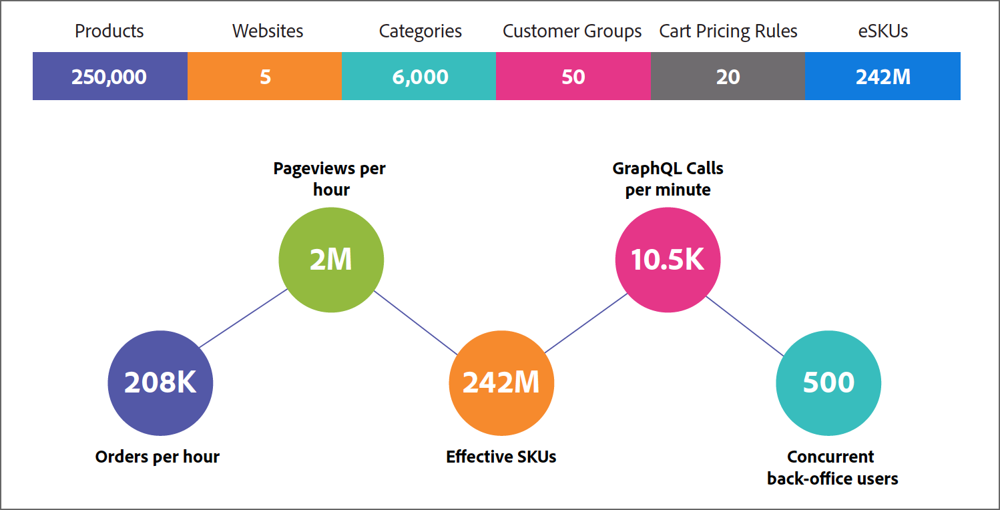

# Benchmark Summary

Adobe Commerce 2.4.5 performance benchmark results reflect performance as measured on an Adobe Commerce instance deployed with the following infrastructure and additional components.
- [Pro cloud environment](https://experienceleague.adobe.com/docs/commerce-cloud-service/user-guide/architecture/pro-architecture.html) with [scaled architecture](https://experienceleague.adobe.com/docs/commerce-cloud-service/user-guide/architecture/scaled-architecture.html)
- [B2B for Adobe Commerce](https://experienceleague.adobe.com/docs/commerce-admin/b2b/introduction.html)
- [Adobe Commerce Inventory Management](https://experienceleague.adobe.com/docs/commerce-admin/inventory/introduction.html)
- [Adobe Stock](https://experienceleague.adobe.com/docs/commerce-admin/content-design/media/adobe-stock/adobe-stock.html)

There are no additional customizations.

The following information summarizes the benchmark results and provides information about the environment and data used during testing.

## Key Performance Metrics

The following figure shows the Commerce store configuration for the performance benchmark and the key performance metrics from the test results.

{width="700" zoomable="yes"}

Based on testing criteria that mimic an enterprise B2C organization, the system can handle requested traffic and order numbers during peak times, at a standard load flow.

### Performance highlights

- **Orders**—Processed 3,481 orders per minute while maintaining response times of less than 2 seconds for the 99th percentile (99% of the requests were serviced with a response time of less than 2 seconds).
- **Page views**—Handled over 2 million page views per hour while maintaining response times of less than 2 seconds for the 99th percentile.
- **Effective SKUs**—The customer profile included 242 million different price variations (<a href="https://experienceleague.adobe.com/docs/commerce-operations/implementation-playbook/best-practices/planning/product-sku-limits.html">eSKUs</a>) for 250,000 products.
- **GraphQL requests**—System scaled to 10,500 GraphQL uncached requests per minute while maintaining response times of less than 2 seconds for the 99th percentile.
- **Concurrent Admin users**—System scaled to support 500 concurrent admin users while maintaining response times of less than 2 seconds for the 99th percentile.

## Test environment

Performance benchmark results were obtained by testing against an Adobe Commerce 2.4.5 instance deployed in a Pro cloud environment with scaled architecture. The instance also had the Adobe Commerce B2B, Inventory Management, and Adobe Stock Integration modules installed, configured, and enabled.

Performance testing data for the test profile was generated using the <a href="https://experienceleague.adobe.com/docs/commerce-operations/configuration-guide/cli/generate-data.html">Performance Toolkit</a>.

Performance measurements are based on simulated day-to-day store activities for customers and business users. The values reflect a close-to-maximum throughput for each case, but do not reflect unique business models, such as private sales or flash sales.

- **LUMA Storefront**
  - 3000 concurrent users on storefront
  - Set to 30% CDN cache hit rate

    Effective usage of the cache layer increases the page views number per hour.

- **GraphQL API**
  - 250 concurrent threads
  - Set to 0% CDN cache hit rate

    Response times significantly improve with a caching layer in front of GraphQL.

- **Admin Web**
  - 500 concurrent users
  - Set to 0% CDN cache hit rate

## Test environment specifications

Load testing was completed using JMeter load profiles run against the Adobe Commerce instance. Three web nodes and three service nodes were used during the test. The following image details the entry point of JMeter and Production infrastructure.

{width="700" zoomable="yes"}

### Application

<a href="https://experienceleague.adobe.com/docs/commerce-operations/release/notes/adobe-commerce/2-4-5.html">Adobe Commerce 2.4.5</a> deployed on cloud infrastructure with Pro architecture.

### Infrastructure

For the performance benchmark, Adobe Commerce 2.4.5 was deployed on a [scalable infrastructure](https://experienceleague.adobe.com/docs/commerce-cloud-service/user-guide/architecture/scaled-architecture.html) with the following capacity.

- **Web node specifications**
  - vCPU 216 (72 x 3 nodes)
  - Memory 432 GiB (144 x 3 nodes)
  - Network bandwidth 768 Gbps (256 x 3 nodes)
  - Provisioned storage 100 GB

- **Service node specifications**
  - vCPU 192 (64 x 3 nodes)
  - Memory 768 GiB (256 x 3 nodes)
  - Network bandwidth 60 Gbps (20 x 3 nodes)
  - EBS bandwidth 40800 Mbps (13600 x 3 nodes)
  - Provisioned storage 1100 GB
