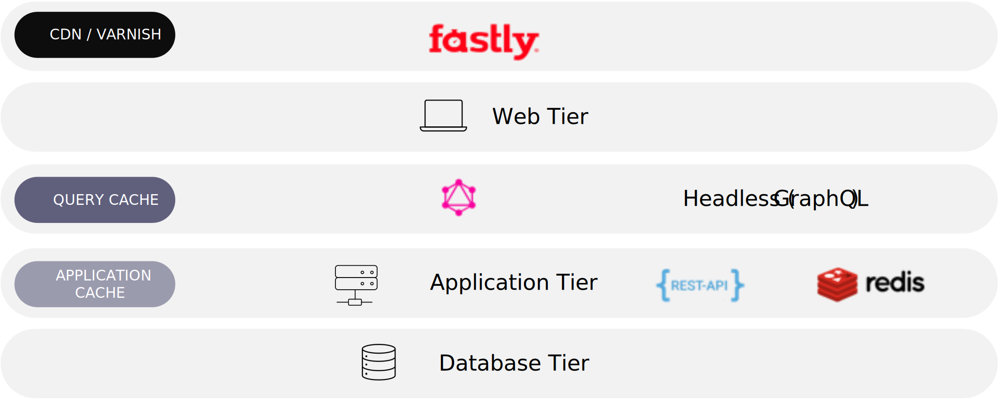

# Performance optimization

Performance is a big topic. When users experience a slow or unresponsive site, it affects conversion. We recommend following these steps to optimize the performance of your Adobe Commerce on cloud infrastructure implementation:

- Assess the problem
- Measure performance
- Identify part of the system critical for performance improvement
- Modify part of system to remove the bottleneck
- Measure the performance after modification
- If better, adopt it or revert

## Typical Performance Issues

The impact of a slow experience is usually defined by two indicators, and each factor can be caused for tons of reasons.

High time-to-first-byte (TTFB) is usually regarded as an indicator that defines the server’s response speed. The time not only comes from source code execution for handling the request, but it can also be impacted by the following factors:

- DNS lookup
- Slow queries from DB layer
- CPU time from each application layer
- Memory limitation
- I/O wait may affect from file read and write, connect service via socket
- Software settings (nginx, PHP, MySQL, Redis, Varnish)
- Network bandwidth
- Bad caching
- Bad code
- Bad integration approach
- Dependency of slow third-party service response
- Architecture without scalability

Slow-loading resources are usually regarded as an indicator that defines the static resource (CSS, JavaScript, images, videos, third-party Ajax call response).

Adobe Commerce can scale with your business through its capabilities:

There are also key factors driving scale in commerce, which also impact the overall performance.

- Complex and large product catalog
- Large numbers of admins
- Global storefronts
- High-variable traffic
- Expanding touchpoints
- High-volume transactions

For layered and cacheable architectures built for scale, you can use this graph as a reference.

