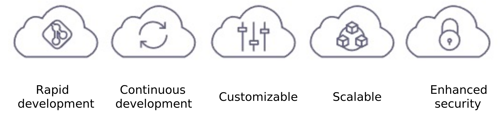

# Principles of platform development

In this playbook, we dive deeper into some of the main standards of Adobe Commerce development, including:

- Functional and technical scoping in line with the development process
- Development best practices aligning with the MVC architecture
- Architectural considerations, including GRA
- Security standards against scripting and exploits
- Extension development best practices
- Web API integrations with REST, SOAP, and GraphQL
- Performance improvements for coding and infrastructure
- Testing tools, strategies, and methodologies

While some solution implementers may have their own preferences when it comes to the methodologies, processes, and tools used throughout an implementation project, this playbook focuses on generally accepted best practices and methodologies that can be shared across the majority of implementations.

Like any large IT project, Adobe Commerce is built on coding standards that leverage best practices and standardizations of the underlying technologies (for example, PHP/Zend, Symfony, JavaScript, jQuery, and HTML), as well as standards that have been established within the Adobe Commerce Coding Standard. Following these standards is an absolute must to eliminate bugs and improve the quality and maintainability of custom-built code.

## Adobe Commerce on cloud infrastructure

Adobe Commerce on cloud infrastructure is a managed, automated hosting platform for the Adobe Commerce software. Adobe Commerce on cloud infrastructure comes with a variety of additional features that sets it apart from on-premises Adobe Commerce and Magento Open Source implementations:

Adobe Commerce on cloud infrastructure provides a pre-provisioned infrastructure that includes PHP, MySQL, Redis, RabbitMQ, and Elasticsearch technologies; a Git-based workflow with automatic build and deploy operations for efficient rapid development and continuous deployment every time code changes are pushed in a Platform as a Service (PaaS) environment; highly customizable environment-configuration files and tools; and AWS hosting that offers a scalable and secure environment for online sales and retailing.

