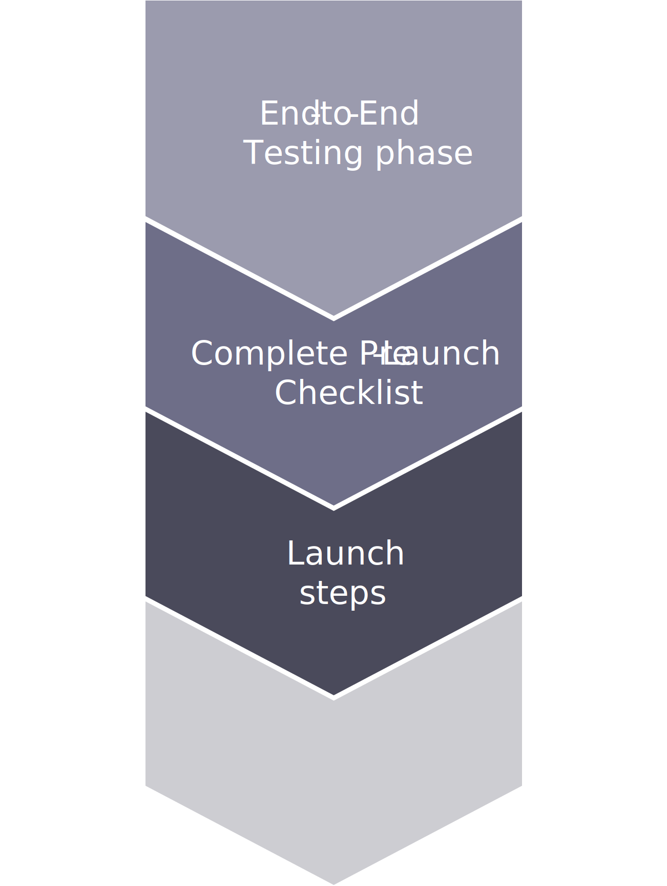

# Launch steps

After testing and completing the pre-launch checklist, we can start the final steps to launch at the time to cutover. These steps include entering site launch (go live) tickets, cutting over access, and finally, testing your store(s) when live. 

Adobe Commerce Support staff work with you through the process, checking the status and helping to address any questions or issues that occur. All issues should be tracked with tickets to best capture what happened and how it was resolved. When you begin deploying continuous iterations of updates to your launched store, you may have similar issues occur again. These tickets can help pinpoint the issues and help adjust your deployment tasks.

- Configure application to Base URL 
  - Switch DNS to the new site 
  - Access your DNS service 
  - Update your A and CNAME records for your domains and hostnames 
  - Wait for the TTL time to pass and access your store 

- Completely test in Production 
  - Verifying all functions of the website 
  - Verifying CDN cache 
  - Verifying all integrated third-party services 
  - Verifying all third-party systems 

- Contact Adobe Commerce hotline in case any issues are blocking the go-live

