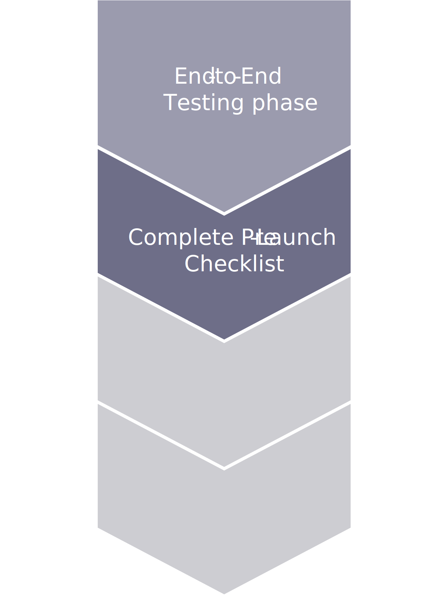

# Pre-launch steps

When you have completed deployment and testing in the staging environments, you can begin site-launch preparation. Staging is a near-production environment running on similar hardware, configurations, architecture, and services. It can reduce your downtime and make your extension, service, custom configurations, and merchant user acceptance testing vital components to releasing your sites and stores.

The pre-launch checklist is required to verify prior to launch state, which includes the following major verifications:

- Code freeze for deployment 
- Ensure that the downtime was communicated in advance by at least one day for maintenance release and one week for the first launch 
- Deployment scripts are set up/configured completely for Production/Staging/Integration environments 
- Databases are all set up and identical between Staging and Production environments 
- SSL (TLS) certificates are validated for Staging/Production environments 
- Mail services are well-configured and functioning for transactional emails 
- CDN is configured for Staging/Production environments 
- Set up security scan for Staging/Production environments 
  - Adobe Commerce security scan 
- Perform performance assessment by 
  - JMeter 
  - Siege 
  - Webpage Test 
  - Google page speed 
- Validate all third-party integrations that will be functioning in application (OMS, CRM) 
- Enable performance-monitor tool (New Relics) 
- Data migration activities in rehearsal (if any) 

The main differences between Adobe Commerce on-premises and cloud implementations are the deployment scripts and tools, as well as the setup for SSL, Mail service, and CDN. However, the process is still the same.

For SSL(TLS) certificate, Adobe Commerce on cloud infrastructure provides a Fastly wildcard certificate. To start using it, you need to pass the validation: add the Fastly TXT record to apex domain name within your DNS settings. The Fastly TXT record can be found in the on-boarding spreadsheet, otherwise you need to submit support a ticket to obtain it. Replace this text with your questions/comments here. If you use your own SSL(TLS) certificate instead of a Fastly wildcard certificate, submit a support ticket with your certificate attached to the setup. 

Adobe Commerce on cloud infrastructure provides SendGrid Mail functionality for your transactional emails. For Pro plans, you need to add SendGrid records to your DNS settings. SendGrid records can be found in the on-boarding spreadsheet, otherwise SI or merchant should submit support tickets to obtain them. To start, you don't need to make any changes to your DNS; SendGrid is pre-configured for you.

## Complete pre-launch checklist

The complete pre-launch checklist shows all major activities whose completeness is necessary for moving to the launch state.

- Go-live risk mitigation plans updated 
- Correct domain names provided 
- Outgoing emails have been tested 
- SSL certificate is provisioned and configured 
- All-important configuration of Adobe Commerce application is updated correctly 
- Base URLs and Base Admin URL are correctly set to final hostname 
- Admin passwords are changed 
- All users with access to application that no longer require access are removed 
- Payment configuration for production environment (for some, payment is using sandbox mode for testing) 
- Test data (customer, wishlist, reviews, orders, and related data) from Production database is cleared

