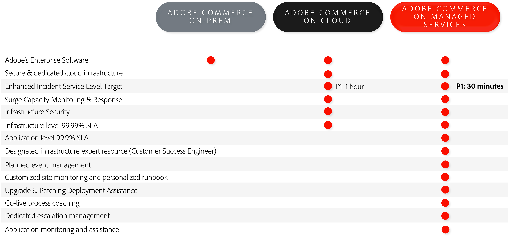

# Adobe Managed Services

Adobe Commerce is a platform for delivering ecommerce capabilitie and includes robust out-of-the-box features, extensive customizability options, and third-party integrations.

Adobe Managed Services rovides hosted and managed application and infrastructure for Adobe Commerce on cloud infrastructure Pro plans.

## Benefits

### Comparison of implementation options

Adobe Managed Services offers key benefits over on-premises and non-managed cloud implementations, including:

- **Enhanced service level times (SLTs)**—Faster response times than standard Adobe Commerce support.
- **Enhanced service level agreements (SLAs)**—99.9% application level that regular Adobe Commerce on cloud infrastructure customers get on top of the 99.99% infrastructure level.
- **Designated Cloud Expertise**—Customer Success Engineers who provider the following services:
  - Guide and support through the onboarding process
  - Manage provisioning and platform setup
  - Advise on architectural principles for integrations and customizations
  - Drive incident management and businee continuity
  - Provide event support through planning, execution, and monitoring
  - Cloud support and expertise (proactive optimization, reporting, and best practices)

Review the following infographic for a more detailed comparison of key Managed Services benefits:

## Roles and responsibilities

Adobe provides a set of services around the provisioning, development, staging and
production of Adobe Commerce on Managed Services systems. For the development and
deployment of the solution to proceed as efficiently as possible, it is important that the
customer and partner understand and fulfill their roles, as described below:

<table>
	<thead>
		<tr>
            <th></th>
            <th>Customer</th>
            <th>Partner</th>
            <th>Customer Success Engineer</th>
		</tr>
	</thead>
	<tbody>
		<tr>
			<td colspan="4" style="background:lightgray;"><strong>Provisioning</strong></td>
		</tr>
		<tr>
			<td>Cloud Region Selection</td>
			<td>Owner</td>
			<td>Contributor</td>
			<td>Advisor</td>
		</tr>
		<tr>
			<td>Instance Provisioning</td>
			<td></td>
			<td></td>
			<td>Owner</td>
		</tr>
		<tr>
			<td>Internal Network Configuration and Security</td>
			<td></td>
			<td></td>
			<td>Owner</td>
		</tr>
		<tr>
			<td>Adobe Commerce Application Provisioning</td>
			<td></td>
			<td></td>
			<td>Owner</td>
		</tr>
		<tr>
			<td>Adobe Commerce Source Code Access</td>
			<td></td>
			<td></td>
			<td>Owner</td>
		</tr>
		<tr>
			<td>CDN Service Provisioning</td>
			<td></td>
			<td></td>
			<td>Owner</td>
		</tr>
		<tr>
			<td>Local development environment</td>
			<td>Contributor</td>
			<td>Owner</td>
			<td></td>
		</tr>
		<tr>
			<td colspan="4" style="background:lightgray;"><strong>Development and QA</strong></td>
		</tr>
		<tr>
			<td>Requirement gathering and project management</td>
			<td>Contributor</td>
			<td>Owner</td>
			<td>Advisor</td>
		</tr>
		<tr>
			<td>Application Development</td>
			<td>Contributor</td>
			<td>Owner</td>
			<td>Advisor</td>
		</tr>
		<tr>
			<td>Application Testing</td>
			<td>Contributor</td>
			<td>Owner</td>
			<td>Advisor</td>
		</tr>
		<tr>
			<td colspan="4" style="background:lightgray;"><strong>Staging &amp; Transition</strong></td>
		</tr>
		<tr>
			<td>Code Deployment to development, integration, and Staging</td>
			<td>Contributor</td>
			<td>Owner</td>
			<td>Advisor</td>
		</tr>
		<tr>
			<td>Content deployment</td>
			<td>Contributor</td>
			<td>Owner</td>
			<td>Advisor</td>
		</tr>
		<tr>
			<td>User-acceptance Test development</td>
			<td>Owner</td>
			<td>Contributor</td>
			<td>Advisor</td>
		</tr>
		<tr>
			<td>User-acceptance Testing</td>
			<td>Owner</td>
			<td>Contributor</td>
			<td>Advisor</td>
		</tr>
		<tr>
			<td>Custom monitoring requirements</td>
			<td>Contributor</td>
			<td>Owner</td>
			<td>Advisor</td>
		</tr>
		<tr>
			<td>Customer-provided SSL Certificates</td>
			<td>Owner</td>
			<td></td>
			<td>Contributor</td>
		</tr>
		<tr>
			<td>Performance and Load Test Development</td>
			<td>Contributor</td>
			<td>Owner</td>
			<td>Advisor</td>
		</tr>
		<tr>
			<td>Performance and Load Testing</td>
			<td>Contributor</td>
			<td>Owner</td>
			<td>Advisor</td>
		</tr>
		<tr>
			<td>Customization Development and QA</td>
			<td>Contributor</td>
			<td>Owner</td>
			<td>Advisor</td>
		</tr>
		<tr>
			<td>Runbook completion</td>
			<td>Owner</td>
			<td>Contributor</td>
			<td>Contributor</td>
		</tr>
		<tr>
			<td>Runbook Review</td>
			<td></td>
			<td></td>
			<td>Owner</td>
		</tr>
		<tr>
			<td colspan="4" style="background:lightgray;"><strong>Launch</strong></td>
		</tr>
		<tr>
			<td>Go-live checklist</td>
			<td>Contributor</td>
			<td>Contributor</td>
			<td>Owner</td>
		</tr>
		<tr>
			<td>Go-live event conference room</td>
			<td>Contributor</td>
			<td>Contributor</td>
			<td>Owner</td>
		</tr>
        <tr>
			<td>Production code deployment</td>
			<td>Contributor</td>
			<td>Contributor</td>
			<td>Owner</td>
		</tr>
        <tr>
	        <td colspan="4" style="background:lightgray;"><strong>Production</strong></td>
        </tr>
        <tr>
            <td>Production infrastructure monitoring</td>
            <td></td>
            <td></td>
            <td>Owner</td>
        </tr>
        <tr>
            <td>Principal application monitoring</td>
            <td>Contributor</td>
            <td>Contributor</td>
            <td>Owner</td>
        </tr>
        <tr>
            <td>Production event response</td>
            <td>Contributor</td>
            <td>Contributor</td>
            <td>Owner</td>
        </tr>
        <tr>
            <td>Infrastructure and operating system-level maintenance</td>
            <td></td>
            <td></td>
            <td>Owner</td>
        </tr>
        <tr>
            <td>Custom-code maintenance and security patches</td>
            <td>Contributor</td>
            <td>Owner</td>
            <td>Advisor</td>
        </tr>
        <tr>
            <td>Provide access to Adobe Commerce Product Updates and Upgrades</td>
            <td>Contributor</td>
            <td>Contributor</td>
            <td>Owner</td>
        </tr>
        <tr>
            <td>Applying Adobe Commerce Product Updates and Upgrades</td>
            <td>Contributor</td>
            <td>Owner</td>
            <td>Advisor</td>
        </tr>
        <tr>
            <td>Change Approval Board to approve production deployments</td>
            <td>Contributor</td>
            <td>Contributor</td>
            <td>Owner</td>
        </tr>
        <tr>
            <td>Production Application administration</td>
            <td>Owner</td>
            <td>Contributor</td>
            <td>Advisor</td>
        </tr>
        <tr>
            <td>Tuning production infrastructure</td>
            <td>Contributor</td>
            <td>Contributor</td>
            <td>Owner</td>
        </tr>
        <tr>
            <td>Scaling Production architecture</td>
            <td></td>
            <td></td>
            <td>Owner</td>
        </tr>
        <tr>
            <td>Production Backups and Recovery</td>
            <td></td>
            <td>Contributor</td>
            <td>Owner</td>
        </tr>
        <tr>
            <td colspan="4" style="background:lightgray;"><strong>Security and Compliance</strong></td>
        </tr>
        <tr>
            <td>SOC-2 Audit of the Service</td>
            <td></td>
            <td></td>
            <td>Owner</td>
        </tr>
        <tr>
            <td>PCI Certification of the infrastructure</td>
            <td></td>
            <td></td>
            <td>Owner</td>
        </tr>
        <tr>
            <td>PCI Certification of the customized application</td>
            <td>Owner</td>
            <td>Contributor</td>
            <td></td>
        </tr>
        <tr>
            <td>Security Audits of the core applications</td>
            <td>Owner</td>
            <td>Contributor</td>
            <td>Advisor</td>
        </tr>
        <tr>
            <td>Security Audits of the customizations and extensions</td>
            <td>Owner</td>
            <td>Contributor</td>
            <td></td>
        </tr>
        <tr>
            <td>Penetration testing of the customer’s instances of the applications</td>
            <td>Owner</td>
            <td>Contributor</td>
            <td></td>
        </tr>
        <tr>
            <td>Web Application Firewall Rules (WAF)</td>
            <td>Contributor</td>
            <td>Contributor</td>
            <td>Owner</td>
        </tr>
        <tr>
            <td>Intrusion Detection Monitoring</td>
            <td></td>
            <td></td>
            <td>Owner</td>
        </tr>
        <tr>
            <td>Application and DB event monitoring</td>
            <td>Contributor</td>
            <td>Contributor</td>
            <td>Owner</td>
        </tr>
        <tr>
            <td>Web Application Firewall Event Monitoring</td>
            <td>Contributor</td>
            <td>Contributor</td>
            <td>Owner</td>
        </tr>
        <tr>
            <td>User management and SSO integration</td>
            <td>Owner</td>
            <td>Contributor</td>
            <td>Contributor</td>
        </tr>
        <tr>
            <td>Security Event Response</td>
            <td>Contributor</td>
            <td>Contributor</td>
            <td>Owner</td>
        </tr>
        <tr>
            <td>Setting up, securing, and maintaining connection to corporate networks and resources </td>
            <td>Owner</td>
            <td>Advisor</td>
            <td>Advisor</td>
        </tr>
	</tbody>
</table>

## Security

The Adobe security stack for Managed Services builds security in at every level using automation and consistency to reduce human error. Development and operations teams automatically inherit security controls from different levels of the stack.

Platform partners, such as Amazon Web Services and Microsoft Azure, ensure maximum security coverage when applying platform customizations, while Adobe’s Managed Services team provides core security services, such as compliance, logging, authentication, scanning, and monitoring, and server security and secure application configuration.

The following diagram shows the Adobe Managed Services security technology stack:

