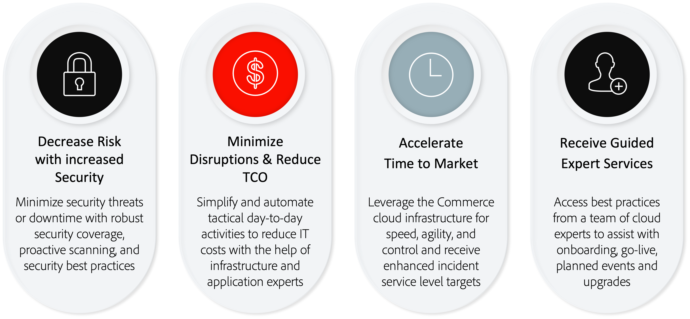

# Adobe Managed Services

Adobe Commerce is a platform for delivering ecommerce capabilities that includes robust out-of-the-box features, extensive customizability options, and third-party integrations.

Adobe Managed Services provides hosted and managed application and infrastructure for Adobe Commerce on cloud infrastructure Pro plans.

## Benefits

### Comparison of implementation options

Adobe Managed Services offers key benefits over on-premises and non-managed cloud implementations, including:

- **Enhanced service level targets (SLTs)**—Faster response times than standard Adobe Commerce support.
- **Enhanced service level agreements (SLAs)**—99.9% application level that regular Adobe Commerce on cloud infrastructure customers get on top of the 99.99% infrastructure level.
- **Designated Cloud Expertise**—Managed Services provides customers with a designated Customer Success Engineer (CSE) that serves as an application and cloud infrastructure expert. The CSE works with customers and their partners, providing them with best practices and guidance to accelerate time to market, including:
  - Guide and support through the onboarding process
  - Manage provisioning and platform setup
  - Advise on architectural principles for integrations and customizations
  - Drive incident management and businee continuity
  - Provide event support through planning, execution, and monitoring
  - Cloud support and expertise (proactive optimization, reporting, and best practices)

Review the following table for a more detailed comparison of key Managed Services benefits:

| Feature | Adobe Commerce on-premises | Adobe Commerce on Cloud | Adobe Commerce on Managed Services |
|---------|---------------------------|-------------------------|-----------------------------------|
| Adobe's Enterprise Software | ✓ | ✓ | ✓ |
| Secure & dedicated cloud infrastructure | | ✓ | ✓ |
| Enhanced Incident Service Level Target | | P1: 1 hour | P1: 15 minutes |
| Surge Capacity Monitoring & Response | | | ✓ |
| Infrastructure Security | | | ✓ |
| Infrastructure level 99.99% SLA | | | ✓ |
| Application level 99.9% SLA | | | |
| Designated infrastructure expert resource (Customer Success Engineer) | | | |
| Planned event management | | | |
| Customized site monitoring and personalized runbook | | | |
| Upgrade & Patching Deployment Assistance | | | |
| Go-live process coordination | | | |
| Dedicated escalation management | | | |
| Application monitoring and assistance | | | |

## Roles and responsibilities

Adobe provides a set of services around the provisioning, development, staging, and production of Adobe Commerce on Managed Services systems. For the development and deployment of the solution to proceed as efficiently as possible, it is important that the customer and partner understand and fulfill their roles, as described below:

<table>
    <thead>
        <tr>
            <th></th>
            <th>Customer</th>
            <th>Partner</th>
            <th>Customer Success Engineer</th>
        </tr>
    </thead>
    <tbody>
        <tr>
            <td colspan="4" style="background:lightgray;"><strong>Provisioning</strong></td>
        </tr>
        <tr>
            <td>Cloud Region Selection</td>
            <td>Owner</td>
            <td>Contributor</td>
            <td>Advisor</td>
        </tr>
        <tr>
            <td>Instance Provisioning</td>
            <td></td>
            <td></td>
            <td>Owner</td>
        </tr>
        <tr>
            <td>Internal Network Configuration and Security</td>
            <td></td>
            <td></td>
            <td>Owner</td>
        </tr>
        <tr>
            <td>Adobe Commerce Application Provisioning</td>
            <td></td>
            <td></td>
            <td>Owner</td>
        </tr>
        <tr>
            <td>Adobe Commerce Source Code Access</td>
            <td></td>
            <td></td>
            <td>Owner</td>
        </tr>
        <tr>
            <td>CDN Service Provisioning</td>
            <td></td>
            <td></td>
            <td>Owner</td>
        </tr>
        <tr>
            <td>Local development environment</td>
            <td>Contributor</td>
            <td>Owner</td>
            <td></td>
        </tr>
        <tr>
            <td colspan="4" style="background:lightgray;"><strong>Development and QA</strong></td>
        </tr>
        <tr>
            <td>Requirement gathering and project management</td>
            <td>Contributor</td>
            <td>Owner</td>
            <td>Advisor</td>
        </tr>
        <tr>
            <td>Application Development</td>
            <td>Contributor</td>
            <td>Owner</td>
            <td>Advisor</td>
        </tr>
        <tr>
            <td>Application Testing</td>
            <td>Contributor</td>
            <td>Owner</td>
            <td>Advisor</td>
        </tr>
        <tr>
            <td colspan="4" style="background:lightgray;"><strong>Staging &amp; Transition</strong></td>
        </tr>
        <tr>
            <td>Code Deployment to development, integration, and Staging</td>
            <td>Contributor</td>
            <td>Owner</td>
            <td>Advisor</td>
        </tr>
        <tr>
            <td>Content deployment</td>
            <td>Contributor</td>
            <td>Owner</td>
            <td>Advisor</td>
        </tr>
        <tr>
            <td>User-acceptance Test development</td>
            <td>Owner</td>
            <td>Contributor</td>
            <td>Advisor</td>
        </tr>
        <tr>
            <td>User-acceptance Testing</td>
            <td>Owner</td>
            <td>Contributor</td>
            <td>Advisor</td>
        </tr>
        <tr>
            <td>Custom monitoring requirements</td>
            <td>Contributor</td>
            <td>Owner</td>
            <td>Advisor</td>
        </tr>
        <tr>
            <td>Customer-provided SSL Certificates</td>
            <td>Owner</td>
            <td></td>
            <td>Contributor</td>
        </tr>
        <tr>
            <td>Performance and Load Test Development</td>
            <td>Contributor</td>
            <td>Owner</td>
            <td>Advisor</td>
        </tr>
        <tr>
            <td>Performance and Load Testing</td>
            <td>Contributor</td>
            <td>Owner</td>
            <td>Advisor</td>
        </tr>
        <tr>
            <td>Customization Development and QA</td>
            <td>Contributor</td>
            <td>Owner</td>
            <td>Advisor</td>
        </tr>
        <tr>
            <td>Runbook completion</td>
            <td>Owner</td>
            <td>Contributor</td>
            <td>Contributor</td>
        </tr>
        <tr>
            <td>Runbook Review</td>
            <td></td>
            <td></td>
            <td>Owner</td>
        </tr>
        <tr>
            <td colspan="4" style="background:lightgray;"><strong>Launch</strong></td>
        </tr>
        <tr>
            <td>Go-live checklist</td>
            <td>Contributor</td>
            <td>Contributor</td>
            <td>Owner</td>
        </tr>
        <tr>
            <td>Go-live event conference room</td>
            <td>Contributor</td>
            <td>Contributor</td>
            <td>Owner</td>
        </tr>
        <tr>
            <td>Production code deployment</td>
            <td>Contributor</td>
            <td>Contributor</td>
            <td>Owner</td>
        </tr>
        <tr>
            <td colspan="4" style="background:lightgray;"><strong>Production</strong></td>
        </tr>
        <tr>
            <td>Production infrastructure monitoring</td>
            <td></td>
            <td></td>
            <td>Owner</td>
        </tr>
        <tr>
            <td>Principal application monitoring</td>
            <td>Contributor</td>
            <td>Contributor</td>
            <td>Owner</td>
        </tr>
        <tr>
            <td>Production event response</td>
            <td>Contributor</td>
            <td>Contributor</td>
            <td>Owner</td>
        </tr>
        <tr>
            <td>Infrastructure and operating system-level maintenance</td>
            <td></td>
            <td></td>
            <td>Owner</td>
        </tr>
        <tr>
            <td>Custom-code maintenance and security patches</td>
            <td>Contributor</td>
            <td>Owner</td>
            <td>Advisor</td>
        </tr>
        <tr>
            <td>Provide access to Adobe Commerce Product Updates and Upgrades</td>
            <td>Contributor</td>
            <td>Contributor</td>
            <td>Owner</td>
        </tr>
        <tr>
            <td>Applying Adobe Commerce Product Updates and Upgrades</td>
            <td>Contributor</td>
            <td>Owner</td>
            <td>Advisor</td>
        </tr>
        <tr>
            <td>Change Approval Board to approve production deployments</td>
            <td>Contributor</td>
            <td>Contributor</td>
            <td>Owner</td>
        </tr>
        <tr>
            <td>Production Application administration</td>
            <td>Owner</td>
            <td>Contributor</td>
            <td>Advisor</td>
        </tr>
        <tr>
            <td>Tuning production infrastructure</td>
            <td>Contributor</td>
            <td>Contributor</td>
            <td>Owner</td>
        </tr>
        <tr>
            <td>Scaling Production architecture</td>
            <td></td>
            <td></td>
            <td>Owner</td>
        </tr>
        <tr>
            <td>Production Backups and Recovery</td>
            <td></td>
            <td>Contributor</td>
            <td>Owner</td>
        </tr>
        <tr>
            <td colspan="4" style="background:lightgray;"><strong>Security and Compliance</strong></td>
        </tr>
        <tr>
            <td>SOC-2 Audit of the Service</td>
            <td></td>
            <td></td>
            <td>Owner</td>
        </tr>
        <tr>
            <td>PCI Certification of the infrastructure</td>
            <td></td>
            <td></td>
            <td>Owner</td>
        </tr>
        <tr>
            <td>PCI Certification of the customized application</td>
            <td>Owner</td>
            <td>Contributor</td>
            <td></td>
        </tr>
        <tr>
            <td>Security Audits of the core applications</td>
            <td>Owner</td>
            <td>Contributor</td>
            <td>Advisor</td>
        </tr>
        <tr>
            <td>Security Audits of the customizations and extensions</td>
            <td>Owner</td>
            <td>Contributor</td>
            <td></td>
        </tr>
        <tr>
            <td>Penetration testing of the customer's instances of the applications</td>
            <td>Owner</td>
            <td>Contributor</td>
            <td></td>
        </tr>
        <tr>
            <td>Web Application Firewall Rules (WAF)</td>
            <td>Contributor</td>
            <td>Contributor</td>
            <td>Owner</td>
        </tr>
        <tr>
            <td>Intrusion Detection Monitoring</td>
            <td></td>
            <td></td>
            <td>Owner</td>
        </tr>
        <tr>
            <td>Application and DB event monitoring</td>
            <td>Contributor</td>
            <td>Contributor</td>
            <td>Owner</td>
        </tr>
        <tr>
            <td>Web Application Firewall Event Monitoring</td>
            <td>Contributor</td>
            <td>Contributor</td>
            <td>Owner</td>
        </tr>
        <tr>
            <td>User management and SSO integration</td>
            <td>Owner</td>
            <td>Contributor</td>
            <td>Contributor</td>
        </tr>
        <tr>
            <td>Security Event Response</td>
            <td>Contributor</td>
            <td>Contributor</td>
            <td>Owner</td>
        </tr>
        <tr>
            <td>Setting up, securing, and maintaining connection to corporate networks and resources </td>
            <td>Owner</td>
            <td>Advisor</td>
            <td>Advisor</td>
        </tr>
    </tbody>
</table>

## Security

The Adobe security stack for Managed Services builds security in at every level using automation and consistency to reduce human error. Development and operations teams automatically inherit security controls from different levels of the stack.

Platform partners, such as Amazon Web Services and Microsoft Azure, ensure maximum security coverage when applying platform customizations, while Adobe's Managed Services team provides core security services, such as compliance, logging, authentication, scanning, and monitoring, and server security and secure application configuration. See [Adobe Commerce Security](https://business.adobe.com/products/magento/secure-ecommerce.html) for more information.

The following diagram shows the Adobe Managed Services security technology stack:

## Upgrade assistance

The Managed Services team plays an active role in helping to plan and assist with the upgrade process. Your Customer Success Engineer (CSE) works with your upgrade project team, including project managers, and developers (internal subject matter experts, Adobe certified partners, or professionals from Adobe Consulting) to help your team ensure proper planning and adherence to best practices during the upgrade.

Managed Services CSEs have worked with Adobe Commerce customers to execute upgrades in large environments. Your CSE can help you leverage expert knowledge to maximize upgrade success while minimizing downtime and reducing overall risk. Additionally, Managed Services CSEs work with your dedicated staging environment for the upgrade so that existing production processes are not impacted while validating the upgrade.

Adobe provides a set of services around the provisioning, development, staging, and production of your Managed Services system. The following table provides an overview of the roles that each participant plays in the upgrade process:

<table>
<thead>
  <tr>
    <th>Step</th>
    <th>Task</th>
    <th>Customer</th>
    <th>Development Partner*</th>
    <th>Managed Services</th>
  </tr>
</thead>
<tbody>
  <tr>
    <td rowspan="3">Plan upgrade</td>
    <td>Create upgrade project plan</td>
    <td>Owner</td>
    <td>Contributor</td>
    <td>Contributor CSE provides upgrade template and upgrade plan samples; offers advice and best practices tips.</td>
  </tr>
  <tr>
    <td>Determine needed infrastructure changes</td>
    <td></td>
    <td>Contributor</td>
    <td>Owner CSE reviews staging and production infrastructure to ensure proper sizing.</td>
  </tr>
  <tr>
    <td>Assess upgrade complexity Identify and document packages, issues &amp; fixes, and 3rd party &amp; custom modules</td>
    <td>Contributor</td>
    <td>Owner</td>
    <td>Contributor CSE provides Upgrade Compatibility Tool reports and recommendations.</td>
  </tr>
  <tr>
    <td rowspan="3">Execute upgrade</td>
    <td>Upgrade infrastructure services [MariaDB, Redis, Open Search, and Rabbit MQ] (Staging and Production)</td>
    <td></td>
    <td></td>
    <td>Owner CSE coordinates infrastructure service upgrades. CSE schedules conference meeting event for upgrades. CSE assists with data migration from Production to Staging.</td>
  </tr>
  <tr>
    <td>Update Commerce code base and customizations; code recompilation and code refactoring</td>
    <td>Contributor</td>
    <td>Owner</td>
    <td></td>
  </tr>
  <tr>
    <td>Perform post-upgrade checks and troubleshooting</td>
    <td></td>
    <td>Owner</td>
    <td>Contributor CSE executes post-upgrade runbook to detect and remediate issues related to upgrade.</td>
  </tr>
  <tr>
    <td rowspan="3">UAT and Launch</td>
    <td>Run performance and security tests</td>
    <td>Contributor</td>
    <td>Owner</td>
    <td>Contributor CSE assists with load testing by monitoring performance of application and infrastructure. CSE assists with configuring Commerce Security Scan Tool.</td>
  </tr>
  <tr>
    <td>User Acceptance Testing on Staging</td>
    <td>Owner</td>
    <td>Contributor</td>
    <td>Contributor CSE validates the application and infrastructure are performing correctly post upgrade.</td>
  </tr>
  <tr>
    <td>Launch to Production</td>
    <td>Contributor</td>
    <td>Owner</td>
    <td>Contributor CSE schedules launch conference meeting event.</td>
  </tr>
  <tr>
    <td>Post-Launch</td>
    <td></td>
    <td>Contributor</td>
    <td>Contributor</td>
    <td>Owner CSE monitors performance of application and infrastructure.</td>
  </tr>
</tbody>
</table>
