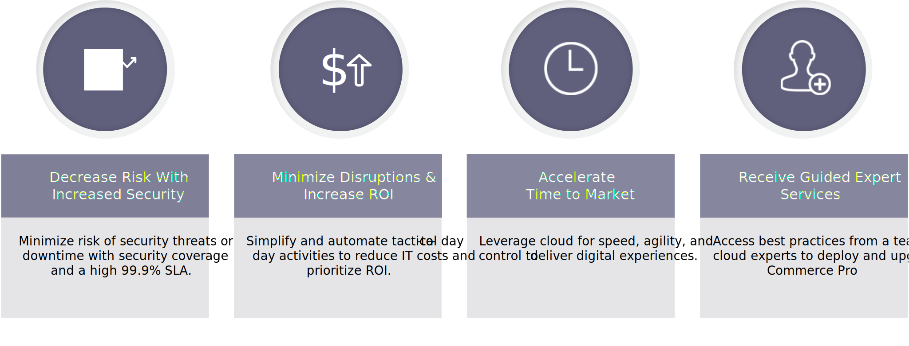

# Adobe Managed Services

Adobe Commerce is a platform for delivering ecommerce capabilities, including out-of-the-box features, an ability to customize, and third-party integrations.

Adobe’s Managed Services is a hosted and managed application and infrastructure for Adobe Commerce on cloud infrastructure Pro plans.

## Benefits

## Security

The Adobe Security stack for Managed Services builds security in at every level using automation and consistency to reduce human error. Development and operations teams automatically inherit security controls from different levels of the stack.

Platform partners such as Amazon Web Services and Microsoft Azure ensures maximum security coverage when applying platform customizations, while Adobe’s Managed Services team provides core security services like compliance, logging, authentication, scanning, and monitoring, as well as server security and secure application configuration. Dentsu commerce will be responsible for custom development & integrations, and the associated security processes for custom code.

The following diagram shows Adobe Managed Service's security technology stack:

