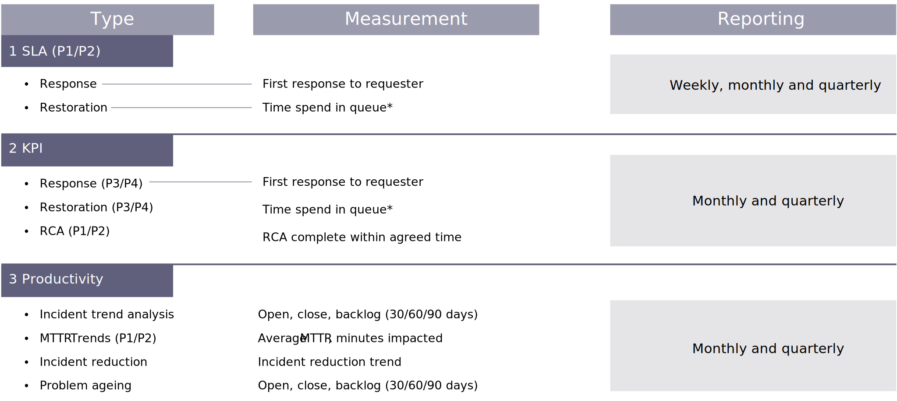

# Support metrics

The following diagram shows typical metrics/KPIs collected and reported for L1 functions:

Measurement and reporting of L2 services (enhancements and optional services) are similar to development projects. Performance and progress of the L2 teams are measured by metrics like velocity, code quality, test effectiveness, and productivity.

| Key Performance Measurement  | Unit of Measure     | Reported Metrics                                                                   |
|------------------------------|---------------------|------------------------------------------------------------------------------------|
| Velocity                     | Number              | No. of story points the team were able to deliver for the sprint                   |
| Sprint Commitment Efficiency | Percentage          | Total no. of Story Points committed Vs Delivered for a Sprint                      |
| Sprint  Burn down            | Number              | Chart (Report, tracks the completion of work throughout the sprint)                |
| Code Quality                 | Numbers, Percentage | Complexity, LoC, Violations, Code coverage for the sprint                          |
| Requirement volatility       | Number              | # of requirements change/ total # requirements for the sprint                      |
| Defect Density               | Percentage          | [No. of valid Defects found/Total No .of Test cases executed]*100 for the sprint   |
| Test Effectiveness           | Percentage          | [Valid Defects raised/(Valid Defects raised+ Rejected defects)]*100 for the sprint |
| Productivity                 | Number (trend)      | Story points delivered per sprint / capacity                                       |
