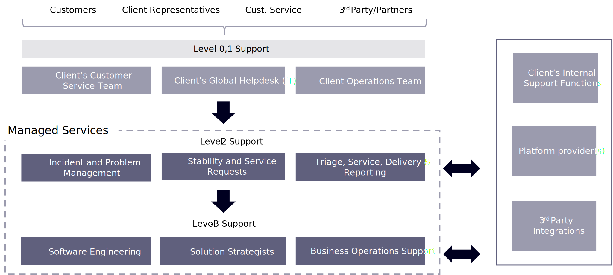

# Maintenance and support models

There is not just one way to handle the support of your ecommerce site. We have outlined four options, depending on the needs and goals of your brand.

## Typical models

The option of managed services with an SLA commitment and fixed maintenance capacity is an outcome-driven model to manage, maintain, and enhance digital commerce ecosystems with expected service levels and to produce strong, quality, and measurable outcomes for digital business and operations with fixed capacity and cost.

- **Fixed capacity production support and enhancements**

  - Fixed capacity refers to a restricted number of committed hours for resources as contracted. For simple commerce sites, this number can typically vary from 40 to 160 hours per month.
  
  - The nature of work and type of resources depend on the scope of the support needed. This is suited for smaller organizations with relatively simple digital ecosystems, and also in specific engagements where the brand already has a sizable technology team.

- **SLA Support with hotfix**
  - Optional 24*7, severity 1 support
  - SLA for all support incidents
  - Monthly allocation of resources for support/delivery effort
  - Additional resources to follow agreed change management process

- **SLA support for critical incidents with dedicated delivery capacity**
  - Optional 24*7 support with SLA for severity 1 incidents
  - Fixed delivery resources and unlimited operational support
  - Additional delivery resources to follow agreed change management process
  - Covers all roles (Dev/QA/SA/PM/RM) and operational support

- **Managed service support with a fixed maintenance capacity**
  - SLA for all support incidents, including 24*7 response time
  - Fixed delivery resources and unlimited operational support to meet committed SLA
  - Complete DevOps for HotFix support
  - Additional delivery resources to follow agreed change management process
  - Covers all roles (Dev/QA/SA/PM/RM) and operational support

## Typical service levels

Typical service levels are defined as operations and break-fix, enhancements (also called Level 3 or L3 services) and optional services (optional L3 services).

Operations and break-fix activities can be further divided into L1 (Level 1: monitoring and incident management) and L2 (Level 2: problem management and continuous service improvement). The scope of these activities include the following:

- **Operations and break-fix**
  - Event management
  - Incident management
  - Service requests
  - Priority notification and reporting
  - Problem management
  - Change management
  - Peak support

- **Enhancements**
  - Backlog grooming + prioritization
  - Sprint + release planning
  - Design + development
  - Functional sprint testing
  - Supporting performance and security testing
  - Deployment planning

- **Optional services**
  - Architecture Audit and recommendation
  - Performance and Security Testing
  - Business Operations support
  - Content production
  - Merchandizing Operations
  - Strategic consulting
  - Adobe Commerce updates

Delivery and service management is also an integral part of support and enhancement function. Here are the activities typically included in the scope under this function:

- Delivery and service oversight, floor and shift management
- Incident and problem triaging
- Stakeholder communication and management
- Service reporting and governance
- Continuous improvement
- Process audit
- Documentation and reporting
- Adobe Commerce platform updates

The support model works seamlessly with clear accountability distributed across client teams and L1, L2, L3 teams, with a proven governance and communication model.

