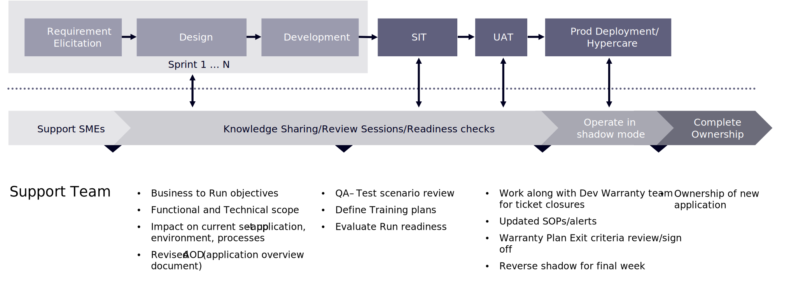

# Maintenance and support overview

Consumers already have more options than ever before at their fingertips. With no shortage of brands vying for attention, you can’t give consumers any reason to look at your competitors. As we’ve seen, loyalty and patience with consumers is thin. It doesn’t take much for them to give up on your brand and having a poor ecommerce experience is an easy way for them to give up. 

This leads to two complementary points. The first is that the launch of a new ecommerce site does not mean you then get to move on. The rate of change in marketing and with consumers’ needs is too great that brands must constantly evolve to keep up. Which brings us to point two. If your ecommerce support is only there to fix something when it breaks, then it will be impossible to meet consumers’ rising expectations. In short, ecommerce support shouldn’t just keep your site working, it should move your brand forward. This section will help you begin to move your brand forward after the launch of your site.

## Transition phase

Setting up production support during the transition phase of a project is one of the most critical success factors for a commerce enterprise. Once the implementation is completed and the site goes live, the production support team is required to be ready and equipped to take over support activities. The usual practice is to ramp down the development team during transition phase and build a smaller team in place for support.

Knowledge transfer occurs over the course of the entire project, and a successful transition approach occurs in parallel with delivery. In addition, user guides and a technology wiki are important tools that enable the team through workshops throughout the project phases.

The following diagram shows the phases and activities that would be included in a successful transition outcome:

>[!NOTE]
>
> It is important to put together a transition checklist that helps project managers complete the tasks that are required to successfully set up the post-production support team. This transition should be part of the overall project plan and the tasks have to be included in the schedule.

Identifying the right support model for your business to continue enhancing and optimizing your platform—and commerce practice as a whole—is a critical step to maintaining all of the hard work that was done during the implementation process. With a comprehensive ongoing support plan in place, your commerce site can keep up with your customers’ expectations and you can keep reaching your goals.
