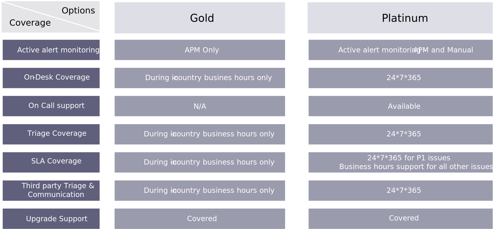

# Service level agreements (SLAs)

The service-level agreement (SLA) defines the level of service expected by a customer from the service provider, with simple metrics by which that service is measured, as well as the remedies or penalties, if any, should the agreed-upon service levels not be achieved.

The SLAs for different types of incident criticalities can be contracted, maintained, and measured. Further, the response type can have multiple standards (Gold, Platinum), based on the level of service required by the customer.

The following table describes a typical SLA metric breakdown with multiple service levels:

<table>
<thead>
  <tr>
    <th>Issue Type</th>
    <th>Impact</th>
    <th>Example</th>
    <th colspan="2">Response/Restoration time during supported business hours</th>
  </tr>
</thead>
<tbody>
  <tr>
    <td colspan="3"></td>
    <td>Gold</td>
    <td>Platinum</td>
  </tr>
  <tr>
    <td>P1</td>
    <td>Critical Impact</td>
    <td>Service down or unusable</td>
    <td>1 hour / 4hours</td>
    <td>1 hour / 4 hours</td>
  </tr>
  <tr>
    <td></td>
    <td></td>
    <td>Service is unavailable</td>
    <td></td>
    <td></td>
  </tr>
  <tr>
    <td></td>
    <td></td>
    <td>Service is unusable across end user base</td>
    <td></td>
    <td></td>
  </tr>
  <tr>
    <td>P2</td>
    <td>High Impact</td>
    <td>Service severely impaired</td>
    <td>2 hours / 12 hours</td>
    <td>2 hours / 8 hours</td>
  </tr>
  <tr>
    <td></td>
    <td></td>
    <td>Service performance is degraded</td>
    <td></td>
    <td></td>
  </tr>
  <tr>
    <td></td>
    <td></td>
    <td>Service available, but producing significant error messages</td>
    <td></td>
    <td></td>
  </tr>
  <tr>
    <td>P3</td>
    <td>Medium Impact</td>
    <td>Service partially impaired</td>
    <td>8 hours / 16 hours</td>
    <td>8 hours / 12 hours</td>
  </tr>
  <tr>
    <td></td>
    <td></td>
    <td>Error messages generated, no noticeable end user impact</td>
    <td></td>
    <td></td>
  </tr>
  <tr>
    <td></td>
    <td></td>
    <td>Questions about features used in customer launch</td>
    <td></td>
    <td></td>
  </tr>
</tbody>
</table>

## Coverage options

The coverage options for committed SLAs varies with different types of offering. Typically, the scope of Gold and Platinum support services look something like the following:

